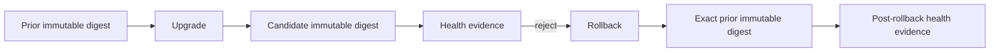

# DTMO Current Project State

Last reconciled: **2026-08-19**  
Software baseline: **16.0.0rc12 plus accepted post-RC13, E8 and Phase 11 repository enhancements**

## Executive summary

DTMO has completed Phases 1–7, RC13 functional acceptance and E8.1–E8.10 product evolution. Phase 8 and Phase 9 evidence remain historical and candidate-bound. Phase 10 concluded **`NO-GO / BLOCKED — PLATFORM INDUSTRIALISATION REQUIRED`**. DTMO is **not production authorized**.

The active programme is **Phase 11 — Platform Industrialisation**. Phase 11.1–11.8h are `PASS / REPOSITORY_COMPLETE`. The sole active bounded objective is **Phase 11.8i exercised upgrade/rollback**, currently `IN PROGRESS / EXACT-HEAD VALIDATION REQUIRED`.

## Lifecycle position

| Stage | Status |
|---|---|
| Phases 1–7 | `PASS` |
| RC13 + owner retest | `PASS / OWNER_ACCEPTED` |
| E8.1–E8.10 | `PASS / REPOSITORY_COMPLETE` |
| Phase 8 | `PASS / OWNER_ACCEPTED — HISTORICAL CANDIDATE` |
| Phase 9 | `PASS / EXTERNAL_ASSURANCE ACCEPTED — HISTORICAL CANDIDATE` |
| Phase 10 | `NO-GO / BLOCKED — PLATFORM INDUSTRIALISATION REQUIRED` |
| Phase 11 | `IN PROGRESS / ACTIVE` |
| Phase 11.1–11.2 Taranis | `PASS / REPOSITORY_COMPLETE` |
| Phase 11.3 IntelOwl | `PASS / REPOSITORY_COMPLETE` |
| Phase 11.4 OpenCTI | `PASS / REPOSITORY_COMPLETE` |
| Phase 11.5 MISP | `PASS / REPOSITORY_COMPLETE` |
| Phase 11.6 TheHive | `PASS / REPOSITORY_COMPLETE` |
| Phase 11.7 Cortex decision gate | `PASS / REPOSITORY_COMPLETE — HISTORICAL DECISION BASELINE` |
| Phase 11.7b Cortex analyzer connector | `PASS / REPOSITORY_COMPLETE` |
| Phase 11.8a runtime foundation | `PASS / REPOSITORY_COMPLETE` |
| Phase 11.8b workload identity / external secrets | `PASS / REPOSITORY_COMPLETE` |
| Phase 11.8c ingress/TLS + network segmentation | `PASS / REPOSITORY_COMPLETE` |
| Phase 11.8d HA / disruption hardening | `PASS / REPOSITORY_COMPLETE` |
| Phase 11.8e observability hardening | `PASS / REPOSITORY_COMPLETE` |
| Phase 11.8f backup / restore / recovery hardening | `PASS / REPOSITORY_COMPLETE` |
| Phase 11.8g software supply-chain hardening | `PASS / REPOSITORY_COMPLETE` |
| Phase 11.8h capacity / resource planning | `PASS / REPOSITORY_COMPLETE` |
| Phase 11.8i exercised upgrade / rollback | `IN PROGRESS / EXACT-HEAD VALIDATION REQUIRED` |
| Phase 11.9 migration/compatibility | `NOT STARTED` |
| Phase 11.10 production-equivalent validation | `NOT STARTED` |
| Phase 11.11 independent external assurance | `NOT STARTED` |
| Phase 12 | `NOT STARTED` |

## Accepted service and runtime boundaries

Taranis, IntelOwl, Cortex, OpenCTI, MISP and TheHive remain separate governed service/licensing boundaries. None gains DTMO human publication/share authority or establishes local compromise by itself. TheHive case-handoff authority remains distinct from publication/share authority.

Accepted Phase 11.8 controls now cover the Helm/GitOps Kubernetes runtime foundation, workload identity/external-secret delivery, TLS ingress/network segmentation, application HA/disruption controls, observability boundaries, backup/restore/recovery controls, software supply-chain hardening and capacity/resource planning. These are repository engineering controls only and do not establish live provider enforcement, production-equivalent behavior or production authorization.

## Active Phase 11.8i upgrade/rollback boundary

The active slice makes application rollout safety explicit: immutable baseline/candidate/rollback digests, bounded RollingUpdate settings, revision history, rollout progress deadline, minimum-ready time, post-upgrade and post-rollback health evidence, and deterministic restoration of the exact prior digest.

Application rollback does not authorize automatic database down migration. Missing immutable identity, rollback compatibility, health evidence or accountable change authority must **fail closed**. Stateful recovery remains governed separately by Phase 11.8f.

## Governance and evidence boundary

Repository CI may prove the upgrade/rollback contract and a deterministic synthetic digest transition only. It cannot prove a live Kubernetes rollback, data recovery, production-equivalent continuity, independent assurance or production authorization.

Historical Phase 8/9 evidence remains valid only for the earlier candidate and is not reused for the materially changed Phase 11 platform. Phase 11.10 must collect fresh production-equivalent upgrade, rollback, health, saturation and recovery evidence for one immutable integrated deployment identity. Phase 11.11 then provides new independent assurance before Phase 12.

## Phase 11 fixed order

1. Taranis AI — `PASS / REPOSITORY_COMPLETE`;
2. IntelOwl — `PASS / REPOSITORY_COMPLETE`;
3. OpenCTI — `PASS / REPOSITORY_COMPLETE`;
4. MISP — `PASS / REPOSITORY_COMPLETE`;
5. TheHive — `PASS / REPOSITORY_COMPLETE`;
6. original Cortex conditional decision — historical `PASS / REPOSITORY_COMPLETE`;
7. owner-required Cortex analyzer connector — `PASS / REPOSITORY_COMPLETE`;
8. Kubernetes/Helm/GitOps and integrated runtime hardening — active Phase 11.8, with 11.8a–11.8h accepted and 11.8i active;
9. migration/compatibility;
10. new production-equivalent validation;
11. new independent external assurance;
12. Phase 12 formal production GO/NO-GO.
