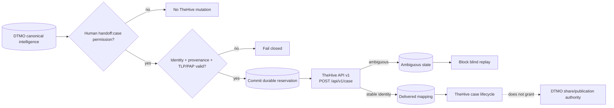

# DTMO Current Project State

Last reconciled: **2026-08-17**  
Software baseline: **16.0.0rc12 plus accepted post-RC13, E8 and Phase 11 repository enhancements**

## Executive summary

DTMO has completed Phases 1–7, RC13 functional acceptance and E8.1–E8.10 product evolution. RC13 is `PASS / OWNER_ACCEPTED`; E8.1–E8.10 are `PASS / REPOSITORY_COMPLETE`. Phase 8 is `PASS / OWNER_ACCEPTED` and Phase 9 is `PASS / EXTERNAL_ASSURANCE_ACCEPTED` for the earlier candidate. Phase 10 concluded **`NO-GO / BLOCKED — PLATFORM INDUSTRIALISATION REQUIRED`**. DTMO is **not production authorized**.

The active programme is **Phase 11 — Platform Industrialisation**. Phase 11.1–11.2 Taranis, Phase 11.3 IntelOwl, Phase 11.4 OpenCTI and Phase 11.5 MISP consolidation are `PASS / REPOSITORY_COMPLETE`. The Phase 11.6 TheHive contract baseline is accepted; the active bounded objective is **the minimal human-authorized TheHive case-handoff adapter plus durable mutation reservation/reconciliation state**, currently `IN PROGRESS / EXACT-HEAD VALIDATION REQUIRED`.

## Lifecycle position

| Stage | Status |
|---|---|
| Phases 1–7 | `PASS` |
| RC13 + owner retest | `PASS / OWNER_ACCEPTED` |
| E8.1–E8.10 | `PASS / REPOSITORY_COMPLETE` |
| Phase 8 | `PASS / OWNER_ACCEPTED` |
| Phase 9 | `PASS / EXTERNAL_ASSURANCE_ACCEPTED` |
| Phase 10 | `NO-GO / BLOCKED — PLATFORM INDUSTRIALISATION REQUIRED` |
| Phase 11 | `IN PROGRESS / ACTIVE` |
| Phase 11.1 Taranis architecture/contract | `PASS / REPOSITORY_COMPLETE` |
| Phase 11.2 Taranis adapter | `PASS / REPOSITORY_COMPLETE` |
| Phase 11.3 IntelOwl integration | `PASS / REPOSITORY_COMPLETE` |
| Phase 11.4 OpenCTI integration | `PASS / REPOSITORY_COMPLETE` |
| Phase 11.5 MISP consolidation | `PASS / REPOSITORY_COMPLETE` |
| Phase 11.6 TheHive contract | `PASS / REPOSITORY_COMPLETE` |
| Phase 11.6 TheHive handoff implementation | `IN PROGRESS / EXACT-HEAD VALIDATION REQUIRED` |
| Phase 12 | `NOT STARTED` |

## Accepted Phase 11 capabilities

Phase 11.2 provides repository-complete Taranis collection/canonicalization with durable checkpointing and provenance. Phase 11.3 provides bounded IntelOwl enrichment with human review authority and no-share/no-local-compromise invariants. Phase 11.4 provides bounded OpenCTI graph integration with explicit OpenCTI/STIX↔DTMO identity mapping and durable reconciliation. Phase 11.5 provides one governed MISP inbound/outbound authority model with durable synchronization state, authoritative distribution/sharing-group/TLP restrictions and human-approved unpublished export.

Taranis, IntelOwl, OpenCTI and MISP remain separate service boundaries. None gains DTMO human publication/share authority and none establishes local compromise by itself.

## Active Phase 11.6 TheHive implementation

The accepted TheHive baseline remains TheHive 5.5.16 using public API v1 (`/api/v1`). TheHive remains a separate StrangeBee service; DTMO does not vendor upstream source or assume license entitlement.

The active bounded implementation adds exactly one external mutation surface: explicit human-authorized `POST /api/v1/case`. A dedicated `handoff:case` permission is separate from `approve:share`; routine service accounts do not receive human handoff authority.

Before mutation, DTMO validates canonical identity, repository provenance, deterministic severity and explicit TLP/PAP mapping. It commits a durable reservation in `thehive_handoff_state` before calling TheHive. The reservation binds the request UUID, canonical item UUID, human principal, organization and handling envelope.

A confirmed stable TheHive case identity marks the reservation `delivered`. Timeout/network ambiguity or a nominal success without stable case identity marks it `ambiguous` and blocks automated replay. Definitive bounded failures are recorded `failed`. Mutable title, description, tags or assignee values are never identity.

The adapter transmits only a bounded canonical title, human-approved summary, deterministic severity, explicit TLP/PAP, bounded tags and DTMO UUID reference. Attachments, raw source bodies, credentials, private enrichment results and unrelated personal data are excluded.

## Runtime and licensing boundary

`DTMO_FEATURE_THEHIVE_HANDOFF` is disabled by default. When enabled, runtime requires an API base, secret token and explicit organization scope. Production configuration requires HTTPS. These repository configuration checks do not prove live connectivity, actual organization permissions or license entitlement.

TheHive 5.3+ requires an activated Community, Gold or Platinum license for continued write operation after the initial trial. Deployment entitlement, credentials, organization scope and privacy/handling approval remain external prerequisites for live integration validation.

## Data and authority model

PostgreSQL remains canonical DTMO application/intelligence/RBAC state. TheHive case lifecycle is operational incident-response state and does not replace canonical CTI truth. TheHive case creation does not prove compromise, change DTMO governance conclusions or grant external-share authority.

Database constraints preserve unique handoff request identity, unique confirmed TheHive case identity and hard no-share/no-local-compromise invariants. TheHive unavailability affects only the explicit handoff path and must not make unrelated DTMO read or ingestion paths unavailable.

## Governance and evidence boundary

Repository CI for this slice can prove synthetic adapter, route, RBAC, state-machine, migration and documentation behavior. It cannot prove live TheHive connectivity, activated license entitlement, deployed permissions, organization/access configuration, privacy approval, correct TLP/PAP mapping on real data, HA/recovery, staging acceptance, independent assurance or production authorization.

Historical Phase 8/9 evidence remains valid only for the earlier candidate and is not reused for the materially changed Phase 11 platform. Fresh Phase 11.10 production-equivalent validation and Phase 11.11 independent assurance remain required before Phase 12.

## Phase 11 fixed order

1. Taranis AI — `PASS / REPOSITORY_COMPLETE` through Phase 11.2;
2. IntelOwl — `PASS / REPOSITORY_COMPLETE` for Phase 11.3;
3. OpenCTI — `PASS / REPOSITORY_COMPLETE` for Phase 11.4;
4. MISP consolidation — `PASS / REPOSITORY_COMPLETE` for Phase 11.5;
5. TheHive — active Phase 11.6 bounded runtime handoff implementation;
6. Cortex — conditional only if IntelOwl leaves a validated capability gap;
7. Kubernetes/Helm/GitOps and integrated runtime hardening;
8. migration/compatibility;
9. new production-equivalent validation;
10. new independent external assurance;
11. Phase 12 formal production GO/NO-GO.
