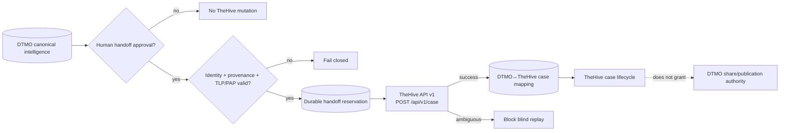

# DTMO Current Project State

Last reconciled: **2026-08-17**  
Software baseline: **16.0.0rc12 plus accepted post-RC13, E8 and Phase 11 repository enhancements**

## Executive summary

DTMO has completed Phases 1–7, RC13 functional acceptance and E8.1–E8.10 product evolution. RC13 is `PASS / OWNER_ACCEPTED`; E8.1–E8.10 are `PASS / REPOSITORY_COMPLETE`. Phase 8 is `PASS / OWNER_ACCEPTED` and Phase 9 is `PASS / EXTERNAL_ASSURANCE_ACCEPTED` for the earlier candidate. Phase 10 concluded **`NO-GO / BLOCKED — PLATFORM INDUSTRIALISATION REQUIRED`**. DTMO is **not production authorized**.

The active programme is **Phase 11 — Platform Industrialisation**. Phase 11.1–11.2 Taranis, Phase 11.3 IntelOwl, Phase 11.4 OpenCTI and Phase 11.5 MISP consolidation are `PASS / REPOSITORY_COMPLETE`. The active bounded objective is **Phase 11.6 TheHive incident/case handoff contract**, currently `IN PROGRESS / EXACT-HEAD VALIDATION REQUIRED`.

## Lifecycle position

| Stage | Status |
|---|---|
| Phases 1–7 | `PASS` |
| RC13 + owner retest | `PASS / OWNER_ACCEPTED` |
| E8.1–E8.10 | `PASS / REPOSITORY_COMPLETE` |
| Phase 8 | `PASS / OWNER_ACCEPTED` |
| Phase 9 | `PASS / EXTERNAL_ASSURANCE_ACCEPTED` |
| Phase 10 | `NO-GO / BLOCKED — PLATFORM INDUSTRIALISATION REQUIRED` |
| Phase 11 | `IN PROGRESS / ACTIVE` |
| Phase 11.1 Taranis architecture/contract | `PASS / REPOSITORY_COMPLETE` |
| Phase 11.2 Taranis adapter | `PASS / REPOSITORY_COMPLETE` |
| Phase 11.3 IntelOwl integration | `PASS / REPOSITORY_COMPLETE` |
| Phase 11.4 OpenCTI integration | `PASS / REPOSITORY_COMPLETE` |
| Phase 11.5 MISP consolidation | `PASS / REPOSITORY_COMPLETE` |
| Phase 11.6 TheHive handoff contract | `IN PROGRESS / EXACT-HEAD VALIDATION REQUIRED` |
| Phase 12 | `NOT STARTED` |

## Accepted Phase 11 capabilities

Phase 11.2 provides repository-complete Taranis collection/canonicalization with durable checkpointing and provenance. Phase 11.3 provides bounded IntelOwl enrichment with human review authority and no-share/no-local-compromise invariants. Phase 11.4 provides bounded OpenCTI graph integration with explicit OpenCTI/STIX↔DTMO identity mapping and durable reconciliation. Phase 11.5 provides one governed MISP inbound/outbound authority model with durable synchronization state, authoritative distribution/sharing-group/TLP restrictions and human-approved unpublished export.

MISP remains a separate AGPL-3.0 service/API. Taranis, IntelOwl, OpenCTI and MISP do not gain DTMO human publication/share authority and do not establish local compromise by themselves.

## Active Phase 11.6 TheHive contract

The current slice is contract-only. The reviewed baseline is TheHive 5.5.16 using public API v1 (`/api/v1`). TheHive remains a separate StrangeBee service; DTMO does not vendor upstream source or assume license entitlement.

TheHive 5.3+ requires an activated Community, Gold or Platinum license for continued write operation after the initial trial. Deployment license entitlement is therefore an explicit external prerequisite for any later live case-creation validation.

The initial mutation candidate is `POST /api/v1/case`, but a DTMO intelligence item never creates a case by itself. Case handoff requires a dedicated server-side RBAC permission and explicit human authorization. Case-handoff approval and publication/share approval are separate authorities.

A later implementation must durably bind DTMO canonical UUID, handoff request/idempotency key, TheHive case identity and target organization context. Mutable title, description, tags or assignee fields are not identity. Ambiguous delivery after a mutation blocks blind replay and requires reconciliation.

TLP/PAP/access mapping must preserve the most restrictive authoritative source constraints. Unknown, malformed or unrepresentable restrictions fail closed. Attachments, raw source bodies, credentials, private enrichment results and unrelated personal data are excluded by default.

## Data and authority model

PostgreSQL remains canonical DTMO application/intelligence/RBAC state. TheHive case lifecycle is operational incident-response state and does not replace canonical CTI truth. TheHive case creation does not prove compromise, change DTMO governance conclusions or grant external-share authority.

The routine runtime identity must be a dedicated non-human TheHive account scoped to the approved organization and minimum case-handoff API surface. Platform administration, organization administration, external sharing, ownership transfer, responders, Cortex and arbitrary bulk mutation are outside the initial boundary.

## Governance and evidence boundary

Repository CI for this contract can prove only documentation consistency and policy assertions. It cannot prove live TheHive connectivity, activated license entitlement, deployed permissions, organization/access configuration, privacy approval, correct TLP/PAP mapping on real data, HA/recovery, staging acceptance, independent assurance or production authorization.

Historical Phase 8/9 evidence remains valid only for the earlier candidate and is not reused for the materially changed Phase 11 platform. Fresh Phase 11.10 production-equivalent validation and Phase 11.11 independent assurance remain required before Phase 12.

## Phase 11 fixed order

1. Taranis AI — `PASS / REPOSITORY_COMPLETE` through Phase 11.2;
2. IntelOwl — `PASS / REPOSITORY_COMPLETE` for Phase 11.3;
3. OpenCTI — `PASS / REPOSITORY_COMPLETE` for Phase 11.4;
4. MISP consolidation — `PASS / REPOSITORY_COMPLETE` for Phase 11.5;
5. TheHive — active Phase 11.6 contract baseline;
6. Cortex — conditional only if IntelOwl leaves a validated capability gap;
7. Kubernetes/Helm/GitOps and integrated runtime hardening;
8. migration/compatibility;
9. new production-equivalent validation;
10. new independent external assurance;
11. Phase 12 formal production GO/NO-GO.
