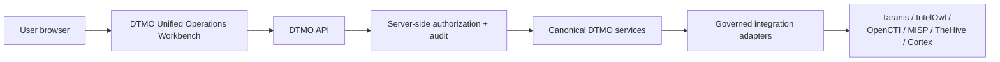

# DTMO Current Project State

Last reconciled: **2026-08-20**  
Software baseline: **16.0.0rc12 plus accepted post-RC13, E8 and Phase 11 repository enhancements**

## Executive summary

DTMO has completed Phases 1–7, RC13 functional acceptance and E8.1–E8.10 product evolution. Phase 8 and Phase 9 evidence remain historical and candidate-bound. Phase 10 concluded **`NO-GO / BLOCKED — PLATFORM INDUSTRIALISATION REQUIRED`**. DTMO is **not production authorized**.

The active programme is **Phase 11 — Platform Industrialisation**. Phase 11.1–11.9 and Phase 11.10a–11.10d are `PASS / REPOSITORY_COMPLETE`. Phase 11.10 remains `IN PROGRESS / FRESH CANDIDATE-BOUND EVIDENCE REQUIRED`.

The sole active bounded objective is **Phase 11.10e IntelOwl/Cortex integrated analysis**, status `IN PROGRESS / EXACT-HEAD VALIDATION REQUIRED`. Phase 11.10d delivered the accepted Unified Intelligence Workspace. Phase 11.10e integrates human-triggered IntelOwl enrichment and analyzer-only Cortex execution/history into the same canonical React/TypeScript/Vite workbench while preserving server-side RBAC, explicit analyzer allowlists, immutable evidence history and the prohibition on inferring local compromise or external-share authority from analyzer output. Fresh production-equivalent execution remains deferred until 11.10a–11.10o are complete and one immutable integrated candidate is frozen for 11.10p.

## Lifecycle position

| Stage | Status |
|---|---|
| Phases 1–7 | `PASS` |
| RC13 + owner retest | `PASS / OWNER_ACCEPTED` |
| E8.1–E8.10 | `PASS / REPOSITORY_COMPLETE` |
| Phase 8 | `PASS / OWNER_ACCEPTED — HISTORICAL CANDIDATE` |
| Phase 9 | `PASS / EXTERNAL_ASSURANCE_ACCEPTED — HISTORICAL CANDIDATE` |
| Phase 10 | `NO-GO / BLOCKED — PLATFORM INDUSTRIALISATION REQUIRED` |
| Phase 11 | `IN PROGRESS / ACTIVE` |
| Phase 11.1–11.2 Taranis | `PASS / REPOSITORY_COMPLETE` |
| Phase 11.3 IntelOwl | `PASS / REPOSITORY_COMPLETE` |
| Phase 11.4 OpenCTI | `PASS / REPOSITORY_COMPLETE` |
| Phase 11.5 MISP | `PASS / REPOSITORY_COMPLETE` |
| Phase 11.6 TheHive | `PASS / REPOSITORY_COMPLETE` |
| Phase 11.7 Cortex decision gate | `PASS / REPOSITORY_COMPLETE — HISTORICAL DECISION BASELINE` |
| Phase 11.7b Cortex analyzer connector | `PASS / REPOSITORY_COMPLETE` |
| Phase 11.8 integrated runtime industrialisation | `PASS / REPOSITORY_COMPLETE` |
| Phase 11.8a runtime foundation | `PASS / REPOSITORY_COMPLETE` |
| Phase 11.8b workload identity / external secrets | `PASS / REPOSITORY_COMPLETE` |
| Phase 11.8c ingress/TLS + network segmentation | `PASS / REPOSITORY_COMPLETE` |
| Phase 11.8d HA / disruption hardening | `PASS / REPOSITORY_COMPLETE` |
| Phase 11.8e observability hardening | `PASS / REPOSITORY_COMPLETE` |
| Phase 11.8f backup / restore / recovery hardening | `PASS / REPOSITORY_COMPLETE` |
| Phase 11.8g software supply-chain hardening | `PASS / REPOSITORY_COMPLETE` |
| Phase 11.8h capacity / resource planning | `PASS / REPOSITORY_COMPLETE` |
| Phase 11.8i exercised upgrade / rollback | `PASS / REPOSITORY_COMPLETE` |
| Phase 11.9 migration/compatibility | `PASS / REPOSITORY_COMPLETE` |
| Phase 11.10 production-equivalent validation | `IN PROGRESS / FRESH CANDIDATE-BOUND EVIDENCE REQUIRED` |
| Phase 11.10a frontend architecture/design contract | `PASS / REPOSITORY_COMPLETE` |
| Phase 11.10b canonical application shell | `PASS / REPOSITORY_COMPLETE` |
| Phase 11.10c Command Center | `PASS / REPOSITORY_COMPLETE` |
| Phase 11.10d Unified Intelligence Workspace | `PASS / REPOSITORY_COMPLETE` |
| Phase 11.10e IntelOwl/Cortex integrated analysis | `IN PROGRESS / EXACT-HEAD VALIDATION REQUIRED` |
| Phase 11.10f OpenCTI graph/entity workspace | `NOT STARTED` |
| Phase 11.10g MISP Sharing & Exchange | `NOT STARTED` |
| Phase 11.10h TheHive Investigations & Cases | `NOT STARTED` |
| Phase 11.10i Vulnerability & Exposure Center | `NOT STARTED` |
| Phase 11.10j Sources & Collection Control Center | `NOT STARTED` |
| Phase 11.10k Automation & Playbooks | `NOT STARTED` |
| Phase 11.10l Governance & Evidence Center | `NOT STARTED` |
| Phase 11.10m Operations & Administration | `NOT STARTED` |
| Phase 11.10n role-aware UX/accessibility | `NOT STARTED` |
| Phase 11.10o consolidation/full functional acceptance | `NOT STARTED` |
| Phase 11.10p fresh production-equivalent validation | `NOT STARTED / CANDIDATE FREEZE REQUIRED` |
| Phase 11.11 independent external assurance | `NOT STARTED` |
| Phase 12 | `NOT STARTED` |

## Accepted service and runtime boundaries

Taranis, IntelOwl, Cortex, OpenCTI, MISP and TheHive remain separate governed service/licensing boundaries. None gains DTMO human publication/share authority or establishes local compromise by itself. TheHive case-handoff authority remains distinct from publication/share authority.

Phase 11.8 is repository-complete. Accepted controls cover the Helm/GitOps Kubernetes runtime foundation, workload identity/external-secret delivery, TLS ingress/network segmentation, application HA/disruption controls, observability boundaries, backup/restore/recovery controls, software supply-chain hardening, capacity/resource planning and exercised upgrade/rollback. Phase 11.9 adds the accepted forward-first migration/application compatibility contract. These remain engineering controls and do not themselves establish production-equivalent behavior or production authorization.

## Accepted Unified Operations Workbench foundation

Phase 11.10a and Phase 11.10b are `PASS / REPOSITORY_COMPLETE`.

The canonical trust path remains:

Normal product workflows use **browser → DTMO API → governed integration adapter → upstream service**. The browser is not a privileged integration broker. Role-aware rendering is a usability function only; **server-side RBAC** remains authoritative.

11.10b delivered the separately built React/TypeScript/Vite application under `frontend/`, canonical `/workbench/` route family, responsive shell, command palette, context rail, strict same-origin CSP, immutable hashed assets, committed npm lockfile consumed with `npm ci`, and `/ui/console` as a migration compatibility path only.

Authoritative accepted baseline:

- `docs/architecture/FRONTEND_ARCHITECTURE.md`;
- `docs/architecture/UI_API_CONTRACT.md`;
- `docs/architecture/PHASE11_10B_APPLICATION_SHELL.md`;
- `docs/ux/UNIFIED_OPERATIONS_WORKBENCH.md`;
- `docs/ux/INFORMATION_ARCHITECTURE.md`;
- `docs/ux/DESIGN_SYSTEM.md`;
- `docs/qa/PHASE11_10A_FRONTEND_ARCHITECTURE_GATE.md`;
- `docs/qa/PHASE11_10B_APPLICATION_SHELL_GATE.md`;
- `.github/workflows/phase11-frontend-architecture.yml`;
- `.github/workflows/phase11-application-shell.yml`.

## Accepted Phase 11.10c Command Center boundary

Phase 11.10c is `PASS / REPOSITORY_COMPLETE` and remains the first functional workspace in the canonical workbench.

It delivers a read-only operational overview with canonical intelligence counts, high/critical intelligence, 24-hour intake, review/share-decision workload, high education relevance, recent canonical intelligence, governed integration capability state, role-aware quick navigation and Collect → Enrich → Analyze → Investigate → Respond → Learn orientation.

The integration panel distinguishes configuration from runtime observation. A configured or enabled integration is **not** labelled healthy solely from configuration. If the canonical datastore is unavailable, metric values remain `null` and missing evidence is not rendered as zero activity or a healthy platform. This boundary must **fail closed**.

Authoritative Phase 11.10c material:

- `backend/dtmo/command_center.py`;
- `backend/dtmo/api_command_center.py`;
- `frontend/src/App.tsx` and `frontend/src/command-center.css`;
- `docs/architecture/PHASE11_10C_COMMAND_CENTER.md`;
- `docs/qa/PHASE11_10C_COMMAND_CENTER_GATE.md`;
- `backend/tests/test_phase11_10c_command_center_contract.py`;
- `backend/tests/test_phase11_10c_command_center_browser.py`;
- `.github/workflows/phase11-command-center.yml`.

Phase 11.10c grants no review, sharing, case, connector or administration authority. Repository CI for that slice does not prove live upstream health, production-equivalent operation, independent assurance or production authorization.

## Accepted Phase 11.10d Unified Intelligence Workspace boundary

Phase 11.10d is `PASS / REPOSITORY_COMPLETE`. It replaces the Threat Intelligence placeholder with a functional read-only discovery and investigation workspace and delivers IOC Explorer as an indicator-oriented view over the same governed contracts.

The browser uses:

- `GET /api/v1/intelligence/search` for server-authorized discovery through the DTMO search service;
- `GET /api/v1/intelligence/{item_id}/workspace` for canonical DTMO object detail and provenance.

Search results remain discovery projections. Selected detail comes from canonical DTMO persistence. A zero-result query does not prove absence from every upstream source. Search-backend failure is rendered unavailable instead of synthetic empty state; canonical-detail failure never causes the browser to fabricate missing object fields from the search hit.

The workspace renders attributable severity, education relevance, confidence/rationale, review status, separate sharing approval state, CVE/known-exploited/vendor/product context and provenance where recorded. Search and investigation require `read:intelligence` and grant no review, publication/share approval, analyzer/connector execution, case mutation or administration authority.

Authoritative Phase 11.10d material:

- `frontend/src/UnifiedIntelligenceWorkspace.tsx`;
- `frontend/src/unified-intelligence.css`;
- `docs/architecture/PHASE11_10D_UNIFIED_INTELLIGENCE_WORKSPACE.md`;
- `docs/user/UNIFIED_INTELLIGENCE_WORKSPACE.md`;
- `docs/qa/PHASE11_10D_UNIFIED_INTELLIGENCE_WORKSPACE_GATE.md`;
- `backend/tests/test_phase11_10d_unified_intelligence_workspace_contract.py`;
- `backend/tests/test_phase11_10d_unified_intelligence_workspace_browser.py`;
- `.github/workflows/phase11-unified-intelligence-workspace.yml`.

Repository/browser CI for 11.10d does not prove live upstream completeness or health, production-equivalent operation, independent assurance or production authorization.

## Active Phase 11.10e IntelOwl/Cortex integrated analysis boundary

Phase 11.10e replaces the Analysis & Enrichment shell placeholder with a functional governed workspace at `/workbench/analysis`.

The slice preserves the existing IntelOwl DTMO execution/history contract and adds a browser-facing, analyzer-only Cortex DTMO API plus durable Cortex history. The integrated history endpoint presents both evidence streams against one canonical intelligence object.

Core controls are:

- `GET /api/v1/analysis/capabilities` requires `read:intelligence` and exposes configured capability/allowlist state without claiming runtime health;
- `GET /api/v1/analysis/items/{item_id}/history` requires `read:intelligence` and returns persisted IntelOwl/Cortex evidence;
- `POST /api/v1/intelowl/items/{item_id}/enrich` remains the existing human-authorized IntelOwl route;
- `POST /api/v1/analysis/items/{item_id}/cortex` requires `review:intelligence` and executes one explicit allowlisted Cortex analyzer;
- migration `0015_cortex_analysis_history` adds durable Cortex result history chained from `0014_thehive_handoff_state`;
- persisted Cortex evidence is constrained to `external_share_authorized=false` and `local_compromise_proven=false`;
- Cortex responders, automatic analyzer discovery, automatic IntelOwl fallback and other side-effect actions remain outside the slice;
- failed history or execution is rendered unavailable and must **fail closed** rather than synthesizing a result.

The browser is not a privileged upstream client. Server-side RBAC remains authoritative; read-only principals may inspect evidence but cannot use the execution controls as authorized actions.

Authoritative Phase 11.10e material:

- `backend/dtmo/intelowl_execution.py`;
- `backend/dtmo/persistence/cortex.py`;
- `database/migrations/versions/0015_cortex_analysis_history.py`;
- `frontend/src/AnalysisWorkspace.tsx`;
- `frontend/src/analysis-workspace.css`;
- `docs/architecture/PHASE11_10E_INTEGRATED_ANALYSIS_WORKSPACE.md`;
- `docs/user/INTEGRATED_ANALYSIS_WORKSPACE.md`;
- `docs/qa/PHASE11_10E_INTEGRATED_ANALYSIS_GATE.md`;
- `backend/tests/test_phase11_10e_integrated_analysis_contract.py`;
- `backend/tests/test_phase11_10e_integrated_analysis_browser.py`;
- `.github/workflows/phase11-integrated-analysis-workspace.yml`.

IntelOwl and Cortex output is evidence, not a verdict: it does **not prove** local compromise and grants no external-share, publication, case or production authority. Repository/browser CI does not prove live analyzer/provider availability, production-equivalent operation, independent assurance or production authorization.

After Phase 11.10e exact-head acceptance and merge, the only next bounded priority is **Phase 11.10f — OpenCTI graph/entity workspace**.

## Phase 11.10 external validation boundary

Fresh production-equivalent validation remains mandatory, but is the final 11.10 candidate step **11.10p** after 11.10a–11.10o candidate completion and functional acceptance.

11.10p requires fresh production-equivalent evidence for the **same immutable** integrated deployment identity and one production-equivalent environment. Mandatory evidence remains candidate identity, migration/compatibility, upgrade, rollback, health, saturation and recovery. Rollback must identify the exact prior immutable digest and include post-rollback health; application rollback does not authorize automatic database down migration.

Historical Phase 8/9 evidence remains audit history only and is not reusable. Missing, placeholder, inaccessible, mixed-candidate or historical-only evidence must **fail closed**.

The external execution package remains authoritative:

- `docs/qa/PHASE11_10_PRODUCTION_EQUIVALENT_VALIDATION_GATE.md`;
- `docs/operations/PHASE11_10_PRODUCTION_EQUIVALENT_VALIDATION_RUNBOOK.md`;
- `docs/evidence/PHASE11_10_PRODUCTION_EQUIVALENT_EVIDENCE.template.json`;
- `tools/phase11_production_equivalent_validation.py`;
- `backend/tests/test_phase11_10_production_equivalent_validation.py`;
- `.github/workflows/phase11-production-equivalent-validation.yml`.

Repository CI validates repository contracts and exact-head metadata only. It does not prove that the production-equivalent environment has been deployed or exercised. Phase 11.10 may become `PASS / OWNER_ACCEPTED` only after 11.10a–11.10o are complete, one candidate is frozen, the 11.10p evidence package is complete and the accountable owner accepts it. Phase 11.11 must then run against the same immutable integrated candidate before Phase 12 can make the formal production decision.
