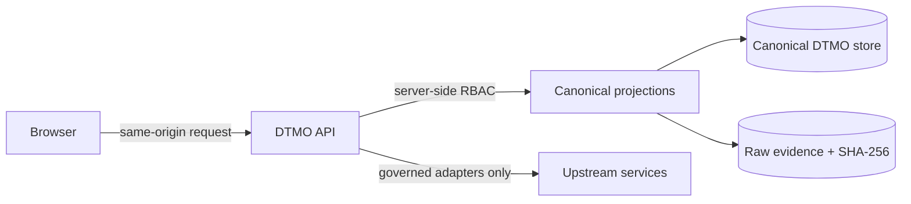

# DTMO Current Project State

Last reconciled: **2026-08-21**  
Software baseline: **16.0.0rc12 plus accepted post-RC13, E8 and Phase 11 repository enhancements**

## Executive summary

DTMO has completed Phases 1–7, RC13 functional acceptance and E8.1–E8.10 product evolution. Phase 8 and Phase 9 evidence remain historical and candidate-bound. Phase 10 concluded **`NO-GO / BLOCKED — PLATFORM INDUSTRIALISATION REQUIRED`**. DTMO is **not production authorized**.

The active programme is **Phase 11 — Platform Industrialisation**. Phase 11.1–11.9 and Phase 11.10a–11.10h are `PASS / REPOSITORY_COMPLETE`. Phase 11.10 remains `IN PROGRESS / FRESH CANDIDATE-BOUND EVIDENCE REQUIRED`.

The sole active bounded objective is **Phase 11.10i — Vulnerability & Exposure Center**, status `IN PROGRESS / EXACT-HEAD VALIDATION REQUIRED`. Phase 11.10i connects the canonical `/workbench/exposure` route to a read-only DTMO vulnerability intelligence workspace over the accepted server-authorized vulnerability analytics projection. CVSS, EPSS, CISA KEV, CWE and vendor/product mappings remain prioritization evidence only: they do not establish local exposure, exploitability, compromise, remediation or safety.

Fresh production-equivalent execution remains deferred until 11.10a–11.10o are complete and one immutable integrated candidate is frozen for 11.10p.

## Lifecycle position

| Stage | Status |
|---|---|
| Phases 1–7 | `PASS` |
| RC13 + owner retest | `PASS / OWNER_ACCEPTED` |
| E8.1–E8.10 | `PASS / REPOSITORY_COMPLETE` |
| Phase 8 | `PASS / OWNER_ACCEPTED — HISTORICAL CANDIDATE` |
| Phase 9 | `PASS / EXTERNAL_ASSURANCE_ACCEPTED — HISTORICAL CANDIDATE` |
| Phase 10 | `NO-GO / BLOCKED — PLATFORM INDUSTRIALISATION REQUIRED` |
| Phase 11 | `IN PROGRESS / ACTIVE` |
| Phase 11.1–11.2 Taranis | `PASS / REPOSITORY_COMPLETE` |
| Phase 11.3 IntelOwl | `PASS / REPOSITORY_COMPLETE` |
| Phase 11.4 OpenCTI | `PASS / REPOSITORY_COMPLETE` |
| Phase 11.5 MISP | `PASS / REPOSITORY_COMPLETE` |
| Phase 11.6 TheHive | `PASS / REPOSITORY_COMPLETE` |
| Phase 11.7 Cortex decision gate | `PASS / REPOSITORY_COMPLETE — HISTORICAL DECISION BASELINE` |
| Phase 11.7b Cortex analyzer connector | `PASS / REPOSITORY_COMPLETE` |
| Phase 11.8 integrated runtime industrialisation | `PASS / REPOSITORY_COMPLETE` |
| Phase 11.8a runtime foundation | `PASS / REPOSITORY_COMPLETE` |
| Phase 11.8b workload identity / external secrets | `PASS / REPOSITORY_COMPLETE` |
| Phase 11.8c ingress/TLS + network segmentation | `PASS / REPOSITORY_COMPLETE` |
| Phase 11.8d HA / disruption hardening | `PASS / REPOSITORY_COMPLETE` |
| Phase 11.8e observability hardening | `PASS / REPOSITORY_COMPLETE` |
| Phase 11.8f backup / restore / recovery hardening | `PASS / REPOSITORY_COMPLETE` |
| Phase 11.8g software supply-chain hardening | `PASS / REPOSITORY_COMPLETE` |
| Phase 11.8h capacity / resource planning | `PASS / REPOSITORY_COMPLETE` |
| Phase 11.8i exercised upgrade / rollback | `PASS / REPOSITORY_COMPLETE` |
| Phase 11.9 migration/compatibility | `PASS / REPOSITORY_COMPLETE` |
| Phase 11.10 production-equivalent validation | `IN PROGRESS / FRESH CANDIDATE-BOUND EVIDENCE REQUIRED` |
| Phase 11.10a frontend architecture/design contract | `PASS / REPOSITORY_COMPLETE` |
| Phase 11.10b canonical application shell | `PASS / REPOSITORY_COMPLETE` |
| Phase 11.10c Command Center | `PASS / REPOSITORY_COMPLETE` |
| Phase 11.10d Unified Intelligence Workspace | `PASS / REPOSITORY_COMPLETE` |
| Phase 11.10e IntelOwl/Cortex integrated analysis | `PASS / REPOSITORY_COMPLETE` |
| Phase 11.10f OpenCTI graph/entity workspace | `PASS / REPOSITORY_COMPLETE` |
| Phase 11.10g MISP Sharing & Exchange | `PASS / REPOSITORY_COMPLETE` |
| Phase 11.10h TheHive Investigations & Cases | `PASS / REPOSITORY_COMPLETE` |
| Phase 11.10i Vulnerability & Exposure Center | `IN PROGRESS / EXACT-HEAD VALIDATION REQUIRED` |
| Phase 11.10j Sources & Collection Control Center | `NOT STARTED` |
| Phase 11.10k Automation & Playbooks | `NOT STARTED` |
| Phase 11.10l Governance & Evidence Center | `NOT STARTED` |
| Phase 11.10m Operations & Administration | `NOT STARTED` |
| Phase 11.10n role-aware UX/accessibility | `NOT STARTED` |
| Phase 11.10o consolidation/full functional acceptance | `NOT STARTED` |
| Phase 11.10p fresh production-equivalent validation | `NOT STARTED / CANDIDATE FREEZE REQUIRED` |
| Phase 11.11 independent external assurance | `NOT STARTED` |
| Phase 12 | `NOT STARTED` |

## Governing service and trust boundaries

Taranis, IntelOwl, Cortex, OpenCTI, MISP and TheHive remain separate governed service/licensing boundaries. None gains DTMO human publication/share authority or establishes local compromise by itself. The browser remains an unprivileged same-origin DTMO client. Server-side RBAC, provenance, handling restrictions and human authority remain authoritative.

The canonical trust path remains:

Repository CI validates repository contracts only. It does not establish production-equivalent behavior, independent assurance or production authorization.

## Accepted Unified Operations Workbench slices

Accepted repository-complete workbench slices are:

- 11.10a frontend architecture/design contract;
- 11.10b canonical React/TypeScript/Vite application shell;
- 11.10c Command Center;
- 11.10d Unified Intelligence Workspace;
- 11.10e IntelOwl/Cortex Integrated Analysis;
- 11.10f OpenCTI graph/entity workspace;
- 11.10g MISP Sharing & Exchange;
- 11.10h TheHive Investigations & Cases.

The active 11.10i slice adds Vulnerability & Exposure without creating a parallel vulnerability datastore or browser-held upstream credential path.

## Accepted Phase 11.10h TheHive boundary

Phase 11.10h is repository-complete. `/workbench/investigations` composes canonical intelligence/provenance with durable TheHive case-handoff evidence. `GET /api/v1/thehive/items/{item_id}/investigation` requires `read:intelligence`; `POST /api/v1/thehive/items/{item_id}/cases` retains explicit human `handoff:case` authority. Reserved or ambiguous handoff state fails closed and requires reconciliation. The UI does not receive TheHive credentials and does not infer responder action, remediation, compromise or production evidence.

Authoritative material remains:

- `backend/dtmo/thehive_handoff.py`;
- `frontend/src/InvestigationsWorkspace.tsx`;
- `docs/architecture/PHASE11_10H_THEHIVE_INVESTIGATIONS_CASES.md`;
- `docs/user/THEHIVE_INVESTIGATIONS_WORKSPACE.md`;
- `docs/qa/PHASE11_10H_THEHIVE_INVESTIGATIONS_GATE.md`;
- `.github/workflows/phase11-thehive-investigations.yml`.

## Active Phase 11.10i Vulnerability & Exposure boundary

Phase 11.10i makes `/workbench/exposure` functional through `ExposureWorkspace`. The frontend reads `GET /api/v1/console/vulnerability-analytics?window=30d` through same-origin DTMO APIs. Server-side `read:intelligence` remains authoritative; no scanner or upstream service credential is exposed to the browser.

The workspace supports evidence-backed prioritization using CVSS, EPSS and CISA KEV indicators and retains raw-evidence linkage when available. These fields are intelligence inputs, not assertions about an organization's assets. Missing, malformed, inaccessible or degraded evidence must remain visible and fail closed rather than being converted into a healthy or zero-risk state.

Authoritative Phase 11.10i material:

- `frontend/src/ExposureWorkspace.tsx`;
- `frontend/src/App.tsx` canonical `/exposure` routing;
- `docs/architecture/PHASE11_10I_VULNERABILITY_EXPOSURE.md`;
- `docs/user/VULNERABILITY_EXPOSURE_WORKSPACE.md`;
- `docs/qa/PHASE11_10I_VULNERABILITY_EXPOSURE_GATE.md`;
- `backend/tests/test_phase11_10i_vulnerability_exposure_contract.py`;
- `.github/workflows/phase11-vulnerability-exposure.yml`.

Acceptance requires the dedicated exact-head gate, application-shell/frontend gates and Professional Documentation Gate to be `completed/success` on the same final commit. Green repository CI remains **non-production evidence**.

After 11.10i is accepted and merged, the next bounded priority is **Phase 11.10j — Sources & Collection Control Center**.

## Phase 11.10p external validation boundary

Fresh production-equivalent validation remains mandatory as the final 11.10 candidate step after 11.10a–11.10o candidate completion and functional acceptance.

11.10p requires fresh production-equivalent evidence for the **same immutable** integrated deployment identity and one production-equivalent environment. Required evidence remains candidate identity, migration/compatibility, upgrade, exact-prior-digest rollback with post-rollback health, health/readiness, representative saturation/capacity and recovery/continuity.

Historical Phase 8/9 evidence remains audit history only and is not reusable. Missing, placeholder, inaccessible, mixed-candidate or historical-only evidence must **fail closed**.

The external execution package remains authoritative:

- `docs/qa/PHASE11_10_PRODUCTION_EQUIVALENT_VALIDATION_GATE.md`;
- `docs/operations/PHASE11_10_PRODUCTION_EQUIVALENT_VALIDATION_RUNBOOK.md`;
- `docs/evidence/PHASE11_10_PRODUCTION_EQUIVALENT_EVIDENCE.template.json`;
- `tools/phase11_production_equivalent_validation.py`;
- `backend/tests/test_phase11_10_production_equivalent_validation.py`;
- `.github/workflows/phase11-production-equivalent-validation.yml`.

Phase 11.10 may become `PASS / OWNER_ACCEPTED` only after 11.10a–11.10o are complete, one candidate is frozen, the 11.10p evidence package for the same immutable candidate is complete and the accountable owner accepts it. Phase 11.11 must then run against that same candidate before Phase 12 can make the formal production decision.
