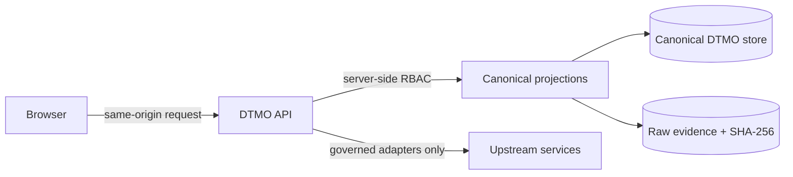

# DTMO Current Project State

Last reconciled: **2026-08-26**  
Software baseline: **16.0.0rc12 plus accepted post-RC13, E8 and Phase 11 repository enhancements**

## Executive summary

DTMO remains **not production authorized**. Repository-controlled CI, local/staging emulators and browser acceptance gates are repository evidence only; they do not establish production-equivalent behavior, independent external assurance or real operator usability.

On **2026-08-26**, an external owner functional test of the current integrated version produced a new **functional rejection / NO-GO**. That finding supersedes the earlier assumption that fresh candidate freeze and Phase 11.10p production-equivalent validation were the next executable lifecycle step. Phase 11.10p is therefore **BLOCKED** until a new owner functional acceptance is recorded against a materially repaired candidate.

The repository remains valuable engineering evidence: Phase 11.10a–11.10o and the later 11.10q recovery slices proved bounded contracts and repository-controlled journeys. They are not reclassified or erased. However, those checks did **not** prove that a clean external installation is a complete, populated and professionally usable product. The external owner test demonstrates that the current product-integration baseline still fails that higher-level acceptance requirement.

The active lifecycle priority is now **Phase 11 functional recovery — external-owner rejection remediation**. No candidate freeze, production-equivalent exercise, independent assurance or production decision may proceed until this recovery is complete and explicitly owner-accepted.

## Lifecycle position

| Stage | Status |
|---|---|
| Phases 1–7 | `PASS` |
| RC13 + historical owner retest | `PASS / OWNER_ACCEPTED — HISTORICAL BASELINE` |
| E8.1–E8.10 | `PASS / REPOSITORY_COMPLETE` |
| Phase 8 | `PASS / OWNER_ACCEPTED — HISTORICAL CANDIDATE` |
| Phase 9 | `PASS / EXTERNAL_ASSURANCE_ACCEPTED — HISTORICAL CANDIDATE` |
| Phase 10 | `NO-GO / BLOCKED — PLATFORM INDUSTRIALISATION REQUIRED` |
| Phase 11 | `IN PROGRESS / FUNCTIONAL RECOVERY ACTIVE` |
| Phase 11.1–11.9 | `PASS / REPOSITORY_COMPLETE` |
| Phase 11.10a–11.10o | `PASS / REPOSITORY_COMPLETE` |
| Phase 11.10a frontend architecture/design contract | `PASS / REPOSITORY_COMPLETE` |
| Phase 11.10b canonical application shell | `PASS / REPOSITORY_COMPLETE` |
| Phase 11.10c Command Center | `PASS / REPOSITORY_COMPLETE` |
| Phase 11.10d Unified Intelligence Workspace | `PASS / REPOSITORY_COMPLETE` |
| Phase 11.10e IntelOwl/Cortex integrated analysis | `PASS / REPOSITORY_COMPLETE` |
| Phase 11.10f OpenCTI graph/entity workspace | `PASS / REPOSITORY_COMPLETE` |
| Phase 11.10g MISP Sharing & Exchange | `PASS / REPOSITORY_COMPLETE` |
| Phase 11.10h TheHive Investigations & Cases | `PASS / REPOSITORY_COMPLETE` |
| Phase 11.10i Vulnerability & Exposure Center | `PASS / REPOSITORY_COMPLETE` |
| Phase 11.10j Sources & Collection Control Center | `PASS / REPOSITORY_COMPLETE` |
| Phase 11.10k Automation & Playbooks | `PASS / REPOSITORY_COMPLETE` |
| Phase 11.10l Governance & Evidence Center | `PASS / REPOSITORY_COMPLETE` |
| Phase 11.10m Operations & Administration | `PASS / REPOSITORY_COMPLETE` |
| Phase 11.10n role-aware UX/accessibility | `PASS / REPOSITORY_COMPLETE` |
| Phase 11.10o consolidation/full functional acceptance contracts | `PASS / REPOSITORY_COMPLETE` |
| Phase 11.10q Functional Recovery Acceptance | `HISTORICAL OWNER-AUTHORIZED MERGE; SUPERSEDED BY 2026-08-26 FUNCTIONAL REJECTION` |
| Current external-owner functional acceptance | `NO-GO / REJECTED` |
| Fresh candidate freeze | `BLOCKED` |
| Phase 11.10p fresh production-equivalent validation | `BLOCKED BY FUNCTIONAL REJECTION` |
| Phase 11.11 independent external assurance | `NOT STARTED / BLOCKED` |
| Phase 12 | `NOT STARTED / BLOCKED` |

The Phase 8 and Phase 9 accepted states remain historical, candidate-bound audit facts. They are not evidence for the current candidate.

## 2026-08-26 external owner findings

The current integrated version is not yet a professionally usable operator product. The external owner test reported the following observable defects:

- the `admin-tester · admin` experience exposes many controls that do not produce a usable end-to-end result;
- canonical Administration remains operationally difficult to use and its layout is not acceptable;
- important platform components are not available as an immediately working default experience; Grafana dashboards are a reported example;
- Threat Intelligence opens without useful content;
- IOC Explorer opens without useful content;
- Knowledge Graph contains data but its user functions are not reliably usable;
- Vulnerability & Exposure Center does not provide a reliably working workflow;
- Investigations is not a workable case interface;
- Analysis & Enrichment does not reliably reflect updated execution/results;
- Sharing & Exchange is not a workable sharing interface;
- Automation & Playbooks is not a workable automation interface;
- Sources & Collection is not a workable source lifecycle interface;
- Governance & Evidence does not yet provide sufficient operational value in its current form.

These observations are owner functional evidence only. They are not represented as production-equivalent, penetration-test or independent-assurance evidence.

## Confirmed repository/runtime integration gaps

Repository inspection after the owner rejection confirms two important integration facts that must be addressed during recovery:

1. external framework feature switches currently default to disabled in `backend/dtmo/config.py`; and
2. the default local Compose topology includes DTMO core storage/search/observability services such as PostgreSQL, Redis, OpenSearch, object storage, Prometheus and Grafana, but it does not itself instantiate all external framework services (for example MISP, AIL, Taranis AI, IntelOwl, Cortex, OpenCTI and TheHive).

That architecture can be secure and modular, but the current product experience does not make the distinction sufficiently actionable for an operator. A professional default installation must either provide the required component as part of the supported topology or clearly present a ready/configure/connect state with guided setup and meaningful local data. A blank or inert workspace is not accepted as functional completion.

External integrations must **not** be blindly enabled when credentials, endpoint identity, analyzer/entity allowlists or other required scopes are absent. Recovery must preserve fail-closed activation, server-side credentials, RBAC and explicit human authority.

## Active functional recovery order

Recovery is executed one bounded, reviewable slice at a time. Every slice requires real canonical-browser/API behavior and persistence where applicable; heading-only tests, source-code marker tests or mocked success responses are insufficient as owner-functionality evidence.

1. **Administration and default platform readiness** — make the canonical admin layout usable; make component state/readiness explicit; ensure bundled core services such as Grafana are available through the supported default startup path; prove real save/reload/health behavior and clear blockers for unconfigured external services.
2. **Data bootstrap and Sources & Collection** — provide a supported path from clean installation to useful intelligence content; make source bootstrap/register/validate/activate/run/status workflows usable without legacy UI.
3. **Threat Intelligence + IOC Explorer** — prove useful populated discovery/search/filter/detail/pivot workflows from the default supported data path.
4. **Knowledge Graph + Vulnerability & Exposure** — prove graph interactions and vulnerability evidence/filter/pivot workflows against real persisted projections.
5. **Investigations + Analysis & Enrichment** — prove case handoff/history and enrichment execution/history/reload as coherent operator journeys.
6. **Sharing & Exchange + Automation & Playbooks** — prove governed human-authorized sharing and executable automation with durable state and explicit prohibited side effects.
7. **Governance & Evidence** — redesign the surface around actionable control/framework evidence, gaps, mappings and drill-down rather than static informational presence.
8. **Whole-product owner acceptance** — repeat the complete external functional test from a clean supported installation. Candidate freeze is blocked until this explicitly passes.

Security boundaries remain non-negotiable throughout recovery: RBAC/separation of duties, provenance/raw-evidence binding, fail-closed missing state, explicit human review/share/publication authority and server-side credential storage must not be weakened to make tests pass.

## Repository hygiene and professionalisation backlog

Repository hygiene is part of the recovery programme but must not be mixed into functional code slices.

- GitHub currently contains a very large number of historical working branches. A dedicated repository-hygiene slice must inventory branches, retain protected/current/release/evidence-relevant refs, and delete only branches that are demonstrably merged or obsolete. No branch is deleted solely because it is old.
- Stable documentation must be separated from transient delivery/run history and organised around installation, architecture, operation, security, user workflows, governance and assurance.
- A single authoritative installation guide must cover prerequisites, local/reference startup, generated/local credentials, required licensed/external prerequisites, service URLs, first-login/admin workflow, health checks, first-data workflow and troubleshooting.
- User-guide screenshots must be regenerated from the current canonical UI; obsolete screenshots must not remain presented as current product behavior.
- AIL must be made discoverable as a first-class framework building block in architecture, integration and operator documentation.
- `docs/architecture/SYSTEM_ARCHITECTURE.md` section **4.1 TheHive mutation trust boundary** must be corrected so the diagram/rich display renders reliably in the supported documentation surface.

Documentation professionalisation does not substitute for functional remediation. Both must be complete before a new candidate can be frozen.

## Governing trust boundaries

Taranis AI, IntelOwl, Cortex, OpenCTI, MISP, AIL and TheHive remain separate governed service boundaries. The browser remains an unprivileged same-origin DTMO client. Credentials remain server-side and RBAC, provenance, human review/share authority and fail-closed behavior remain authoritative.

A successful connector or enrichment run proves only the recorded DTMO action and resulting persisted state. It does not prove upstream truth, local compromise, remediation success, publication authority, production readiness or production authorization.

## Candidate-freeze and assurance boundary

Phase 11.10p production-equivalent validation and Phase 11.11 independent external assurance remain required later, but they are **not the active priority while functional acceptance is NO-GO**.

When functional recovery is explicitly owner-accepted, a new candidate must be frozen and bound to one exact immutable application identity. Production-equivalent evidence must then cover the exact deployed Git commit, immutable image digests, migration head, deployment revision, approved environment identity, upgrade, health/readiness, saturation/capacity, recovery and exact-prior-digest rollback. Any later independent assurance must evaluate the same immutable candidate.

No current repository state is described here as fresh production-equivalent, penetration-tested, independently assured or production authorized unless separately supported by candidate-bound evidence and an explicit accountable acceptance decision.
