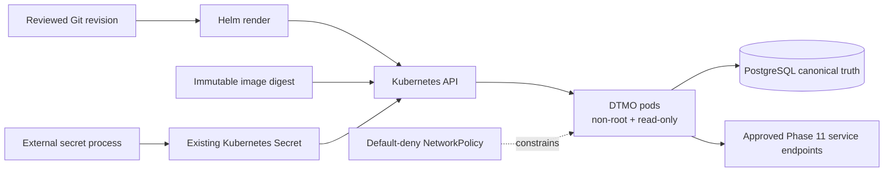

# DTMO Current Project State

Last reconciled: **2026-08-17**  
Software baseline: **16.0.0rc12 plus accepted post-RC13, E8 and Phase 11 repository enhancements**

## Executive summary

DTMO has completed Phases 1–7, RC13 functional acceptance and E8.1–E8.10 product evolution. Phase 8 and Phase 9 evidence remain historical and candidate-bound. Phase 10 concluded **`NO-GO / BLOCKED — PLATFORM INDUSTRIALISATION REQUIRED`**. DTMO is **not production authorized**.

The active programme is **Phase 11 — Platform Industrialisation**. Phase 11.1–11.7b are now `PASS / REPOSITORY_COMPLETE`, with the original 11.7 Cortex no-adoption decision preserved as a historical decision baseline and the later owner-required 11.7b Cortex analyzer connector accepted separately. The sole active bounded objective is now **Phase 11.8a runtime foundation**, currently `IN PROGRESS / EXACT-HEAD VALIDATION REQUIRED`.

## Lifecycle position

| Stage | Status |
|---|---|
| Phases 1–7 | `PASS` |
| RC13 + owner retest | `PASS / OWNER_ACCEPTED` |
| E8.1–E8.10 | `PASS / REPOSITORY_COMPLETE` |
| Phase 8 | `PASS / OWNER_ACCEPTED — HISTORICAL CANDIDATE` |
| Phase 9 | `PASS / EXTERNAL_ASSURANCE_ACCEPTED — HISTORICAL CANDIDATE` |
| Phase 10 | `NO-GO / BLOCKED — PLATFORM INDUSTRIALISATION REQUIRED` |
| Phase 11 | `IN PROGRESS / ACTIVE` |
| Phase 11.1–11.2 Taranis | `PASS / REPOSITORY_COMPLETE` |
| Phase 11.3 IntelOwl | `PASS / REPOSITORY_COMPLETE` |
| Phase 11.4 OpenCTI | `PASS / REPOSITORY_COMPLETE` |
| Phase 11.5 MISP | `PASS / REPOSITORY_COMPLETE` |
| Phase 11.6 TheHive | `PASS / REPOSITORY_COMPLETE` |
| Phase 11.7 Cortex decision gate | `PASS / REPOSITORY_COMPLETE — HISTORICAL DECISION BASELINE` |
| Phase 11.7b Cortex analyzer connector | `PASS / REPOSITORY_COMPLETE` |
| Phase 11.8a runtime foundation | `IN PROGRESS / EXACT-HEAD VALIDATION REQUIRED` |
| Phase 11.9 migration/compatibility | `NOT STARTED` |
| Phase 11.10 production-equivalent validation | `NOT STARTED` |
| Phase 11.11 independent external assurance | `NOT STARTED` |
| Phase 12 | `NOT STARTED` |

## Accepted Phase 11 service boundaries

Taranis provides governed collection/canonicalization; IntelOwl provides bounded human-authorized enrichment with immutable history; Cortex provides bounded analyzer-only enrichment; OpenCTI provides bounded graph integration and durable identity reconciliation; MISP provides governed inbound/outbound exchange with authoritative restriction state; TheHive provides minimal explicit human-authorized case handoff with durable mutation reservation/reconciliation and no blind replay after ambiguity.

All remain separate service and licensing boundaries. None gains DTMO human publication/share authority or establishes local compromise by itself. TheHive case-handoff authority remains distinct from publication/share authority.

## Active Phase 11.8a runtime foundation

The first bounded 11.8 slice establishes a governed Helm/GitOps Kubernetes foundation for the DTMO application workload. The chart requires an immutable image digest, references an existing runtime Secret rather than storing secret material in Git, runs non-root with a read-only root filesystem and dropped capabilities, disables service-account token automounting, supplies probes/resources, applies a PodDisruptionBudget and enables fail-closed NetworkPolicy with explicit external CIDR allowlisting.

This foundation does **not** yet prove stateful or multi-zone HA, live secret-provider/workload-identity integration, ingress/TLS policy, centralized metrics/logs/traces, recovery objectives, SBOM/scanning/signing/attestation, capacity, upgrade/rollback behavior or production-equivalent runtime characteristics. Those are later bounded Phase 11.8 slices.

## Governance and evidence boundary

Repository CI can prove chart, policy and documentation contracts only. It cannot prove Kubernetes admission behavior in a target cluster, cloud IAM, secret-provider permissions, CNI enforcement, runtime availability, recovery objectives, service entitlement or lawful disclosure authorization.

Historical Phase 8/9 evidence remains valid only for the earlier candidate and is not reused for the materially changed Phase 11 platform. Fresh Phase 11.10 production-equivalent validation and Phase 11.11 independent assurance remain required before Phase 12.

## Phase 11 fixed order

1. Taranis AI — `PASS / REPOSITORY_COMPLETE`;
2. IntelOwl — `PASS / REPOSITORY_COMPLETE`;
3. OpenCTI — `PASS / REPOSITORY_COMPLETE`;
4. MISP — `PASS / REPOSITORY_COMPLETE`;
5. TheHive — `PASS / REPOSITORY_COMPLETE`;
6. original Cortex conditional decision — historical `PASS / REPOSITORY_COMPLETE`;
7. owner-required Cortex analyzer connector — `PASS / REPOSITORY_COMPLETE`;
8. Kubernetes/Helm/GitOps and integrated runtime hardening — active Phase 11.8, beginning with 11.8a runtime foundation;
9. migration/compatibility;
10. new production-equivalent validation;
11. new independent external assurance;
12. Phase 12 formal production GO/NO-GO.
