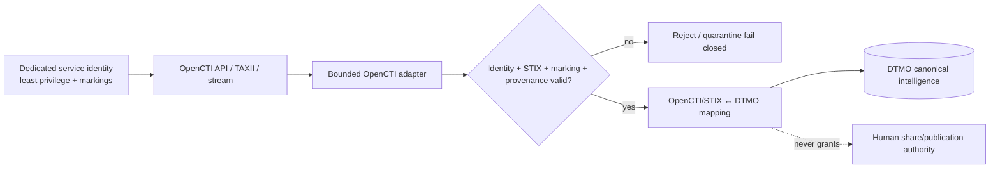

# DTMO Current Project State

Last reconciled: **2026-08-16**  
Software baseline: **16.0.0rc12 plus accepted post-RC13, E8 and Phase 11 repository enhancements**

## Executive summary

DTMO has completed the repository-controlled engineering baseline through Phase 7, RC13 functional unified-console acceptance and E8.1–E8.10 product evolution. RC13 is `PASS / OWNER_ACCEPTED`; E8.1–E8.10 are `PASS / REPOSITORY_COMPLETE`.

Phase 8 production-equivalent validation is `PASS / OWNER_ACCEPTED` and Phase 9 independent external assurance is `PASS / EXTERNAL_ASSURANCE_ACCEPTED` for the earlier candidate they covered. Phase 10 concluded **`NO-GO / BLOCKED — PLATFORM INDUSTRIALISATION REQUIRED`**. DTMO is **not production authorized**.

The active programme is **Phase 11 — Platform Industrialisation**. Phase 11.1 Taranis architecture/contract and Phase 11.2 Taranis adapter are **`PASS / REPOSITORY_COMPLETE`**. The **Phase 11.3 IntelOwl contract**, bounded adapter and governed execution/persistence integration are **`PASS / REPOSITORY_COMPLETE`**. The active bounded objective is **Phase 11.4 OpenCTI service/API/STIX/data-model/identity/security/licensing contract validation**.

## Lifecycle position

| Stage | Status |
|---|---|
| Phases 1–7 | `PASS` |
| RC13 + owner retest | `PASS / OWNER_ACCEPTED` |
| E8.1–E8.10 | `PASS / REPOSITORY_COMPLETE` |
| Phase 8 | `PASS / OWNER_ACCEPTED` |
| Phase 9 | `PASS / EXTERNAL_ASSURANCE_ACCEPTED` |
| Phase 10 | `NO-GO / BLOCKED — PLATFORM INDUSTRIALISATION REQUIRED` |
| Phase 11 | `IN PROGRESS / ACTIVE` |
| Phase 11.1 Taranis architecture/contract | `PASS / REPOSITORY_COMPLETE` |
| Phase 11.2 Taranis adapter | `PASS / REPOSITORY_COMPLETE` |
| Phase 11.3 IntelOwl contract | `PASS / REPOSITORY_COMPLETE` |
| Phase 11.3 IntelOwl integration | `PASS / REPOSITORY_COMPLETE` |
| Phase 11.4 OpenCTI contract | `IN PROGRESS / EXACT-HEAD VALIDATION REQUIRED` |
| Phase 12 | `NOT STARTED` |

## Accepted product and integration capabilities

The accepted DTMO baseline provides the canonical application shell across Overview, Intelligence, Sources & Catalog, Visual Analytics, Administration and Governance; severity/classification filters; governed source/provenance operations; native analytics; RBAC administration; repository-backed governance knowledge; OpenCVE; CIRCL Vulnerability-Lookup; vulnerability prioritization; governed MISP read/export; AIL read/enrichment/correlation; and explicit framework/evidence semantics.

Phase 11.2 provides the repository-complete Taranis read-only canonical integration with durable checkpointing/reconciliation, detail/CTI retrieval, governed execution, canonical persistence/indexing and observability.

Phase 11.3 provides the repository-complete IntelOwl service boundary, bounded enrichment adapter, human-authorized `REVIEW_INTELLIGENCE` execution, durable enrichment history and read-only history access. IntelOwl enrichment never grants external-share authority and does not prove local compromise.

## Phase 11.4 OpenCTI contract baseline

The reviewed compatibility baseline is **OpenCTI 7.260811.0**. OpenCTI Community Edition is Apache-2.0; Enterprise Edition uses a separate license. DTMO will consume OpenCTI as a separate service/API boundary and will not vendor OpenCTI source in this phase.

The contract defines GraphQL, STIX 2.1, TAXII 2.1 and access-controlled stream interfaces; a dedicated least-privilege non-human identity; explicit OpenCTI/STIX-to-DTMO identity mapping; marking/TLP/PAP, confidence and provenance preservation; restart-safe pagination/stream reconciliation; and fail-closed handling of authorization, marking and malformed/unsupported STIX conditions.

The initial adapter after contract acceptance is read-oriented. It does not authorize OpenCTI connector registration, MISP synchronization, arbitrary GraphQL mutation, external enrichment, TheHive case creation or report publication.

Graph presence, relationship confidence or upstream labels do not establish local exposure, exploitability, compromise, attribution certainty, DTMO severity or remediation completion.

## Data and persistence model

- **PostgreSQL** — canonical DTMO application, intelligence, RBAC and IntelOwl enrichment-history state;
- **OpenSearch** — supporting search/index representation;
- **S3-compatible object storage** — raw source/evidence objects;
- **Redis** — queue/cache/runtime coordination;
- **Prometheus/Grafana** — operational observability;
- **OpenCTI** — external STIX knowledge-graph service under an explicit identity/provenance mapping boundary, not a replacement for DTMO canonical truth.

A later OpenCTI adapter may add durable mapping/checkpoint state only through a separately accepted bounded PR and migration as required.

## Security and authority model

Server-side RBAC, least privilege, human/service separation, auditable privileged actions, provenance, data minimization and explicit review/share approval remain authoritative.

Taranis cannot grant DTMO publication/share authority. IntelOwl jobs/results cannot grant DTMO publication/share authority or local-compromise proof. OpenCTI entities, relationships, confidence, connectors and stream events follow the same rule.

For OpenCTI, routine integration requires a dedicated non-human identity with minimum knowledge/read capability and only the markings required by scope. `Bypass all capabilities`, administrator authority or connector capabilities are not routine integration requirements. `401`, `403`, unknown markings and malformed STIX fail closed; privilege is never broadened automatically.

No connector, successful import, enrichment result, graph relationship, CI result, analytics view, Administration privilege, Governance mapping, staging acceptance or prior external assurance automatically grants external publication authority.

## Governance and framework model

Framework relationships remain explicit, versioned and provenance-backed. DTMO includes relationships to Normenkader IBP, MITRE ATT&CK and NIST CSF and uses CVSS as vulnerability-scoring context. OpenCTI may surface ATT&CK/STIX relationships, but DTMO governance mappings remain independently explicit and do not become blanket compliance claims.

## Phase 11 fixed order

1. Taranis AI — `PASS / REPOSITORY_COMPLETE` through Phase 11.2;
2. IntelOwl — `PASS / REPOSITORY_COMPLETE` for Phase 11.3;
3. OpenCTI — active Phase 11.4 contract objective;
4. MISP consolidation;
5. TheHive;
6. Cortex only if IntelOwl cannot satisfy a validated requirement;
7. Kubernetes/Helm/GitOps and integrated runtime hardening;
8. migration/compatibility;
9. new production-equivalent validation;
10. new independent external assurance;
11. Phase 12 formal production GO/NO-GO.

See:

- `docs/roadmap/PLATFORM_INDUSTRIALISATION_ROADMAP.md`;
- `docs/architecture/OPENCTI_DTMO_INTEGRATION_CONTRACT.md`;
- `docs/integrations/OPENCTI_INTEGRATION.md`;
- `docs/operations/OPENCTI_INTEGRATION_RUNBOOK.md`.

## Licensing boundary

DTMO remains a separate service consumer of upstream platform components. Taranis remains behind its accepted service boundary. IntelOwl/pyIntelOwl remain AGPL-3.0 services behind a service/API boundary. OpenCTI Community Edition is Apache-2.0 while Enterprise Edition is separately licensed; Enterprise Edition-only dependencies require explicit entitlement/legal approval before acceptance.

No Phase 11 contract implicitly authorizes vendoring, redistribution or operation of unapproved upstream source/features.

## Evidence boundary

Professional current-state documents describe the present controlled state. Historical records under `docs/development/` remain scoped to what was true when they were created and are not rewritten to simulate later acceptance.

Repository/CI evidence for the OpenCTI contract can prove only contract/document/test synchronization. It cannot prove live OpenCTI connectivity, deployed service identity or markings, production STIX interoperability, graph correctness/performance, privacy approval, HA/recovery, independent assurance or production authorization.

Fresh Phase 11.10 production-equivalent validation and Phase 11.11 independent assurance are required for the materially changed integrated candidate before Phase 12 can consider production authorization.
