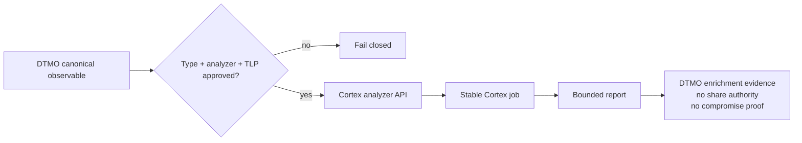

# DTMO Current Project State

Last reconciled: **2026-08-17**  
Software baseline: **16.0.0rc12 plus accepted post-RC13, E8 and Phase 11 repository enhancements**

## Executive summary

DTMO has completed Phases 1–7, RC13 functional acceptance and E8.1–E8.10 product evolution. RC13 is `PASS / OWNER_ACCEPTED`; E8.1–E8.10 are `PASS / REPOSITORY_COMPLETE`. Phase 8 is `PASS / OWNER_ACCEPTED` and Phase 9 is `PASS / EXTERNAL_ASSURANCE_ACCEPTED` for the earlier candidate. Phase 10 concluded **`NO-GO / BLOCKED — PLATFORM INDUSTRIALISATION REQUIRED`**. DTMO is **not production authorized**.

The active programme is **Phase 11 — Platform Industrialisation**. Phase 11.1–11.6 are `PASS / REPOSITORY_COMPLETE`. The original Phase 11.7 Cortex no-adoption decision is an accepted historical decision baseline. On 2026-08-17 the accountable owner added Cortex connector integration as a new attributable requirement. The sole active bounded objective is therefore **Phase 11.7b Cortex analyzer connector**, currently `IN PROGRESS / OWNER-REQUIRED EXACT-HEAD VALIDATION`.

## Lifecycle position

| Stage | Status |
|---|---|
| Phases 1–7 | `PASS` |
| RC13 + owner retest | `PASS / OWNER_ACCEPTED` |
| E8.1–E8.10 | `PASS / REPOSITORY_COMPLETE` |
| Phase 8 | `PASS / OWNER_ACCEPTED` |
| Phase 9 | `PASS / EXTERNAL_ASSURANCE_ACCEPTED` |
| Phase 10 | `NO-GO / BLOCKED — PLATFORM INDUSTRIALISATION REQUIRED` |
| Phase 11 | `IN PROGRESS / ACTIVE` |
| Phase 11.1–11.2 Taranis | `PASS / REPOSITORY_COMPLETE` |
| Phase 11.3 IntelOwl | `PASS / REPOSITORY_COMPLETE` |
| Phase 11.4 OpenCTI | `PASS / REPOSITORY_COMPLETE` |
| Phase 11.5 MISP | `PASS / REPOSITORY_COMPLETE` |
| Phase 11.6 TheHive | `PASS / REPOSITORY_COMPLETE` |
| Phase 11.7 Cortex decision gate | `PASS / REPOSITORY_COMPLETE — HISTORICAL DECISION BASELINE` |
| Phase 11.7b Cortex analyzer connector | `IN PROGRESS / OWNER-REQUIRED EXACT-HEAD VALIDATION` |
| Phase 11.8 integrated runtime industrialisation | `NOT STARTED / BLOCKED BY 11.7b` |
| Phase 12 | `NOT STARTED` |

## Accepted Phase 11 capabilities

Taranis provides governed collection/canonicalization; IntelOwl provides bounded human-authorized enrichment with immutable history; OpenCTI provides bounded graph integration and durable identity reconciliation; MISP provides governed inbound/outbound exchange with authoritative restriction state; TheHive provides minimal explicit human-authorized case handoff with durable mutation reservation/reconciliation and no blind replay after ambiguity.

All remain separate service boundaries. None gains DTMO human publication/share authority or establishes local compromise by itself. TheHive case-handoff authority remains distinct from publication/share authority.

## Active Phase 11.7b Cortex connector

The accountable owner explicitly required a Cortex connector after the original conditional Phase 11.7 decision had been accepted. This is recorded as new attributable scope rather than rewriting the earlier no-adoption decision.

The active bounded connector is analyzer-only. DTMO uses an explicit Cortex API base, bearer API key, analyzer allowlist and observable datatype allowlist. Only `POST /api/analyzer/{ANALYZER_ID}/run` and `GET /api/job/{JOB_ID}/waitreport` are in scope. Stable job identity is mandatory, returned analyzer identity must match when present, result size is bounded, and malformed output fails closed.

Cortex result metadata explicitly retains `external_share_authorized=false` and `local_compromise_proven=false`. Responders, external side effects, Cortex administration, file/attachment analysis, dynamic analyzer enablement and automatic IntelOwl fallback/replacement remain excluded.

## Runtime and licensing boundary

Cortex remains a separate service with a separate runtime API key and organization boundary. StrangeBee documents Cortex as fully open source and not requiring a Cortex product license; individual analyzers and external providers can carry their own licenses, subscriptions or data-handling terms and must be approved separately. No upstream Cortex or Cortex-Analyzers source is vendored by this integration.

Repository CI cannot prove live Cortex reachability, analyzer/provider coverage, provider entitlement, deployed organization permissions, privacy approval or production-equivalent behavior.

## Governance and evidence boundary

The accepted Phase 11.7 no-adoption decision remains historical evidence tied to the requirements available at that time. Phase 11.7b is a later owner-required scope addition and therefore receives its own architecture contract, runbook, QA gate and exact-head evidence.

Historical Phase 8/9 evidence remains valid only for the earlier candidate and is not reused for the materially changed Phase 11 platform. Fresh Phase 11.10 production-equivalent validation and Phase 11.11 independent assurance remain required before Phase 12.

## Phase 11 fixed order

1. Taranis AI — `PASS / REPOSITORY_COMPLETE`;
2. IntelOwl — `PASS / REPOSITORY_COMPLETE`;
3. OpenCTI — `PASS / REPOSITORY_COMPLETE`;
4. MISP — `PASS / REPOSITORY_COMPLETE`;
5. TheHive — `PASS / REPOSITORY_COMPLETE`;
6. original Cortex conditional decision — `PASS / REPOSITORY_COMPLETE` historical baseline;
7. owner-required Cortex analyzer connector — active Phase 11.7b;
8. Kubernetes/Helm/GitOps and integrated runtime hardening — next after protected Phase 11.7b acceptance;
9. migration/compatibility;
10. new production-equivalent validation;
11. new independent external assurance;
12. Phase 12 formal production GO/NO-GO.
