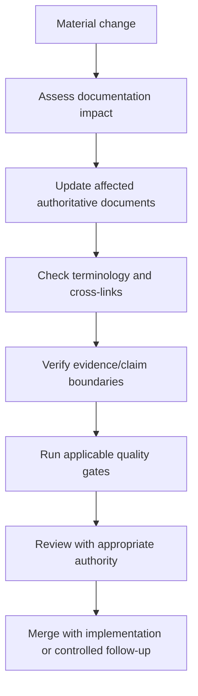

# DTMO Documentation Maintenance Lifecycle

## Objective

Professional documentation must remain synchronized with material product, architecture, security, governance, operational and readiness changes. This lifecycle defines when and how documentation is reviewed without turning stable documents into implementation diaries.

## Change triggers

A documentation impact assessment is required when a change affects one or more of the following:

- externally visible product behavior;
- API or data contracts;
- logical architecture or persistence;
- trust boundaries, identity or authorization;
- source/connector behavior or provenance;
- security controls or secret handling;
- framework mappings or compliance claims;
- deployment topology or operational procedures;
- recovery, observability or performance assumptions;
- release/readiness gate criteria or status;
- accountable ownership or approval boundaries.

## Maintenance flow

## Review by claim type

| Claim type | Minimum review perspective |
|---|---|
| Product capability | Product / engineering |
| Architecture | Architecture / engineering |
| Security control | Security / engineering |
| Governance or framework mapping | Governance / security |
| Operations | Operations / engineering |
| Release/readiness status | QA/release plus accountable authority where required |
| External assurance | Independent evidence owner plus release governance |

## Stable documentation versus evidence

Stable documentation explains what DTMO is, how it is governed and what state is currently accepted. Point-in-time evidence proves a particular claim for a particular identity.

Do not copy large CI transcripts, PR chronology or transient failure lists into architecture, security or executive documents. Instead, retain evidence in the appropriate immutable record and link or index it where needed.

## Quality criteria

Before merging a material documentation update, confirm that:

- terminology matches `GLOSSARY.md` or deliberately introduces a defined new term;
- links point to authoritative documents rather than duplicated summaries where possible;
- current-state language distinguishes `IMPLEMENTED`, `PASS`, external validation and planned work;
- no secret or credential value is introduced;
- no framework mapping is inferred;
- environment claims identify their evidence boundary;
- production-readiness claims remain consistent across the executive status, current state, readiness report, checklist and roadmap;
- historical details are moved to development/evidence records when they do not belong in stable documentation.

## Periodic review

A structured documentation review should be performed at each major release/readiness transition and before formal production go/no-go. The review should check orphaned documents, broken links, contradictory status language, stale component versions, superseded evidence references and missing ownership/decision records.

Periodic review is a quality activity; it does not renew or extend the validity of environment-specific or independent evidence beyond its actual scope.
