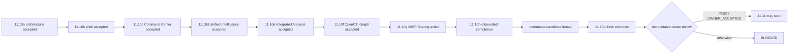

# DTMO Executive Decision View

## Purpose

This document gives accountable decision makers the current production-readiness position and the evidence required before the programme may advance.

## Current position

| Decision area | Current state | Decision consequence |
|---|---|---|
| Repository-controlled engineering | Phases 1–7 `PASS` | Engineering foundation accepted |
| Functional product | RC13 `PASS / OWNER_ACCEPTED` | Accepted pre-workbench functional baseline |
| E8 product line | `PASS / REPOSITORY_COMPLETE` | Product-evolution baseline accepted |
| Phase 8 staging | `PASS / OWNER_ACCEPTED — HISTORICAL CANDIDATE` | Prior-candidate evidence only |
| Phase 9 assurance | `PASS / EXTERNAL_ASSURANCE_ACCEPTED — HISTORICAL CANDIDATE` | Prior-candidate assurance only |
| Phase 10 authorization | `NO-GO / BLOCKED — PLATFORM INDUSTRIALISATION REQUIRED` | No production GO |
| Phase 11.1–11.9 | `PASS / REPOSITORY_COMPLETE` | Integration/runtime/migration baseline accepted |
| Phase 11.10 | `IN PROGRESS / FRESH CANDIDATE-BOUND EVIDENCE REQUIRED` | Candidate completion plus fresh external validation required |
| Phase 11.10a | `PASS / REPOSITORY_COMPLETE` | Frontend architecture/design accepted |
| Phase 11.10b | `PASS / REPOSITORY_COMPLETE` | Canonical application shell accepted |
| Phase 11.10c | `PASS / REPOSITORY_COMPLETE` | Canonical Command Center accepted |
| Phase 11.10d | `PASS / REPOSITORY_COMPLETE` | Unified Intelligence Workspace accepted |
| Phase 11.10e | `PASS / REPOSITORY_COMPLETE` | Integrated IntelOwl/Cortex analysis accepted |
| Phase 11.10f | `PASS / REPOSITORY_COMPLETE` | OpenCTI graph/entity workspace accepted |
| Phase 11.10g | `IN PROGRESS / EXACT-HEAD VALIDATION REQUIRED` | MISP Sharing & Exchange is the sole active decision gate |
| Phase 11.10h | `NOT STARTED` | TheHive workspace blocked until 11.10g acceptance |
| Phase 11.10p | `NOT STARTED / CANDIDATE FREEZE REQUIRED` | External validation blocked until candidate completion/freeze |
| Phase 11.11 | `NOT STARTED` | Blocked until 11.10 acceptance |
| Phase 12 | `NOT STARTED` | Requires fresh validation and assurance |

Phase 11 remains `IN PROGRESS / ACTIVE`. DTMO is **not production authorized**.

## Active decision boundary

The immediate question is whether **Phase 11.10g MISP Sharing & Exchange** provides a trustworthy human-governed transfer path using existing DTMO review/share controls without creating implicit publication, synchronization, MISP-health or autonomous sharing claims.

The exact-head gate must prove:

- functional `/workbench/sharing` route inside the accepted canonical shell;
- canonical sharing-state reads protected by `read:intelligence`;
- existing review remains protected by `review:intelligence`;
- existing share approval remains protected by `approve:share`;
- reviewer and share approver are different human principals and service accounts cannot substitute for them;
- the browser uses DTMO APIs only and receives no MISP credential;
- authoritative MISP source distribution, sharing-group and TLP restrictions cannot be weakened on re-export;
- MISP-origin intelligence without authoritative restriction evidence fails closed;
- deterministic current-revision replay is blocked by persisted `pending`, `success` or `uncertain` evidence;
- an uncertain delivery requires operator inspection rather than automatic replay;
- the exporter creates `published=false` events only;
- no Publish or Synchronize action is present in Phase 11.10g;
- feature/configuration state is not presented as live MISP health;
- dependency failures are unavailable rather than synthesized into approval/export eligibility;
- professional lifecycle/evidence/roadmap documentation is synchronized to the same exact head.

The canonical trust path remains **browser → DTMO API → governed integration adapter → upstream service**. `/ui/console`, `/ui/intelligence-workspace` and `/ui/misp-workspace` remain temporary **compatibility paths**.

## Candidate-completion decision chain

## Decision rules

- One bounded PR is active at a time; exact-head CI must be fully green before merge.
- Professional documentation is a merge criterion.
- Role-aware UI is not authorization; server-side enforcement remains authoritative.
- Human publication/share authority and TheHive case-handoff authority remain distinct.
- Review and share approval are separate human decisions.
- MISP export does not grant approval and does not publish or synchronize the event.
- Authoritative source handling restrictions cannot be weakened by the UI or export request.
- Enrichment, graph presence, correlation or MISP exchange does not establish local compromise.
- Taranis AI, IntelOwl, Cortex, OpenCTI, MISP and TheHive remain separate service/licensing boundaries.
- Design mockups, fixtures and browser mocks are not live or production-equivalent evidence.
- Historical Phase 8/9 evidence is preserved but cannot be reused as Phase 11.10/11.11 evidence.
- Repository CI **does not prove** production-equivalent operation.
- 11.10p evidence must bind to the **same immutable** candidate and environment.
- Rollback must restore the exact prior immutable digest and include post-rollback health.
- Application rollback does not authorize automatic database down migration.
- Missing, placeholder, inaccessible, historical-only or mixed-candidate evidence must **fail closed**.

## Current decision

**Phase 10 remains `NO-GO / BLOCKED`. Phase 11.1–11.9 and 11.10a–11.10f are `PASS / REPOSITORY_COMPLETE`. Phase 11.10 is `IN PROGRESS / FRESH CANDIDATE-BOUND EVIDENCE REQUIRED`; 11.10g is the active bounded MISP Sharing & Exchange gate. 11.10h, Phase 11.11 and Phase 12 are `NOT STARTED`. DTMO remains not production authorized.**
