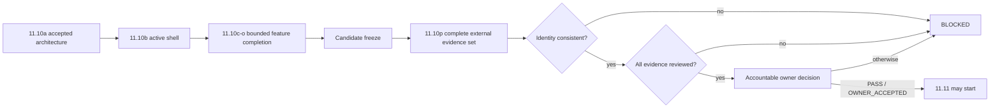

# DTMO Executive Decision View

## Purpose

This document gives accountable decision makers the current production-readiness position and the evidence required before the programme may advance.

## Current position

| Decision area | Current state | Decision consequence |
|---|---|---|
| Repository-controlled engineering | Phases 1–7 `PASS` | Engineering foundation accepted |
| Functional product | RC13 `PASS / OWNER_ACCEPTED` | Accepted pre-workbench functional baseline |
| E8 product line | `PASS / REPOSITORY_COMPLETE` | Product-evolution baseline accepted |
| Phase 8 staging | `PASS / OWNER_ACCEPTED — HISTORICAL CANDIDATE` | Prior-candidate evidence only |
| Phase 9 assurance | `PASS / EXTERNAL_ASSURANCE_ACCEPTED — HISTORICAL CANDIDATE` | Prior-candidate assurance only |
| Phase 10 authorization | `NO-GO / BLOCKED — PLATFORM INDUSTRIALISATION REQUIRED` | No production GO |
| Phase 11.1–11.8 | `PASS / REPOSITORY_COMPLETE` | Service/runtime industrialisation accepted |
| Phase 11.9 | `PASS / REPOSITORY_COMPLETE` | Migration/compatibility contract accepted |
| Phase 11.10 | `IN PROGRESS / FRESH CANDIDATE-BOUND EVIDENCE REQUIRED` | Candidate completion plus fresh external validation required |
| Phase 11.10a | `PASS / REPOSITORY_COMPLETE` | Frontend architecture/design foundation accepted |
| Phase 11.10b | `IN PROGRESS / EXACT-HEAD VALIDATION REQUIRED` | Canonical application shell is the sole active decision gate |
| Phase 11.10c | `NOT STARTED` | Command Center blocked until 11.10b acceptance |
| Phase 11.10p | `NOT STARTED / CANDIDATE FREEZE REQUIRED` | External validation blocked until candidate completion/freeze |
| Phase 11.11 | `NOT STARTED` | Blocked until 11.10 acceptance |
| Phase 12 | `NOT STARTED` | Requires fresh validation and assurance |

Phase 11 remains `IN PROGRESS / ACTIVE`. DTMO is **not production authorized**.

## Active decision boundary

The immediate question is whether **Phase 11.10b canonical application shell** correctly implements the accepted 11.10a architecture without weakening authority, evidence, accessibility or supply-chain controls.

11.10b must establish and prove on one exact final head:

- separately built React/TypeScript/Vite canonical shell under `/workbench/`;
- committed npm dependency graph consumed unchanged with `npm ci`;
- task-oriented navigation, top status/command bar and navigation-only command palette;
- context rail with explicit no-selection truth;
- responsive/accessibility shell baseline and semantic dark/light themes;
- same-origin serving with strict CSP and immutable hashed-asset caching;
- the governed request path **browser → DTMO API → governed integration adapter → upstream service**;
- **server-side RBAC** as the authority boundary;
- human publication/share approval separate from technical execution;
- separate TheHive case authority;
- `/ui/console` only as a temporary **compatibility path**;
- no synthetic operational data used to make later workspaces appear complete.

Only after 11.10b is accepted and merged may **11.10c Command Center** start.

## Candidate-completion decision chain

## Decision rules

- One bounded PR is active at a time and exact-head CI must be green before merge.
- Professional current-state and roadmap documentation is a merge criterion.
- Normal frontend operations use DTMO APIs and governed adapters rather than direct browser-to-upstream privileged calls.
- Role-aware UI is not authorization; **server-side RBAC** remains authoritative.
- Human publication/share authority and TheHive case-handoff authority remain separate from deployment, validation and technical service authority.
- Enrichment, graph presence or correlation does not itself prove local compromise.
- Taranis AI, IntelOwl, Cortex, OpenCTI, MISP and TheHive remain separate service/licensing boundaries.
- Design mockups, placeholder routes and synthetic UI examples are not live/staging/production-equivalent evidence.
- Historical Phase 8/9 evidence is preserved but cannot be reused as current Phase 11.10/11.11 evidence.
- Repository CI, local Compose, emulators and synthetic fixtures are supporting engineering evidence only and **do not prove** production-equivalent operation.
- Missing, placeholder, inaccessible, historical-only or mixed-candidate 11.10p evidence fails closed.
- Upgrade and rollback in 11.10p use immutable image digests; rollback targets the exact approved prior digest and includes post-rollback health.
- Application rollback does not authorize automatic database down migration.

## External evidence package

The existing Phase 11.10 production-equivalent validation gate, execution runbook, evidence manifest template, evidence validator and Evidence Index remain the controlled external package. They are exercised only after 11.10a–11.10o candidate completion and candidate freeze.

Sensitive evidence references may point to approved restricted storage; secrets, bearer tokens, private keys and raw credentials are not committed to Git.

## Current decision

**Phase 10 remains `NO-GO / BLOCKED`. Phase 11.1–11.9 and 11.10a are `PASS / REPOSITORY_COMPLETE`. Phase 11.10 is `IN PROGRESS / FRESH CANDIDATE-BOUND EVIDENCE REQUIRED`; 11.10b is the active bounded canonical-shell gate. 11.10c, Phase 11.11 and Phase 12 are `NOT STARTED`. DTMO remains not production authorized.**
