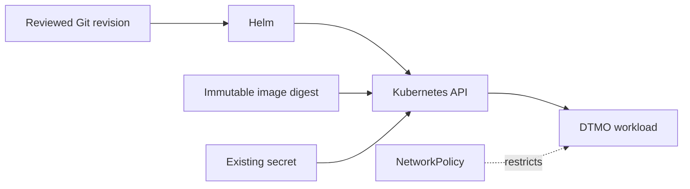

# DTMO Executive Decision View

## Purpose

This document gives accountable decision makers the concise current decision position for DTMO production readiness and the active Phase 11 successor programme.

## Current position

| Decision area | Current state | Decision consequence |
|---|---|---|
| Repository-controlled engineering | `PASS` for Phases 1–7 | Engineering foundation accepted |
| Functional product | `RC13 PASS / OWNER_ACCEPTED` | Canonical product journey accepted |
| E8 vulnerability/CTI product line | `PASS / REPOSITORY_COMPLETE` | Repository product baseline accepted |
| Phase 8 production-equivalent staging | `PASS / OWNER_ACCEPTED` | Historical evidence for prior candidate only |
| Phase 9 independent assurance | `PASS / EXTERNAL_ASSURANCE_ACCEPTED` | Historical evidence for prior candidate only |
| Phase 10 production authorization | `NO-GO / BLOCKED — PLATFORM INDUSTRIALISATION REQUIRED` | Production authorization not granted |
| Phase 11.1–11.7b | `PASS / REPOSITORY_COMPLETE` | Accepted integration/service boundaries |
| Phase 11.8a runtime foundation | `IN PROGRESS / EXACT-HEAD VALIDATION REQUIRED` | Current bounded Kubernetes/Helm/GitOps gate |
| Phase 11 platform industrialisation | `IN PROGRESS / ACTIVE` | Highest-priority programme |
| Phase 12 production authorization | `NOT STARTED` | New decision only after fresh validation and assurance |

## Decision interpretation

DTMO has not received a production `GO`. Historical Phase 8 and Phase 9 evidence remains valid only for the candidate it originally covered and cannot be treated as production acceptance of the materially changed Phase 11 platform.

The active engineering decision is whether Phase 11.8a establishes a secure, governed runtime foundation without inventing deployment evidence or weakening accepted service boundaries.

## Phase 11 progression

1. Taranis architecture/licensing and canonical adapter — completed.
2. IntelOwl bounded enrichment integration — completed.
3. OpenCTI graph integration — completed.
4. MISP governed exchange/consolidation — completed.
5. TheHive human-authorized case handoff — completed.
6. Original Cortex conditional decision — historical accepted baseline.
7. Owner-required Cortex analyzer connector — completed separately as Phase 11.7b.
8. **Active:** Phase 11.8 runtime industrialisation, beginning with bounded 11.8a runtime foundation.
9. Migration/compatibility — not started.
10. New production-equivalent validation — not started.
11. New independent external assurance — not started.
12. Phase 12 formal production GO/NO-GO — not started.

## Phase 11.8a decision boundary

The runtime foundation requires immutable image digests, GitOps-controlled non-secret configuration, existing-secret references, non-root/read-only pods, disabled service-account token automounting, explicit resource/probe defaults, disruption protection and fail-closed network policy.

Taranis AI, IntelOwl, Cortex, OpenCTI, MISP and TheHive remain separate service/licensing/identity boundaries. Kubernetes scheduling cannot grant human publication/share authority, TheHive case-handoff authority, or prove local compromise.

## Decision rules

- Green CI is repository engineering evidence, not production authorization.
- Historical Phase 8/9 evidence remains deployment/candidate-bound.
- Service integrations preserve provenance, least privilege, RBAC and applicable licensing boundaries.
- Secret values are not committed to Git; runtime secret/provider evidence is deployment-bound.
- Missing or conflicting mandatory evidence fails closed.
- Phase 11.8a acceptance does not imply HA/recovery/observability/supply-chain completion.

## Current decision

**Phase 10 remains `NO-GO / BLOCKED`. Phase 11.1–11.7b are `PASS / REPOSITORY_COMPLETE`. Phase 11.8a is `IN PROGRESS / EXACT-HEAD VALIDATION REQUIRED`. DTMO remains not production authorized; Phase 12 is `NOT STARTED` and requires accepted Phase 11.10/11.11 evidence for one immutable integrated candidate.**