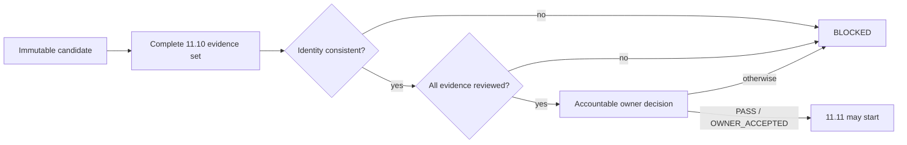

# DTMO Executive Decision View

## Purpose

This document gives accountable decision makers the current production-readiness position and the evidence required before the programme may advance.

## Current position

| Decision area | Current state | Decision consequence |
|---|---|---|
| Repository-controlled engineering | Phases 1–7 `PASS` | Engineering foundation accepted |
| Functional product | RC13 `PASS / OWNER_ACCEPTED` | Product journey accepted |
| E8 product line | `PASS / REPOSITORY_COMPLETE` | Product-evolution baseline accepted |
| Phase 8 staging | `PASS / OWNER_ACCEPTED — HISTORICAL CANDIDATE` | Prior-candidate evidence only |
| Phase 9 assurance | `PASS / EXTERNAL_ASSURANCE_ACCEPTED — HISTORICAL CANDIDATE` | Prior-candidate assurance only |
| Phase 10 authorization | `NO-GO / BLOCKED — PLATFORM INDUSTRIALISATION REQUIRED` | No production GO |
| Phase 11.1–11.8 | `PASS / REPOSITORY_COMPLETE` | Service/runtime industrialisation accepted |
| Phase 11.9 | `PASS / REPOSITORY_COMPLETE` | Migration/compatibility contract accepted |
| Phase 11.10 | `IN PROGRESS / FRESH CANDIDATE-BOUND EVIDENCE REQUIRED` | Current decision gate |
| Phase 11.11 | `NOT STARTED` | Blocked until 11.10 acceptance |
| Phase 12 | `NOT STARTED` | Requires fresh validation and assurance |

Phase 11 remains `IN PROGRESS / ACTIVE`. DTMO is **not production authorized**.

## Active decision boundary

The current decision is whether one immutable integrated DTMO candidate has been exercised successfully in an approved production-equivalent environment with complete, fresh and reviewable evidence. The required evidence classes are immutable candidate identity, migration/compatibility, upgrade, rollback, health/readiness, saturation/capacity and recovery/continuity.

## Decision rules

- All evidence classes bind to the same candidate fingerprint and production-equivalent environment.
- Historical Phase 8/9 evidence is preserved but cannot be reused as current Phase 11.10/11.11 evidence.
- Repository CI, local Compose, emulators and synthetic fixtures are supporting engineering evidence only.
- Missing, placeholder, inaccessible, historical-only or mixed-candidate evidence fails closed.
- Upgrade and rollback must use immutable image digests; rollback targets the exact approved prior digest and includes post-rollback health.
- Application rollback does not authorize automatic database down migration.
- Release-blocking findings must be closed or accountably dispositioned before 11.10 acceptance.
- Human publication/share authority and TheHive case-handoff authority remain separate from deployment, validation and technical service authority.
- Taranis AI, IntelOwl, Cortex, OpenCTI, MISP and TheHive remain separate service/licensing boundaries.

## Evidence package

The controlled execution package consists of the Phase 11.10 validation gate, production-equivalent execution runbook, evidence manifest template, evidence validator and Evidence Index. Sensitive evidence references may point to approved restricted storage; secrets, bearer tokens, private keys and raw credentials are not committed to Git.

## Current decision

**Phase 10 remains `NO-GO / BLOCKED`. Phase 11.1–11.9 are `PASS / REPOSITORY_COMPLETE`. Phase 11.10 is `IN PROGRESS / FRESH CANDIDATE-BOUND EVIDENCE REQUIRED`. Phase 11.11 and Phase 12 are `NOT STARTED`. DTMO remains not production authorized.**
