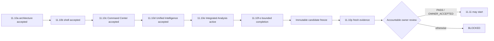

# DTMO Executive Decision View

## Purpose

This document gives accountable decision makers the current production-readiness position and the evidence required before the programme may advance.

## Current position

| Decision area | Current state | Decision consequence |
|---|---|---|
| Repository-controlled engineering | Phases 1–7 `PASS` | Engineering foundation accepted |
| Functional product | RC13 `PASS / OWNER_ACCEPTED` | Accepted pre-workbench functional baseline |
| E8 product line | `PASS / REPOSITORY_COMPLETE` | Product-evolution baseline accepted |
| Phase 8 staging | `PASS / OWNER_ACCEPTED — HISTORICAL CANDIDATE` | Prior-candidate evidence only |
| Phase 9 assurance | `PASS / EXTERNAL_ASSURANCE_ACCEPTED — HISTORICAL CANDIDATE` | Prior-candidate assurance only |
| Phase 10 authorization | `NO-GO / BLOCKED — PLATFORM INDUSTRIALISATION REQUIRED` | No production GO |
| Phase 11.1–11.9 | `PASS / REPOSITORY_COMPLETE` | Integration/runtime/migration baseline accepted |
| Phase 11.10 | `IN PROGRESS / FRESH CANDIDATE-BOUND EVIDENCE REQUIRED` | Candidate completion plus fresh external validation required |
| Phase 11.10a | `PASS / REPOSITORY_COMPLETE` | Frontend architecture/design accepted |
| Phase 11.10b | `PASS / REPOSITORY_COMPLETE` | Canonical application shell accepted |
| Phase 11.10c | `PASS / REPOSITORY_COMPLETE` | Canonical Command Center accepted |
| Phase 11.10d | `PASS / REPOSITORY_COMPLETE` | Unified Intelligence Workspace accepted |
| Phase 11.10e | `IN PROGRESS / EXACT-HEAD VALIDATION REQUIRED` | IntelOwl/Cortex integrated analysis is the sole active decision gate |
| Phase 11.10f | `NOT STARTED` | OpenCTI workspace blocked until 11.10e acceptance |
| Phase 11.10p | `NOT STARTED / CANDIDATE FREEZE REQUIRED` | External validation blocked until candidate completion/freeze |
| Phase 11.11 | `NOT STARTED` | Blocked until 11.10 acceptance |
| Phase 12 | `NOT STARTED` | Requires fresh validation and assurance |

Phase 11 remains `IN PROGRESS / ACTIVE`. DTMO is **not production authorized**.

## Active decision boundary

The immediate question is whether **Phase 11.10e IntelOwl/Cortex integrated analysis** provides trustworthy human-triggered analyzer workflows and persisted evidence without fabricating runtime health, local-compromise conclusions or external-share authority.

The exact-head gate must prove:

- functional `/workbench/analysis` route inside the accepted canonical shell;
- governed capability and combined-history APIs protected by `read:intelligence`;
- IntelOwl enrichment remains explicitly human-triggered and protected by `review:intelligence`;
- Cortex execution is explicitly human-triggered, feature-gated, analyzer-only, allowlist/TLP validated and protected by `review:intelligence`;
- durable Cortex history is bound to canonical item, stable job identity, explicit analyzer and requesting principal;
- database/runtime invariants preserve `external_share_authorized=false` and `local_compromise_proven=false`;
- Cortex responders, automatic analyzer discovery and automatic IntelOwl fallback remain outside scope;
- read-only principals can inspect history but are not presented with authorized execution controls;
- dependency, policy and persistence failures are unavailable/failed rather than synthetic success;
- professional lifecycle/evidence/roadmap documentation is synchronized to the same exact head.

The canonical trust path remains **browser → DTMO API → governed integration adapter → upstream service**. `/ui/console` and earlier UI routes remain temporary **compatibility paths**.

## Candidate-completion decision chain

## Decision rules

- One bounded PR is active at a time; exact-head CI must be fully green before merge.
- Professional documentation is a merge criterion.
- Role-aware UI is not authorization; server-side enforcement remains authoritative.
- Human publication/share authority and TheHive case-handoff authority remain distinct.
- Enrichment, graph presence or correlation does not establish local compromise.
- Taranis AI, IntelOwl, Cortex, OpenCTI, MISP and TheHive remain separate service/licensing boundaries.
- Cortex responders remain outside the approved analyzer-only connector boundary.
- Design mockups, fixtures and browser mocks are not live or production-equivalent evidence.
- Historical Phase 8/9 evidence is preserved but cannot be reused as Phase 11.10/11.11 evidence.
- Repository CI **does not prove** production-equivalent operation.
- 11.10p evidence must bind to the **same immutable** candidate and environment.
- Rollback must restore the exact prior immutable digest and include post-rollback health.
- Application rollback does not authorize automatic database down migration.
- Missing, placeholder, inaccessible, historical-only or mixed-candidate evidence must **fail closed**.

## Current decision

**Phase 10 remains `NO-GO / BLOCKED`. Phase 11.1–11.9 and 11.10a–11.10d are `PASS / REPOSITORY_COMPLETE`. Phase 11.10 is `IN PROGRESS / FRESH CANDIDATE-BOUND EVIDENCE REQUIRED`; 11.10e is the active bounded IntelOwl/Cortex integrated-analysis gate. 11.10f, Phase 11.11 and Phase 12 are `NOT STARTED`. DTMO remains not production authorized.**
