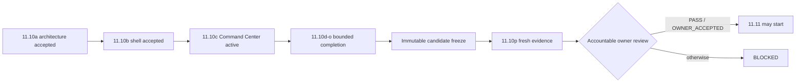

# DTMO Executive Decision View

## Purpose

This document gives accountable decision makers the current production-readiness position and the evidence required before the programme may advance.

## Current position

| Decision area | Current state | Decision consequence |
|---|---|---|
| Repository-controlled engineering | Phases 1–7 `PASS` | Engineering foundation accepted |
| Functional product | RC13 `PASS / OWNER_ACCEPTED` | Accepted pre-workbench functional baseline |
| E8 product line | `PASS / REPOSITORY_COMPLETE` | Product-evolution baseline accepted |
| Phase 8 staging | `PASS / OWNER_ACCEPTED — HISTORICAL CANDIDATE` | Prior-candidate evidence only |
| Phase 9 assurance | `PASS / EXTERNAL_ASSURANCE_ACCEPTED — HISTORICAL CANDIDATE` | Prior-candidate assurance only |
| Phase 10 authorization | `NO-GO / BLOCKED — PLATFORM INDUSTRIALISATION REQUIRED` | No production GO |
| Phase 11.1–11.9 | `PASS / REPOSITORY_COMPLETE` | Integration/runtime/migration baseline accepted |
| Phase 11.10 | `IN PROGRESS / FRESH CANDIDATE-BOUND EVIDENCE REQUIRED` | Candidate completion plus fresh external validation required |
| Phase 11.10a | `PASS / REPOSITORY_COMPLETE` | Frontend architecture/design accepted |
| Phase 11.10b | `PASS / REPOSITORY_COMPLETE` | Canonical application shell accepted |
| Phase 11.10c | `IN PROGRESS / EXACT-HEAD VALIDATION REQUIRED` | Command Center is the sole active decision gate |
| Phase 11.10d | `NOT STARTED` | Unified Intelligence Workspace blocked until 11.10c acceptance |
| Phase 11.10p | `NOT STARTED / CANDIDATE FREEZE REQUIRED` | External validation blocked until candidate completion/freeze |
| Phase 11.11 | `NOT STARTED` | Blocked until 11.10 acceptance |
| Phase 12 | `NOT STARTED` | Requires fresh validation and assurance |

Phase 11 remains `IN PROGRESS / ACTIVE`. DTMO is **not production authorized**.

## Active decision boundary

The immediate question is whether **Phase 11.10c Command Center** provides trustworthy operational orientation from canonical DTMO evidence without fabricating health, workload or threat state.

The exact-head gate must prove:

- canonical `/api/v1/command-center` read API protected by `READ_INTELLIGENCE`;
- metrics derived from canonical persistence, not hard-coded dashboard numbers;
- explicit `unavailable`/`null` state when canonical persistence cannot be queried;
- no zero-value synthesis from missing evidence;
- configured integrations never labelled healthy solely from flags or API configuration;
- runtime execution shown only as attributable observation;
- role-aware quick navigation based on authenticated permissions while **server-side RBAC** remains authoritative;
- no new review/share/case/connector/admin mutation authority;
- responsive/browser behavior inside the accepted `/workbench/` shell;
- professional lifecycle/evidence/roadmap documentation synchronized to the same exact head.

The canonical trust path remains **browser → DTMO API → governed integration adapter → upstream service**. `/ui/console` remains a temporary **compatibility path**.

## Candidate-completion decision chain

## Decision rules

- One bounded PR is active at a time; exact-head CI must be fully green before merge.
- Professional documentation is a merge criterion.
- Role-aware UI is not authorization; server-side enforcement remains authoritative.
- Human publication/share authority and TheHive case-handoff authority remain distinct.
- Enrichment, graph presence or correlation does not establish local compromise.
- Taranis AI, IntelOwl, Cortex, OpenCTI, MISP and TheHive remain separate service/licensing boundaries.
- Design mockups, fixtures and browser mocks are not live or production-equivalent evidence.
- Historical Phase 8/9 evidence is preserved but cannot be reused as Phase 11.10/11.11 evidence.
- Repository CI **does not prove** production-equivalent operation.
- 11.10p evidence must bind to the **same immutable** candidate and environment.
- Rollback must restore the exact prior immutable digest and include post-rollback health.
- Application rollback does not authorize automatic database down migration.
- Missing, placeholder, inaccessible, historical-only or mixed-candidate evidence must **fail closed**.

## Current decision

**Phase 10 remains `NO-GO / BLOCKED`. Phase 11.1–11.9, 11.10a and 11.10b are `PASS / REPOSITORY_COMPLETE`. Phase 11.10 is `IN PROGRESS / FRESH CANDIDATE-BOUND EVIDENCE REQUIRED`; 11.10c is the active bounded Command Center gate. 11.10d, Phase 11.11 and Phase 12 are `NOT STARTED`. DTMO remains not production authorized.**
