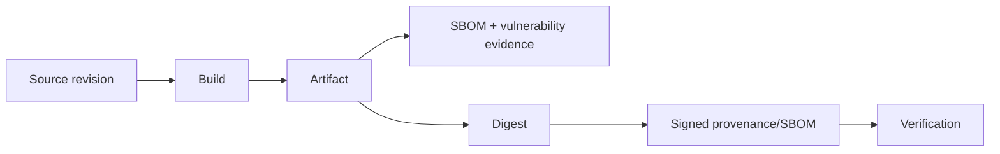

# DTMO Executive Decision View

## Purpose

This document gives accountable decision makers the current production-readiness position and active Phase 11 successor gate.

## Current position

| Decision area | Current state | Decision consequence |
|---|---|---|
| Repository-controlled engineering | `PASS` for Phases 1–7 | Engineering foundation accepted |
| Functional product | `RC13 PASS / OWNER_ACCEPTED` | Product journey accepted |
| E8 product line | `PASS / REPOSITORY_COMPLETE` | Repository baseline accepted |
| Phase 8 staging | `PASS / OWNER_ACCEPTED` | Historical prior-candidate evidence |
| Phase 9 assurance | `PASS / EXTERNAL_ASSURANCE_ACCEPTED` | Historical prior-candidate evidence |
| Phase 10 authorization | `NO-GO / BLOCKED — PLATFORM INDUSTRIALISATION REQUIRED` | No production GO |
| Phase 11.1–11.8f | `PASS / REPOSITORY_COMPLETE` | Accepted service/runtime boundaries |
| Phase 11.8g supply-chain | `IN PROGRESS / EXACT-HEAD VALIDATION REQUIRED` | Current bounded gate |
| Phase 11 | `IN PROGRESS / ACTIVE` | Highest-priority programme |
| Phase 12 | `NOT STARTED` | Requires fresh validation and assurance |

## Active decision boundary

The decision is whether Phase 11.8g establishes an exact-subject software supply-chain evidence path without overstating what repository CI or signatures prove. The bounded controls are CycloneDX SBOM generation, dependency/container vulnerability evidence, SHA-256 artifact identity, and OIDC-backed signed provenance/SBOM attestations on the governed release path.

## Decision rules

- Green PR CI is repository engineering evidence, not proof that a future release has been signed or deployed.
- Signed provenance binds artifact/build evidence; it does not prove vulnerability absence or production suitability.
- Missing required SBOM, vulnerability, digest or attestation evidence fails closed.
- Long-lived signing keys do not belong in Git; release signing uses the governed short-lived identity path.
- Taranis AI, IntelOwl, Cortex, OpenCTI, MISP and TheHive remain separate service/licensing boundaries.
- Human publication/share and TheHive case-handoff authority remain separate from technical build/release authority.
- Historical Phase 8/9 evidence cannot satisfy Phase 11.10/11.11 for the materially changed candidate.

## Current decision

**Phase 10 remains `NO-GO / BLOCKED`. Phase 11.1–11.8f are `PASS / REPOSITORY_COMPLETE`. Phase 11.8g is `IN PROGRESS / EXACT-HEAD VALIDATION REQUIRED`. DTMO remains not production authorized; Phase 12 is `NOT STARTED`.**
