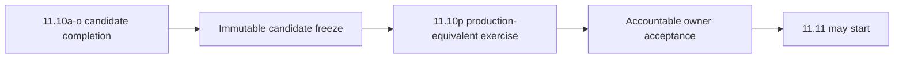

# DTMO Executive Status

Date: **2026-08-20**  
Software baseline: **16.0.0rc12 plus accepted post-RC13/E8/Phase-11 repository enhancements**

## Management summary

DTMO retains Phases 1–7 `PASS`, RC13 `PASS / OWNER_ACCEPTED`, E8.1–E8.10 `PASS / REPOSITORY_COMPLETE`, and historical Phase 8 `PASS / OWNER_ACCEPTED` plus Phase 9 `PASS / EXTERNAL_ASSURANCE_ACCEPTED` evidence for their earlier candidate only. Phase 10 remains **`NO-GO / BLOCKED — PLATFORM INDUSTRIALISATION REQUIRED`** and DTMO is **not production authorized**.

Phase 11 Platform Industrialisation is `IN PROGRESS / ACTIVE`. Phase 11.1–11.9 and Phase 11.10a are `PASS / REPOSITORY_COMPLETE`. Phase 11.10 remains `IN PROGRESS / FRESH CANDIDATE-BOUND EVIDENCE REQUIRED`.

The current bounded priority is **Phase 11.10b canonical application shell**, status `IN PROGRESS / EXACT-HEAD VALIDATION REQUIRED`. The next-generation Unified Operations Workbench materially changes the integrated candidate, so the fresh external production-equivalent exercise remains **11.10p**, after 11.10a–11.10o candidate completion and immutable candidate freeze. Phase 11.11 independent external assurance and Phase 12 formal production GO/NO-GO remain `NOT STARTED`.

## Decision position

| Decision area | Status | Consequence |
|---|---|---|
| Engineering baseline | `PASS` | Repository foundation accepted |
| Functional product | `PASS / OWNER_ACCEPTED` | Historical/current pre-workbench product baseline accepted within its scope |
| E8 product evolution | `PASS / REPOSITORY_COMPLETE` | Product-evolution baseline accepted |
| Phase 8 | `PASS / OWNER_ACCEPTED — HISTORICAL CANDIDATE` | Prior candidate only |
| Phase 9 | `PASS / EXTERNAL_ASSURANCE_ACCEPTED — HISTORICAL CANDIDATE` | Prior candidate only |
| Phase 10 | `NO-GO / BLOCKED — PLATFORM INDUSTRIALISATION REQUIRED` | Production authorization not granted |
| Phase 11.1–11.8 | `PASS / REPOSITORY_COMPLETE` | Service and industrialised runtime boundaries accepted |
| Phase 11.9 | `PASS / REPOSITORY_COMPLETE` | Migration/compatibility contract accepted |
| Phase 11.10 | `IN PROGRESS / FRESH CANDIDATE-BOUND EVIDENCE REQUIRED` | Candidate completion plus fresh external validation still required |
| Phase 11.10a | `PASS / REPOSITORY_COMPLETE` | Frontend architecture/design contract accepted |
| Phase 11.10b | `IN PROGRESS / EXACT-HEAD VALIDATION REQUIRED` | Canonical application shell is the sole active bounded slice |
| Phase 11.10c | `NOT STARTED` | Command Center remains blocked until 11.10b acceptance |
| Phase 11.10p | `NOT STARTED / CANDIDATE FREEZE REQUIRED` | Fresh external validation deferred until candidate completion |
| Phase 11.11 | `NOT STARTED` | Blocked until 11.10 owner acceptance |
| Phase 12 | `NOT STARTED` | Formal production decision not started |

## Active Phase 11.10b objective

11.10b implements the accepted 11.10a architecture as a maintainable canonical shell:

- separately built React/TypeScript/Vite frontend;
- canonical `/workbench/` route with `/ui/console` as a temporary **compatibility path** only;
- task-oriented primary navigation, top status/command bar and navigation-only command palette;
- object context rail with explicit no-selection state;
- semantic dark/light design tokens and responsive/accessibility shell baseline;
- same-origin static serving with strict CSP and immutable hashed-asset caching;
- committed npm dependency lockfile consumed with `npm ci`;
- container build-stage integration without Node/npm in the runtime image;
- normal operations through **browser → DTMO API → governed integration adapter → upstream service**;
- explicit preservation of **server-side RBAC**, provenance, human publication/share authority and separate case authority.

The slice deliberately does not implement Command Center feature data or later workspaces and does not fabricate operational state. Those capabilities remain later bounded slices.

## Candidate-completion sequence

The workbench is delivered one bounded slice at a time from 11.10a through 11.10o. 11.10a is accepted; 11.10b is active. The remaining order covers Command Center, Intelligence, IntelOwl/Cortex, OpenCTI, MISP, TheHive, Vulnerability/Exposure, Sources/Collection, Automation, Governance/Evidence, Operations/Admin, role-aware accessibility and final consolidation/full functional acceptance.

After 11.10o, one immutable integrated candidate is frozen for 11.10p.

## 11.10p external evidence boundary

11.10p retains the seven required external evidence classes: candidate identity, migration/compatibility, upgrade, rollback, health/readiness, representative saturation/capacity behavior and recovery/continuity.

Every external evidence item must identify the same candidate and production-equivalent environment. Rollback must restore the exact approved prior immutable application digest and include successful post-rollback health evidence. Application rollback does not authorize automatic database down migration.

## Evidence boundary

Repository CI validates architecture, implementation and evidence contracts within their bounded claims. It **does not prove** live upstream integration behavior, production-equivalent execution, independent assurance or production authorization. Historical Phase 8/9 evidence cannot satisfy Phase 11.10 or Phase 11.11 for the materially changed candidate. Missing, placeholder, inaccessible, historical-only or mixed-candidate evidence fails closed.

Phase 11.10 completes only when the candidate-completion programme is accepted, the 11.10p real-environment package has been reviewed and the accountable owner records `PASS / OWNER_ACCEPTED`. That acceptance still does not authorize production; fresh Phase 11.11 independent assurance and Phase 12 remain required.

## Executive recommendation

Continue only **Phase 11.10b** until the committed dependency graph, canonical shell/browser acceptance, existing security/supply-chain regressions and professional documentation are fully green on one exact final head. Only then proceed to **11.10c Command Center**. Do not execute 11.10p or start Phase 11.11 until the integrated workbench candidate is complete, frozen and ready for fresh external validation.
