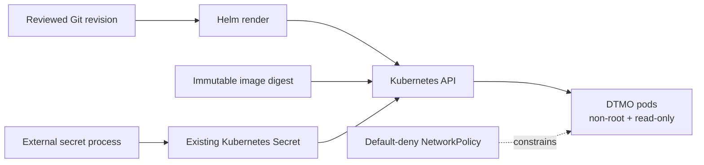

# DTMO Executive Status

Date: **2026-08-17**  
Software baseline: **16.0.0rc12 plus accepted post-RC13/E8/Phase-11 repository enhancements**

## Management summary

DTMO has an accepted repository-controlled engineering baseline, RC13 `PASS / OWNER_ACCEPTED` functional acceptance and E8.1–E8.10 `PASS / REPOSITORY_COMPLETE` product evolution. Phase 8 remains `PASS / OWNER_ACCEPTED` and Phase 9 remains `PASS / EXTERNAL_ASSURANCE_ACCEPTED` for the earlier candidate they actually covered. Those historical evidence classes are not transferred to the materially changed Phase 11 platform.

Phase 10 remains **`NO-GO / BLOCKED — PLATFORM INDUSTRIALISATION REQUIRED`**. DTMO is **not production authorized**.

The highest-priority programme is **Phase 11 Platform Industrialisation**, `IN PROGRESS / ACTIVE`. Phase 11.1–11.7b are `PASS / REPOSITORY_COMPLETE`; the original Phase 11.7 Cortex no-adoption decision remains preserved as a historical decision baseline, while the later owner-required 11.7b analyzer connector is accepted separately. The sole active bounded objective is **Phase 11.8a runtime foundation**, currently `IN PROGRESS / EXACT-HEAD VALIDATION REQUIRED`.

Phase 12 remains `NOT STARTED` and can only begin after fresh Phase 11.10 production-equivalent validation and Phase 11.11 independent external assurance against the same immutable integrated candidate.

## Current decision position

| Decision area | Status | Consequence |
|---|---|---|
| Engineering baseline | `PASS` | Repository foundation accepted |
| Functional product | `PASS / OWNER_ACCEPTED` | Canonical console journey accepted |
| E8 product evolution | `PASS / REPOSITORY_COMPLETE` | Repository product baseline accepted |
| Phase 8 | `PASS / OWNER_ACCEPTED` | Historical candidate-bound staging evidence |
| Phase 9 | `PASS / EXTERNAL_ASSURANCE_ACCEPTED` | Historical candidate-bound assurance evidence |
| Phase 10 | `NO-GO / BLOCKED` | Production authorization not granted |
| Phase 11.1–11.7b | `PASS / REPOSITORY_COMPLETE` | Accepted service/integration boundaries |
| Phase 11.8a runtime foundation | `IN PROGRESS / EXACT-HEAD VALIDATION REQUIRED` | Active Kubernetes/Helm/GitOps foundation gate |
| Phase 11.9–11.11 | `NOT STARTED` | Follow only after bounded 11.8 completion |
| Phase 12 | `NOT STARTED` | New formal production decision |

## Active Phase 11.8a control objective

Phase 11.8a establishes the governed DTMO application runtime foundation only: Helm and GitOps-owned configuration, immutable image digest enforcement, existing-secret consumption without secret material in Git, non-root/read-only runtime hardening, disabled service-account token automounting, health probes/resources, a PodDisruptionBudget and fail-closed NetworkPolicy with explicit external CIDR allowlisting.

This slice does not establish live-cluster admission behavior, workload identity/external-secret provider integration, ingress/TLS, multi-zone/stateful HA, centralized observability, recovery objectives, SBOM/scanning/signing/attestation, capacity or exercised upgrade/rollback. Those remain later bounded Phase 11.8 objectives.

## Security, authority and licensing boundaries

Taranis AI, IntelOwl, Cortex, OpenCTI, MISP and TheHive remain separate services under their applicable licensing/provider boundaries. Kubernetes placement does not transfer service ownership, grant DTMO publication/share authority, grant case-handoff authority, or prove local compromise. Provenance, RBAC, human/service identity separation and fail-closed handling remain mandatory.

## Evidence boundaries

Repository CI for Phase 11.8a is repository engineering evidence only. It cannot prove target-cluster behavior, cloud IAM, effective CNI enforcement, secret-provider permissions, availability, recovery, production-equivalent characteristics, independent assurance or production authorization. Historical Phase 8/9 evidence remains candidate-bound.

## Executive recommendation

Continue only the active Phase 11.8a PR. Merge only after the dedicated runtime-foundation gate, RC4, Professional Documentation and all required exact-head checks are green on the same final head with expected-head protection. Do not start the next 11.8 slice before protected acceptance.