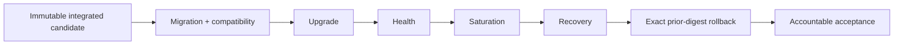

# DTMO Executive Status

Date: **2026-08-20**  
Software baseline: **16.0.0rc12 plus accepted post-RC13/E8/Phase-11 repository enhancements**

## Management summary

DTMO retains Phases 1–7 `PASS`, RC13 `PASS / OWNER_ACCEPTED`, E8.1–E8.10 `PASS / REPOSITORY_COMPLETE`, and historical Phase 8 `PASS / OWNER_ACCEPTED` plus Phase 9 `PASS / EXTERNAL_ASSURANCE_ACCEPTED` evidence for their earlier candidate only. Phase 10 remains **`NO-GO / BLOCKED — PLATFORM INDUSTRIALISATION REQUIRED`** and DTMO is **not production authorized**.

Phase 11 Platform Industrialisation is `IN PROGRESS / ACTIVE`. Phase 11.1–11.9 are `PASS / REPOSITORY_COMPLETE`. The sole active production-readiness objective is **Phase 11.10 integrated production-equivalent validation**, `IN PROGRESS / FRESH CANDIDATE-BOUND EVIDENCE REQUIRED`. Phase 11.11 independent external assurance and Phase 12 formal production GO/NO-GO are `NOT STARTED`.

## Decision position

| Decision area | Status | Consequence |
|---|---|---|
| Engineering baseline | `PASS` | Repository foundation accepted |
| Functional product | `PASS / OWNER_ACCEPTED` | Canonical product journey accepted |
| E8 product evolution | `PASS / REPOSITORY_COMPLETE` | Product-evolution baseline accepted |
| Phase 8 | `PASS / OWNER_ACCEPTED — HISTORICAL CANDIDATE` | Prior candidate only |
| Phase 9 | `PASS / EXTERNAL_ASSURANCE_ACCEPTED — HISTORICAL CANDIDATE` | Prior candidate only |
| Phase 10 | `NO-GO / BLOCKED — PLATFORM INDUSTRIALISATION REQUIRED` | Production authorization not granted |
| Phase 11.1–11.8 | `PASS / REPOSITORY_COMPLETE` | Service and industrialised runtime boundaries accepted |
| Phase 11.9 | `PASS / REPOSITORY_COMPLETE` | Migration/compatibility contract accepted |
| Phase 11.10 | `IN PROGRESS / FRESH CANDIDATE-BOUND EVIDENCE REQUIRED` | Real production-equivalent evidence required |
| Phase 11.11 | `NOT STARTED` | Blocked until 11.10 acceptance |
| Phase 12 | `NOT STARTED` | Formal production decision not started |

## Active Phase 11.10 objective

Phase 11.10 requires one immutable integrated deployment identity across seven evidence classes: candidate identity, migration/compatibility, upgrade, rollback, health/readiness, representative saturation/capacity behavior and recovery/continuity.

Every evidence item must identify the same candidate and production-equivalent environment. The rollback exercise must restore the exact approved prior immutable application digest and must include successful post-rollback health evidence. Application rollback does not authorize automatic database down migration.

## Evidence boundary

Repository CI validates implementation, manifest structure and evidence-binding rules. It does not prove live production-equivalent execution. Historical Phase 8/9 evidence cannot satisfy Phase 11.10 or Phase 11.11 for the materially changed candidate. Missing, placeholder, inaccessible, historical-only or mixed-candidate evidence fails closed.

Phase 11.10 completes only when the full real-environment package has been reviewed and the accountable owner records `PASS / OWNER_ACCEPTED`. That acceptance still does **not** authorize production; fresh Phase 11.11 independent assurance and Phase 12 remain required.

## Executive recommendation

Continue only Phase 11.10. Use the controlled production-equivalent validation runbook and evidence manifest, preserve secrets and restricted evidence outside Git, and do not start Phase 11.11 until Phase 11.10 is explicitly accepted against one immutable integrated candidate.
