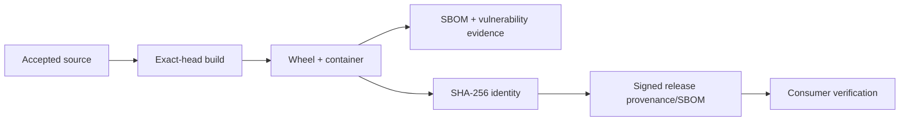

# DTMO Executive Status

Date: **2026-08-18**  
Software baseline: **16.0.0rc12 plus accepted post-RC13/E8/Phase-11 repository enhancements**

## Management summary

DTMO retains Phases 1–7 `PASS`, RC13 `PASS / OWNER_ACCEPTED`, E8.1–E8.10 `PASS / REPOSITORY_COMPLETE`, and historical Phase 8 `PASS / OWNER_ACCEPTED` plus Phase 9 `PASS / EXTERNAL_ASSURANCE_ACCEPTED` evidence for the earlier candidate only. Phase 10 remains **`NO-GO / BLOCKED — PLATFORM INDUSTRIALISATION REQUIRED`** and DTMO is **not production authorized**.

Phase 11 Platform Industrialisation is `IN PROGRESS / ACTIVE`. Phase 11.1–11.8f are `PASS / REPOSITORY_COMPLETE`. The sole active bounded objective is **Phase 11.8g software supply-chain hardening**, `IN PROGRESS / EXACT-HEAD VALIDATION REQUIRED`. Phase 12 is `NOT STARTED` and still requires fresh Phase 11.10 production-equivalent validation and Phase 11.11 independent external assurance against the same immutable integrated candidate.

## Decision position

| Decision area | Status | Consequence |
|---|---|---|
| Engineering baseline | `PASS` | Repository foundation accepted |
| Functional product | `PASS / OWNER_ACCEPTED` | Canonical product journey accepted |
| E8 product evolution | `PASS / REPOSITORY_COMPLETE` | Repository baseline accepted |
| Phase 8 | `PASS / OWNER_ACCEPTED` | Historical candidate-bound evidence |
| Phase 9 | `PASS / EXTERNAL_ASSURANCE_ACCEPTED` | Historical candidate-bound assurance |
| Phase 10 | `NO-GO / BLOCKED` | Production authorization not granted |
| Phase 11.1–11.8f | `PASS / REPOSITORY_COMPLETE` | Accepted integration/runtime boundaries |
| Phase 11.8g | `IN PROGRESS / EXACT-HEAD VALIDATION REQUIRED` | Active supply-chain gate |
| Phase 11.9–11.11 | `NOT STARTED` | Follow after required 11.8 completion |
| Phase 12 | `NOT STARTED` | Formal production decision not started |

## Active supply-chain control objective

The active slice requires exact-head build identity, Python and container CycloneDX SBOMs, governed vulnerability evidence, SHA-256 artifact identity, and a release path for cryptographically signed provenance and SBOM attestations using short-lived OIDC-backed signing. PR CI validates the mechanism and candidate scan evidence only; it does not manufacture release-signing evidence.

Supply-chain evidence does not grant publication/share authority, case-handoff authority, responder authority or proof of local compromise. Taranis AI, IntelOwl, Cortex, OpenCTI, MISP and TheHive remain separate service/licensing boundaries.

## Evidence boundary

Repository CI does not prove future release signing, registry integrity, deployment verification, absence of all vulnerabilities, production-equivalent behavior, independent assurance or production authorization. Missing mandatory evidence fails closed. Historical Phase 8/9 evidence is not transferred to this materially changed candidate.

## Executive recommendation

Continue only Phase 11.8g. Merge only after the dedicated supply-chain gate, RC4, Professional Documentation and all required exact-head checks are green on the same final head with expected-head protection. Capacity and upgrade/rollback remain later bounded Phase 11.8 work.
