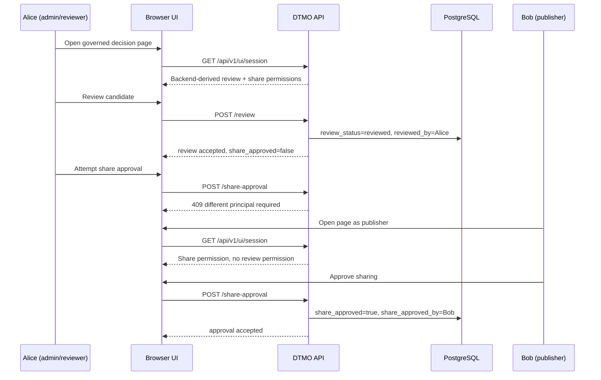

# Phase 6 RC9.1 — Governed browser decision journey

RC9.1 introduces the first browser-level Phase-6 acceptance path. It intentionally covers one high-risk workflow only: review of candidate intelligence followed by separate approval for external sharing.

A service-account browser context must expose neither review nor share-approval controls. The browser never grants authorization: UI visibility is derived from backend-resolved permissions, while the backend remains authoritative for RBAC and separation of duties.

RC9.1 does not claim keyboard-only operation, responsive acceptance, cross-browser support or WCAG 2.2 AA compliance. Those remain separate Phase-6 gates.
