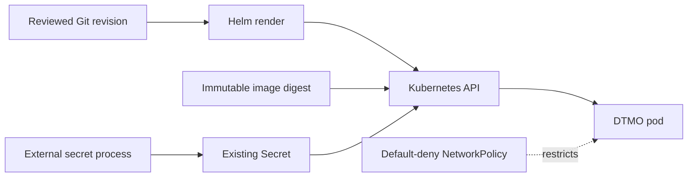

# DTMO Production Readiness Report

Assessment date: **2026-08-17**  
Software baseline: **16.0.0rc12 plus accepted post-RC13/E8/Phase-11 repository enhancements**

## 1. Executive conclusion

DTMO completed the repository engineering baseline, RC13 `PASS / OWNER_ACCEPTED` functional acceptance, E8.1–E8.10 `PASS / REPOSITORY_COMPLETE` product evolution, Phase 8 `PASS / OWNER_ACCEPTED` staging acceptance and Phase 9 `PASS / EXTERNAL_ASSURANCE_ACCEPTED` independent assurance for the earlier candidate they covered.

Phase 10 concluded with **`NO-GO / BLOCKED — PLATFORM INDUSTRIALISATION REQUIRED`**. DTMO is **not production authorized**.

Phase 11 remains `IN PROGRESS / ACTIVE`. Phase 11.1–11.7b are `PASS / REPOSITORY_COMPLETE`; the active bounded step is **Phase 11.8a runtime foundation**, `IN PROGRESS / EXACT-HEAD VALIDATION REQUIRED`. Phase 12 is `NOT STARTED` and remains dependent on fresh Phase 11.10 production-equivalent validation and Phase 11.11 independent external assurance against one immutable integrated deployment identity.

## 2. Readiness summary

| Readiness dimension | Current position | Decision |
|---|---|---|
| Engineering / CI | Accepted through completed Phase 11 slices | `PASS` |
| Functional product | Unified console owner-accepted | `PASS / OWNER_ACCEPTED` |
| E8 vulnerability/CTI scope | Repository-complete | `PASS / REPOSITORY_COMPLETE` |
| Phase 8 | Historical validation for prior candidate | `PASS / OWNER_ACCEPTED` |
| Phase 9 | Historical assurance for prior candidate | `PASS / EXTERNAL_ASSURANCE_ACCEPTED` |
| Phase 10 | Production authorization | `NO-GO / BLOCKED` |
| Phase 11.1–11.7b | Service/integration boundaries | `PASS / REPOSITORY_COMPLETE` |
| Phase 11.8a | Governed Kubernetes/Helm/GitOps foundation | `IN PROGRESS / EXACT-HEAD VALIDATION REQUIRED` |
| Phase 11.9–11.11 | Migration, validation, assurance | `NOT STARTED` |
| Phase 12 | New formal production decision | `NOT STARTED` |

## 3. Accepted Phase 11 service baseline

Taranis AI, IntelOwl, Cortex, OpenCTI, MISP and TheHive remain separate service boundaries with separate identities and applicable licensing/provider terms. PostgreSQL remains canonical DTMO application truth. Provenance, RBAC, human publication/share authority, separate TheHive case-handoff authority and fail-closed evidence handling remain preserved.

## 4. Active Phase 11.8a runtime foundation

The bounded runtime foundation introduces:

- Helm packaging and GitOps-owned environment values;
- mandatory immutable image digest references;
- existing-secret consumption without secret material in Git;
- non-root runtime, read-only root filesystem and dropped capabilities;
- disabled service-account token automounting;
- readiness/liveness probes and explicit resource defaults;
- application PodDisruptionBudget;
- fail-closed NetworkPolicy with explicit external CIDR allowlisting.

## 5. Explicitly unproven controls

Phase 11.8a does not prove target-cluster admission behavior, cloud workload identity, external-secret provider permissions, ingress/TLS, multi-zone or stateful HA, centralized metrics/logs/traces, backup/recovery objectives, SBOM/scanning/signing/attestation, capacity or exercised upgrade/rollback. Those remain later bounded Phase 11.8 work.

## 6. Security and governance posture

Kubernetes placement cannot broaden data-handling rights or service licensing boundaries. Technical service identities cannot authorize publication/share or human case handoff. Runtime secrets remain outside repository evidence. Unknown or conflicting configuration and missing required deployment evidence fail closed.

## 7. Historical evidence effect

Phase 8 and Phase 9 remain valid historical evidence for the earlier candidate but cannot authorize or independently assure the materially changed Phase 11 platform. They must not be reused as Phase 11.10/11.11 acceptance.

## 8. Active documentation

Current runtime documentation is governed by `docs/architecture/PHASE11_8_RUNTIME_FOUNDATION.md`, `docs/administration/KUBERNETES_RUNTIME_CONFIGURATION.md`, `docs/operations/PHASE11_8_RUNTIME_FOUNDATION_RUNBOOK.md`, `docs/qa/PHASE11_8_RUNTIME_FOUNDATION_GATE.md`, the Platform Industrialisation Roadmap, Current State, Security Overview, Evidence Index and synchronized README/docs portal material.

No live-cluster screenshot is promoted as evidence because this slice provides repository-controlled runtime contracts, not accepted deployment evidence.

## 9. Evidence boundary

Repository CI can prove chart rendering, policy structure and documentation/test contracts only. It does not prove real Kubernetes admission/CNI behavior, cloud IAM, live secret delivery, availability, recovery, production-equivalent validation, independent assurance or production authorization.

## 10. Recommendation

Continue only the active Phase 11.8a PR. Merge only on fully green exact-head CI with the dedicated Phase 11 Runtime Foundation Gate, RC4, Professional Documentation and expected-head protection. Start the next bounded Phase 11.8 hardening slice only after protected acceptance.