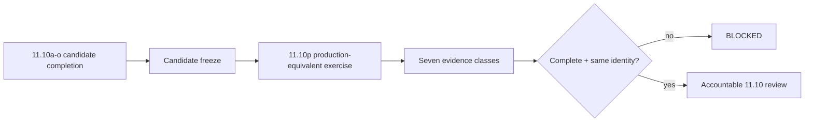

# DTMO Production Readiness Report

Assessment date: **2026-08-20**  
Software baseline: **16.0.0rc12 plus accepted post-RC13/E8/Phase-11 repository enhancements**

## 1. Executive conclusion

DTMO retains RC13 `PASS / OWNER_ACCEPTED`, E8.1–E8.10 `PASS / REPOSITORY_COMPLETE`, and historical Phase 8 `PASS / OWNER_ACCEPTED` plus Phase 9 `PASS / EXTERNAL_ASSURANCE_ACCEPTED` evidence for the earlier candidate. Phase 10 remains **`NO-GO / BLOCKED — PLATFORM INDUSTRIALISATION REQUIRED`**. DTMO is **not production authorized**.

Phase 11 is `IN PROGRESS / ACTIVE`. Phase 11.1–11.9 and Phase 11.10a are `PASS / REPOSITORY_COMPLETE`. Phase 11.10 remains `IN PROGRESS / FRESH CANDIDATE-BOUND EVIDENCE REQUIRED`, with external execution intentionally deferred while the materially changed user-facing candidate is completed. The current bounded gate is **Phase 11.10b canonical application shell**, `IN PROGRESS / EXACT-HEAD VALIDATION REQUIRED`. Phase 11.11 and Phase 12 are `NOT STARTED`.

## 2. Readiness summary

| Dimension | Current position | Decision |
|---|---|---|
| Engineering / CI | Accepted through Phase 11.9 plus 11.10a architecture baseline | `PASS` within accepted scope |
| Functional product | Pre-workbench canonical journey owner accepted | `PASS / OWNER_ACCEPTED` historical/current baseline within scope |
| E8 scope | Repository complete | `PASS / REPOSITORY_COMPLETE` |
| Phase 8 | Historical prior-candidate validation | `PASS / OWNER_ACCEPTED` |
| Phase 9 | Historical prior-candidate assurance | `PASS / EXTERNAL_ASSURANCE_ACCEPTED` |
| Phase 10 | Production authorization | `NO-GO / BLOCKED` |
| Phase 11.1–11.8 | Service integrations and runtime industrialisation | `PASS / REPOSITORY_COMPLETE` |
| Phase 11.9 | Migration and compatibility | `PASS / REPOSITORY_COMPLETE` |
| Phase 11.10 | Candidate completion + production-equivalent validation | `IN PROGRESS / FRESH CANDIDATE-BOUND EVIDENCE REQUIRED` |
| Phase 11.10a | Frontend architecture/design contract | `PASS / REPOSITORY_COMPLETE` |
| Phase 11.10b | Canonical application shell | `IN PROGRESS / EXACT-HEAD VALIDATION REQUIRED` |
| Phase 11.10c | Command Center | `NOT STARTED` |
| Phase 11.10p | Fresh production-equivalent validation | `NOT STARTED / CANDIDATE FREEZE REQUIRED` |
| Phase 11.11 | Independent external assurance | `NOT STARTED` |
| Phase 12 | Formal production decision | `NOT STARTED` |

## 3. Accepted Phase 11 baseline

Taranis AI, IntelOwl, Cortex, OpenCTI, MISP and TheHive remain separate service boundaries with applicable licensing/provider terms. PostgreSQL remains canonical DTMO application truth. Provenance, **server-side RBAC**, least privilege, human publication/share authority, separate TheHive case-handoff authority and fail-closed evidence handling remain preserved.

Phase 11.8 accepted repository controls cover Kubernetes/Helm/GitOps runtime foundations, workload identity and external secret delivery, ingress/TLS and network segmentation, HA/disruption, observability, backup/restore/recovery, software supply-chain hardening, capacity/resource planning and upgrade/rollback contracts. Phase 11.9 accepted the connected migration graph and forward-first compatibility model. Phase 11.10a accepted the frontend architecture, UI/API, information-architecture and design-system contracts. None of these repository acceptances is production authorization.

## 4. Active candidate-completion boundary

The owner-required next-generation Unified Operations Workbench expands the functionality available from the canonical DTMO interface and therefore materially changes the candidate that must later be validated externally.

The controlled candidate-completion sequence is 11.10a–11.10o. Phase 11.10a is accepted. Phase 11.10b now implements the canonical shell foundation with:

- exact-pinned React/TypeScript/Vite/TanStack/React Router dependencies;
- committed npm lockfile consumed with `npm ci`;
- canonical `/workbench/` route;
- `/ui/console` as a temporary **compatibility path** only;
- task-oriented primary navigation, top bar and navigation-only command palette;
- context rail with explicit no-selection truth;
- responsive/accessibility shell baseline and semantic dark/light themes;
- same-origin FastAPI serving with strict CSP and immutable hashed-asset caching;
- container frontend build stage without Node/npm in the final runtime;
- explicit prohibition on synthetic operational state for later workspaces.

Normal browser operations use **browser → DTMO API → governed integration adapter → upstream service**. Direct privileged browser calls to upstream products are not the canonical model.

Command Center functional content begins only in Phase 11.10c. Repository acceptance of 11.10b remains engineering/functional shell evidence only.

## 5. Phase 11.10p production-equivalent boundary

After 11.10o acceptance, one immutable integrated candidate is frozen. Production-equivalent validation must then bind the complete evidence set to that candidate and one approved environment.

Required evidence remains:

- immutable candidate identity and fingerprint;
- migration/compatibility behavior;
- upgrade behavior;
- exact prior-digest rollback and post-rollback health;
- application/dependency health and readiness;
- representative saturation/capacity observations;
- recovery/continuity with data-integrity and RPO/RTO observations where applicable.

## 6. Explicitly unproven controls

A green repository workflow **does not prove** the new workbench has been deployed to the production-equivalent environment, live upstream integrations, a live cluster, real migration, exercised continuity, actual saturation behavior, real rollback/recovery or production authorization. A valid evidence manifest proves metadata consistency only; reviewers must inspect the referenced external evidence.

Design mockups, generated visuals, shell route foundations and documentation screenshots are not live, staging or production-equivalent evidence.

## 7. Security and governance posture

- Server-side RBAC remains authoritative even when the UI is role-aware.
- Evidence references must not expose secrets, bearer tokens, private keys or raw credentials.
- Workload identity and external secret controls remain authoritative in the deployed environment.
- Human publication/share authority and TheHive case authority remain distinct from UI, validation and technical execution.
- Connector, enrichment, graph or correlation state does not establish local compromise.
- Service and licensing boundaries remain separate during UI integration, deployment and validation.
- The browser does not receive upstream privileged credentials for normal governed workflows.
- Missing or ambiguous identity/evidence fails closed.

## 8. Historical evidence effect

Phase 8 and Phase 9 remain valid only for the earlier candidate and cannot satisfy Phase 11.10 or Phase 11.11 for the materially changed integrated platform. Historical evidence is not rewritten or upgraded into current acceptance.

## 9. Active documentation

The accepted 11.10a package remains defined by:

- `docs/architecture/FRONTEND_ARCHITECTURE.md`;
- `docs/architecture/UI_API_CONTRACT.md`;
- `docs/ux/UNIFIED_OPERATIONS_WORKBENCH.md`;
- `docs/ux/INFORMATION_ARCHITECTURE.md`;
- `docs/ux/DESIGN_SYSTEM.md`;
- `docs/qa/PHASE11_10A_FRONTEND_ARCHITECTURE_GATE.md`;
- `backend/tests/test_phase11_10a_frontend_architecture_contract.py`;
- `.github/workflows/phase11-frontend-architecture.yml`.

The active 11.10b package is defined by:

- `docs/architecture/PHASE11_10B_APPLICATION_SHELL.md`;
- `docs/qa/PHASE11_10B_APPLICATION_SHELL_GATE.md`;
- `frontend/package.json` and `frontend/package-lock.json`;
- `frontend/src/main.tsx`, `frontend/src/App.tsx`, `frontend/src/styles.css`;
- `backend/dtmo/workbench_frontend.py`;
- `backend/tests/test_phase11_10b_application_shell_contract.py`;
- `backend/tests/test_phase11_10b_application_shell_browser.py`;
- `.github/workflows/phase11-application-shell.yml`.

The existing external validation package remains defined by the Phase 11.10 production-equivalent validation gate, runbook, evidence template, validator and Evidence Index and is exercised only at 11.10p.

## 10. Acceptance rule

Phase 11.10b may become `PASS / REPOSITORY_COMPLETE` only when its final exact head consumes the committed lockfile unchanged, canonical shell build/browser acceptance is green, existing security/supply-chain/accessibility regressions remain green and all affected professional documentation is synchronized. That permits only 11.10c to start.

Phase 11.10 overall may become `PASS / OWNER_ACCEPTED` only when 11.10a–11.10o candidate completion is accepted, 11.10p fresh evidence is reviewable and bound to one immutable candidate/environment, release-blocking findings are absent or accountably dispositioned, and an accountable owner records acceptance.

Phase 11.10 acceptance does not itself authorize production. Phase 11.11 independent assurance must then assess the same immutable candidate.

## 11. Recommendation

Continue only **Phase 11.10b**. Do not start 11.10c, execute the external 11.10p exercise, start Phase 11.11 or infer a Phase 12 production decision until the current bounded shell gate and subsequent fixed sequence are accepted in order.
