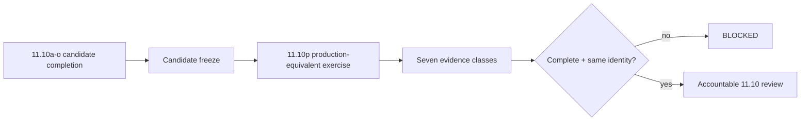

# DTMO Production Readiness Report

Assessment date: **2026-08-20**  
Software baseline: **16.0.0rc12 plus accepted post-RC13/E8/Phase-11 repository enhancements**

## 1. Executive conclusion

DTMO retains RC13 `PASS / OWNER_ACCEPTED`, E8.1–E8.10 `PASS / REPOSITORY_COMPLETE`, and historical Phase 8 `PASS / OWNER_ACCEPTED` plus Phase 9 `PASS / EXTERNAL_ASSURANCE_ACCEPTED` evidence for the earlier candidate. Phase 10 remains **`NO-GO / BLOCKED — PLATFORM INDUSTRIALISATION REQUIRED`**. DTMO is **not production authorized**.

Phase 11 is `IN PROGRESS / ACTIVE`. Phase 11.1–11.9 are `PASS / REPOSITORY_COMPLETE`. Phase 11.10 remains `IN PROGRESS / FRESH CANDIDATE-BOUND EVIDENCE REQUIRED`, but external execution is intentionally deferred while the materially changed user-facing candidate is completed. The current bounded gate is **Phase 11.10a frontend architecture/design contract**, `IN PROGRESS / REPOSITORY ARCHITECTURE CONTRACT`. Phase 11.11 and Phase 12 are `NOT STARTED`.

## 2. Readiness summary

| Dimension | Current position | Decision |
|---|---|---|
| Engineering / CI | Accepted through Phase 11.9 repository controls | `PASS` |
| Functional product | Current canonical journey owner accepted | `PASS / OWNER_ACCEPTED` |
| E8 scope | Repository complete | `PASS / REPOSITORY_COMPLETE` |
| Phase 8 | Historical prior-candidate validation | `PASS / OWNER_ACCEPTED` |
| Phase 9 | Historical prior-candidate assurance | `PASS / EXTERNAL_ASSURANCE_ACCEPTED` |
| Phase 10 | Production authorization | `NO-GO / BLOCKED` |
| Phase 11.1–11.8 | Service integrations and runtime industrialisation | `PASS / REPOSITORY_COMPLETE` |
| Phase 11.9 | Migration and compatibility | `PASS / REPOSITORY_COMPLETE` |
| Phase 11.10 | Candidate completion + production-equivalent validation | `IN PROGRESS / FRESH CANDIDATE-BOUND EVIDENCE REQUIRED` |
| Phase 11.10a | Frontend architecture/design contract | `IN PROGRESS / REPOSITORY ARCHITECTURE CONTRACT` |
| Phase 11.11 | Independent external assurance | `NOT STARTED` |
| Phase 12 | Formal production decision | `NOT STARTED` |

## 3. Accepted Phase 11 baseline

Taranis AI, IntelOwl, Cortex, OpenCTI, MISP and TheHive remain separate service boundaries with applicable licensing/provider terms. PostgreSQL remains canonical DTMO application truth. Provenance, RBAC, least privilege, human publication/share authority, separate TheHive case-handoff authority and fail-closed evidence handling remain preserved.

Phase 11.8 accepted repository controls cover Kubernetes/Helm/GitOps runtime foundations, workload identity and external secret delivery, ingress/TLS and network segmentation, HA/disruption, observability, backup/restore/recovery, software supply-chain hardening, capacity/resource planning and upgrade/rollback contracts. Phase 11.9 accepted the connected migration graph and forward-first compatibility model. None of these repository acceptances is production authorization.

## 4. Candidate-completion boundary

The owner-required next-generation Unified Operations Workbench expands the functionality available from the canonical DTMO interface and therefore materially changes the candidate that must later be validated externally.

The controlled candidate-completion sequence is 11.10a–11.10o. 11.10a defines architecture, UI/API boundaries, information architecture and design-system/accessibility requirements. Later slices implement shell, command center, intelligence, integrated analysis, graph, sharing, cases, vulnerability/exposure, source operations, automation, governance/evidence, operations/administration, role-aware UX and final consolidation/full functional acceptance.

Normal browser operations must use **browser → DTMO API → governed integration adapter → upstream service**. Direct privileged browser calls to upstream products are not the canonical model.

Repository acceptance of candidate-completion slices remains engineering/functional evidence only.

## 5. Phase 11.10p production-equivalent boundary

After 11.10o acceptance, one immutable integrated candidate is frozen. Production-equivalent validation must then bind the complete evidence set to that candidate and one approved environment.

Required evidence remains:

- immutable candidate identity and fingerprint;
- migration/compatibility behavior;
- upgrade behavior;
- exact prior-digest rollback and post-rollback health;
- application/dependency health and readiness;
- representative saturation/capacity observations;
- recovery/continuity with data-integrity and RPO/RTO observations where applicable.

## 6. Explicitly unproven controls

A green repository workflow does not prove the new UI has been deployed, a live cluster, real migration, exercised continuity, actual saturation behavior, real rollback/recovery or production authorization. A valid evidence manifest proves metadata consistency only; reviewers must inspect the referenced external evidence.

Design mockups, generated visuals and documentation screenshots are not live, staging or production-equivalent evidence.

## 7. Security and governance posture

- Server-side RBAC remains authoritative even when the UI is role-aware.
- Evidence references must not expose secrets, bearer tokens, private keys or raw credentials.
- Workload identity and external secret controls remain authoritative in the deployed environment.
- Human publication/share authority and TheHive case authority remain distinct from UI, validation and technical execution.
- Connector, enrichment, graph or correlation state does not establish local compromise.
- Service and licensing boundaries remain separate during UI integration, deployment and validation.
- Missing or ambiguous identity/evidence fails closed.

## 8. Historical evidence effect

Phase 8 and Phase 9 remain valid only for the earlier candidate and cannot satisfy Phase 11.10 or Phase 11.11 for the materially changed integrated platform. Historical evidence is not rewritten or upgraded into current acceptance.

## 9. Active documentation

The active 11.10a package is defined by:

- `docs/architecture/FRONTEND_ARCHITECTURE.md`;
- `docs/architecture/UI_API_CONTRACT.md`;
- `docs/ux/UNIFIED_OPERATIONS_WORKBENCH.md`;
- `docs/ux/INFORMATION_ARCHITECTURE.md`;
- `docs/ux/DESIGN_SYSTEM.md`;
- `docs/qa/PHASE11_10A_FRONTEND_ARCHITECTURE_GATE.md`;
- `backend/tests/test_phase11_10a_frontend_architecture_contract.py`;
- `.github/workflows/phase11-frontend-architecture.yml`.

The existing external validation package remains defined by the Phase 11.10 production-equivalent validation gate, runbook, evidence template, validator and Evidence Index and is exercised only at 11.10p.

## 10. Acceptance rule

11.10a may become `PASS / REPOSITORY_COMPLETE` only when its exact-head architecture contract CI is green and all affected professional documentation is synchronized. That permits only 11.10b to start.

Phase 11.10 overall may become `PASS / OWNER_ACCEPTED` only when 11.10a–11.10o candidate completion is accepted, 11.10p fresh evidence is reviewable and bound to one immutable candidate/environment, release-blocking findings are absent or accountably dispositioned, and an accountable owner records acceptance.

Phase 11.10 acceptance does not itself authorize production. Phase 11.11 independent assurance must then assess the same immutable candidate.

## 11. Recommendation

Continue only **Phase 11.10a**. Do not execute the external 11.10p exercise, start Phase 11.11 or infer a Phase 12 production decision until the new integrated candidate has completed its fixed bounded sequence.
