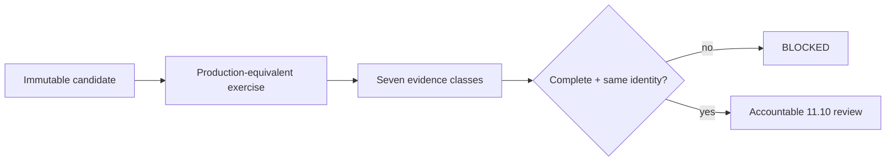

# DTMO Production Readiness Report

Assessment date: **2026-08-20**  
Software baseline: **16.0.0rc12 plus accepted post-RC13/E8/Phase-11 repository enhancements**

## 1. Executive conclusion

DTMO retains RC13 `PASS / OWNER_ACCEPTED`, E8.1–E8.10 `PASS / REPOSITORY_COMPLETE`, and historical Phase 8 `PASS / OWNER_ACCEPTED` plus Phase 9 `PASS / EXTERNAL_ASSURANCE_ACCEPTED` evidence for the earlier candidate. Phase 10 remains **`NO-GO / BLOCKED — PLATFORM INDUSTRIALISATION REQUIRED`**. DTMO is **not production authorized**.

Phase 11 is `IN PROGRESS / ACTIVE`. Phase 11.1–11.9 are `PASS / REPOSITORY_COMPLETE`. The active gate is **Phase 11.10 production-equivalent validation**, `IN PROGRESS / FRESH CANDIDATE-BOUND EVIDENCE REQUIRED`. Phase 11.11 and Phase 12 are `NOT STARTED`.

## 2. Readiness summary

| Dimension | Current position | Decision |
|---|---|---|
| Engineering / CI | Accepted through Phase 11.9 repository controls | `PASS` |
| Functional product | Owner accepted | `PASS / OWNER_ACCEPTED` |
| E8 scope | Repository complete | `PASS / REPOSITORY_COMPLETE` |
| Phase 8 | Historical prior-candidate validation | `PASS / OWNER_ACCEPTED` |
| Phase 9 | Historical prior-candidate assurance | `PASS / EXTERNAL_ASSURANCE_ACCEPTED` |
| Phase 10 | Production authorization | `NO-GO / BLOCKED` |
| Phase 11.1–11.8 | Service integrations and runtime industrialisation | `PASS / REPOSITORY_COMPLETE` |
| Phase 11.9 | Migration and compatibility | `PASS / REPOSITORY_COMPLETE` |
| Phase 11.10 | Production-equivalent execution | `IN PROGRESS / FRESH CANDIDATE-BOUND EVIDENCE REQUIRED` |
| Phase 11.11 | Independent external assurance | `NOT STARTED` |
| Phase 12 | Formal production decision | `NOT STARTED` |

## 3. Accepted Phase 11 baseline

Taranis AI, IntelOwl, Cortex, OpenCTI, MISP and TheHive remain separate service boundaries with applicable licensing/provider terms. PostgreSQL remains canonical DTMO application truth. Provenance, RBAC, least privilege, human publication/share authority, separate TheHive case-handoff authority and fail-closed evidence handling remain preserved.

Phase 11.8 accepted repository controls cover Kubernetes/Helm/GitOps runtime foundations, workload identity and external secret delivery, ingress/TLS and network segmentation, HA/disruption, observability, backup/restore/recovery, software supply-chain hardening, capacity/resource planning and upgrade/rollback contracts. Phase 11.9 accepted the connected migration graph and forward-first compatibility model. None of these repository acceptances is production authorization.

## 4. Active Phase 11.10 boundary

Production-equivalent validation must bind the complete evidence set to one immutable integrated candidate and one approved environment.

Required evidence:

- immutable candidate identity and fingerprint;
- migration/compatibility behavior;
- upgrade behavior;
- exact prior-digest rollback and post-rollback health;
- application/dependency health and readiness;
- representative saturation/capacity observations;
- recovery/continuity with data-integrity and RPO/RTO observations where applicable.

## 5. Explicitly unproven controls

A green repository workflow does not prove a live cluster, real migration, exercised continuity, actual saturation behavior, real rollback/recovery or production authorization. A valid evidence manifest proves metadata consistency only; reviewers must inspect the referenced external evidence.

## 6. Security and governance posture

- Evidence references must not expose secrets, bearer tokens, private keys or raw credentials.
- Workload identity and external secret controls remain authoritative in the deployed environment.
- Human publication/share authority and TheHive case authority remain distinct from validation execution.
- Connector or enrichment state does not establish local compromise.
- Service and licensing boundaries remain separate during deployment and validation.
- Missing or ambiguous identity/evidence fails closed.

## 7. Historical evidence effect

Phase 8 and Phase 9 remain valid only for the earlier candidate and cannot satisfy Phase 11.10 or Phase 11.11 for the materially changed integrated platform. Historical evidence is not rewritten or upgraded into current acceptance.

## 8. Active documentation

The controlled Phase 11.10 package is defined by:

- `docs/qa/PHASE11_10_PRODUCTION_EQUIVALENT_VALIDATION_GATE.md`;
- `docs/operations/PHASE11_10_PRODUCTION_EQUIVALENT_VALIDATION_RUNBOOK.md`;
- `docs/evidence/PHASE11_10_PRODUCTION_EQUIVALENT_EVIDENCE.template.json`;
- `tools/phase11_production_equivalent_validation.py`;
- `docs/evidence/EVIDENCE_INDEX.md`;
- the Platform Industrialisation Roadmap and Current State.

## 9. Acceptance rule

Phase 11.10 may become `PASS / OWNER_ACCEPTED` only when the complete fresh evidence set is reviewable, bound to one immutable candidate and environment, release-blocking findings are absent or accountably dispositioned, and an accountable owner records the acceptance decision.

Phase 11.10 acceptance does not itself authorize production. Phase 11.11 independent assurance must then assess the same immutable candidate.

## 10. Recommendation

Continue only Phase 11.10 production-equivalent execution and evidence consolidation. Do not start Phase 11.11 and do not infer a Phase 12 production decision until the required evidence sequence is complete.
