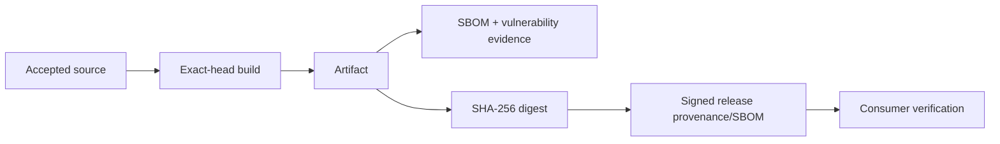

# DTMO Production Readiness Report

Assessment date: **2026-08-18**  
Software baseline: **16.0.0rc12 plus accepted post-RC13/E8/Phase-11 repository enhancements**

## 1. Executive conclusion

DTMO retains RC13 `PASS / OWNER_ACCEPTED`, E8.1–E8.10 `PASS / REPOSITORY_COMPLETE`, and historical Phase 8 `PASS / OWNER_ACCEPTED` plus Phase 9 `PASS / EXTERNAL_ASSURANCE_ACCEPTED` evidence for the earlier candidate. Phase 10 remains **`NO-GO / BLOCKED — PLATFORM INDUSTRIALISATION REQUIRED`**. DTMO is **not production authorized**.

Phase 11 is `IN PROGRESS / ACTIVE`. Phase 11.1–11.8f are `PASS / REPOSITORY_COMPLETE`; the active bounded step is **Phase 11.8g software supply-chain hardening**, `IN PROGRESS / EXACT-HEAD VALIDATION REQUIRED`. Phase 12 is `NOT STARTED` and still requires fresh Phase 11.10 production-equivalent validation and Phase 11.11 independent external assurance against one immutable integrated candidate.

## 2. Readiness summary

| Dimension | Current position | Decision |
|---|---|---|
| Engineering / CI | Accepted through completed Phase 11 slices | `PASS` |
| Functional product | Owner accepted | `PASS / OWNER_ACCEPTED` |
| E8 scope | Repository complete | `PASS / REPOSITORY_COMPLETE` |
| Phase 8 | Historical prior-candidate validation | `PASS / OWNER_ACCEPTED` |
| Phase 9 | Historical prior-candidate assurance | `PASS / EXTERNAL_ASSURANCE_ACCEPTED` |
| Phase 10 | Production authorization | `NO-GO / BLOCKED` |
| Phase 11.1–11.8f | Integration/runtime hardening | `PASS / REPOSITORY_COMPLETE` |
| Phase 11.8g | Software supply chain | `IN PROGRESS / EXACT-HEAD VALIDATION REQUIRED` |
| Phase 11.9–11.11 | Migration, validation, assurance | `NOT STARTED` |
| Phase 12 | Formal production decision | `NOT STARTED` |

## 3. Accepted Phase 11 baseline

Taranis AI, IntelOwl, Cortex, OpenCTI, MISP and TheHive remain separate service boundaries with applicable licensing/provider terms. PostgreSQL remains canonical DTMO application truth. Provenance, RBAC, human publication/share authority, separate TheHive case-handoff authority and fail-closed evidence handling remain preserved.

Accepted Phase 11.8a–11.8f repository controls cover the Helm/GitOps runtime foundation, workload identity/external secret delivery, TLS ingress/network segmentation, HA/disruption controls, observability boundaries and recovery requirements. None of those repository acceptances is production authorization.

## 4. Active Phase 11.8g boundary

The bounded slice requires exact-head wheel/container builds, CycloneDX SBOMs, known-vulnerability evidence, SHA-256 artifact identities, and a governed release workflow for signed provenance and SBOM attestations. Long-lived signing keys are not stored in the repository.

## 5. Explicitly unproven controls

Repository acceptance does not prove future release signing, registry integrity, deployment verification/admission, absence of all vulnerabilities, production-equivalent behavior or production authorization. Capacity and exercised upgrade/rollback remain separate bounded Phase 11.8 work.

## 6. Security and governance posture

Technical artifact metadata cannot broaden data-handling rights, publication/share authority, TheHive case authority or service licensing boundaries. Missing or mismatched artifact identity, SBOM, vulnerability or required attestation evidence fails closed.

## 7. Historical evidence effect

Phase 8 and Phase 9 remain valid only for the earlier candidate and cannot satisfy Phase 11.10 or Phase 11.11 for the materially changed integrated platform.

## 8. Active documentation

Current supply-chain documentation is governed by `docs/security/PHASE11_8G_SUPPLY_CHAIN_HARDENING.md`, `docs/administration/SUPPLY_CHAIN_RELEASE_VERIFICATION.md`, `docs/operations/PHASE11_8G_SUPPLY_CHAIN_RUNBOOK.md`, `docs/governance/PHASE11_8G_SUPPLY_CHAIN_MAPPING.md`, `docs/qa/PHASE11_8G_SUPPLY_CHAIN_GATE.md`, the Platform Industrialisation Roadmap, Current State, Evidence Index and synchronized README/docs portal material.

## 9. Evidence boundary

Repository CI proves only repository-controlled mechanisms and exact-head outputs. Actual release attestations become evidence only when generated for the exact release subject; later deployment verification remains environment-bound evidence.

## 10. Recommendation

Continue only Phase 11.8g and merge only on fully green exact-head CI with the dedicated supply-chain gate, RC4, Professional Documentation and expected-head protection.
