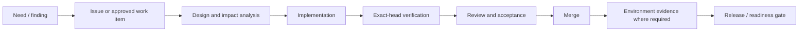

# DTMO Project Governance

## Purpose

This document defines the governance model for the Dutch Threat Monitoring for Education (DTMO) project. It provides a stable, decision-oriented reference for ownership, authority, change control, release progression, evidence and accountability.

DTMO is developed as a security-sensitive Cyber Threat Intelligence platform. Project governance therefore treats functional capability, security assurance, operational readiness and publication authority as distinct concerns.

## Governance principles

1. **Evidence before status.** A milestone, gate or control is accepted only when its required evidence exists and is attributable to the relevant version or deployment.
2. **Fail closed.** Missing, stale, skipped, cancelled, inaccessible or ambiguous evidence does not become implicit approval.
3. **Separation of duties.** Engineering capability, administration, deployment access, review and external publication authority remain distinct.
4. **Immutable release identity.** Acceptance evidence must identify the commit, release or deployment to which it applies.
5. **Least privilege.** Human and service identities receive only the permissions required for their responsibilities.
6. **Traceability.** Material requirements, decisions, changes, controls and acceptance outcomes remain traceable to authoritative records.
7. **No inferred compliance.** Framework or control mappings require explicit evidence; descriptive similarity is not a mapping.

## Decision domains

| Domain | Primary decision | Required evidence |
|---|---|---|
| Product | Capability is suitable for intended use | Functional acceptance and documented limitations |
| Engineering | Change is technically acceptable | Exact-head CI, review and traceability |
| Security | Security posture is acceptable for the target stage | Security gates, threat/risk evidence and exceptions |
| Operations | Service can be operated and recovered | Runbooks, monitoring, recovery and operational exercises |
| Staging | Production-equivalent deployment is accepted | Immutable deployment identity and Phase 8 evidence |
| External assurance | Independent assurance is sufficient | Phase 9 evidence and disposition of findings |
| Production | Release may enter production | Phase 10 go/no-go record and accountable approvals |
| External sharing | Intelligence may be externally shared | Explicit human review and separate share approval |

No decision in one domain automatically grants authority in another.

## Roles and accountability

### Project owner

The project owner is accountable for product direction, acceptance of intended functionality and formal progression decisions that explicitly require owner acceptance. Owner acceptance does not replace security, operational or external-assurance evidence.

### Engineering

Engineering is responsible for implementation quality, automated tests, architecture integrity, migrations, maintainability and truthful technical documentation. Engineering must not mark external or manual evidence as passed merely because repository-controlled tests succeed.

### Security and governance

Security/governance responsibilities include authorization boundaries, secrets handling, auditability, provenance, privacy, control mapping, risk acceptance and assurance requirements. Security exceptions must be explicit, bounded and attributable.

### Operations

Operations is responsible for deployment procedures, observability, incident response, backup/recovery, capacity and service continuity evidence for the relevant environment.

### Independent assurance

Independent assurance validates claims that must not rely solely on the implementation team. Phase 9 evidence remains separate from repository-controlled engineering evidence.

## Change governance

Material changes should follow this lifecycle:

A new commit invalidates exact-head CI evidence for an earlier commit. Environment-specific claims require evidence from that environment and must not be substituted with local Compose, emulators or synthetic fixtures.

## Release and readiness governance

DTMO distinguishes software release identity from production readiness.

- **Phases 1–7** establish repository-controlled engineering, security, recovery, connector, performance, accessibility and operational foundations.
- **RC13** establishes accepted functional behavior of the canonical unified console.
- **Phase 8** requires a real approved production-equivalent staging deployment and evidence tied to one immutable deployment identity.
- **Phase 9** requires independent external assurance and disposition of material findings.
- **Phase 10** is the formal production go/no-go decision.

A successful software release or CI run is therefore not synonymous with production authorization.

## Evidence hierarchy

Evidence is evaluated according to its claim boundary:

1. **Repository evidence** — source, tests, static contracts, CI and review records.
2. **Runtime engineering evidence** — controlled local/reference runtime tests and emulators.
3. **Environment evidence** — observations from an identified staging or production-equivalent deployment.
4. **Independent evidence** — assessment produced by an appropriately independent party.
5. **Accountable approval** — explicit human acceptance for decisions requiring accountable authority.

Higher-order claims cannot be satisfied solely by lower-order evidence when the governing gate explicitly requires environment, independent or accountable evidence.

## Documentation governance

Professional documentation is maintained as stable subject-oriented material. Implementation chronology and point-in-time evidence belong in development records, issues, pull requests and CI artifacts.

Authoritative documentation should:

- describe the current accepted state rather than narrate every historical change;
- identify evidence and claim boundaries;
- distinguish implemented, verified, externally validated and planned capabilities;
- avoid credentials, secrets and unnecessary sensitive operational detail;
- link to authoritative evidence rather than duplicating volatile data;
- be updated when a material change alters architecture, security, operation, governance or readiness claims.

See `docs/project/DOCUMENTATION_STANDARD.md` for the detailed documentation rules.

## Exceptions and risk acceptance

An exception must identify the affected requirement, rationale, scope, owner, compensating controls, expiry/review condition and evidence. An undocumented exception is not an accepted exception. Risk acceptance cannot be inferred from deployment, elapsed time or absence of incidents.

## Current governance boundary

At the current baseline, repository-controlled engineering and RC13 functional acceptance are complete. Production readiness remains incomplete. Phase 8 requires real production-equivalent staging evidence; Phase 9 and Phase 10 remain subsequent independent assurance and production decision gates.

This document defines governance structure only. It does not itself constitute Phase 8, Phase 9 or Phase 10 acceptance evidence.
