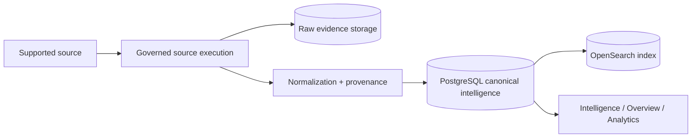

# DTMO Intelligence Pipeline Release Gate

**Status:** `PASS` for the accepted RC13 intelligence pipeline

## Objective

Define the end-to-end repository-controlled contract from supported source execution through raw evidence, normalization/provenance, durable canonical persistence, search/index representation and operator-facing application visibility.

## Canonical pipeline

PostgreSQL is the canonical application truth. Raw evidence and OpenSearch are essential supporting stores, but neither replaces the canonical database state used by application reads and dashboard aggregation.

## Required source behavior

- Source execution is authorized and disabled sources fail closed.
- Supported source profiles preserve provider/source identity and provenance.
- Credentialed sources use logical secret references rather than raw repository credentials.
- Network/response behavior remains bounded by the relevant safe execution or provider adapter contract.
- Unsupported/invalid records do not bypass normalization validation.

## Required normalization behavior

Canonical normalization must preserve or explicitly derive only supported values.

The accepted baseline includes:

- explicit supported item-type normalization (including the supported `security-advisory` → `advisory` alias);
- fail-closed unknown intelligence types;
- HTTP(S)-only canonical URL/reference behavior where defined by the schema;
- stable HTTPS NVD CVE canonical/provenance identity while preserving upstream references in raw evidence;
- source/reliability and publication/context provenance.

## Required persistence behavior

- Raw source evidence is retained through the evidence-storage path.
- Canonical intelligence is written through the PostgreSQL repository/session boundary.
- Connector ingestion returns durable success only after the database session completes its commit.
- A raw-object write or successful OpenSearch document creation alone is not reported as canonical application success.
- Repeat ingestion remains idempotent according to the canonical record contract.
- Supporting OpenSearch state can be repaired/rebuilt without redefining canonical intelligence truth.

## Search and application visibility

- Search behaves safely on fresh/empty index state.
- OpenSearch mappings match indexed canonical fields.
- Intelligence views read durable canonical records.
- Overview/dashboard summaries aggregate canonical PostgreSQL intelligence.
- Native Visual Analytics represents canonical analytical state.
- Empty canonical datasets produce truthful empty states rather than false success/pseudo-data.

## Provenance and authority

Source execution and ingestion must not modify or grant:

- human review authority;
- external-share approval;
- publication authority;
- unrelated privileged Administration authority.

Provenance/raw evidence remains traceable from normalized records where the model provides the reference.

## Evidence requirements for changes

Future pipeline changes require applicable tests for:

1. source execution/authorization;
2. raw evidence persistence;
3. normalization/type/reference contracts;
4. canonical PostgreSQL commit semantics;
5. idempotency/replay;
6. OpenSearch indexing/search;
7. canonical console/dashboard visibility;
8. provenance and authority boundaries;
9. complete exact-head CI on the final PR head.

A new commit invalidates earlier exact-head evidence.

## Claim boundary

This gate's PASS is repository-controlled engineering and accepted functional-product evidence. It does not establish:

- real production-equivalent staging persistence/network configuration;
- independent penetration testing;
- provider SLA/contractual authorization;
- production backup/restoration acceptance;
- Phase 10 production approval.

Those remain Phase 8/9/10 evidence classes.
