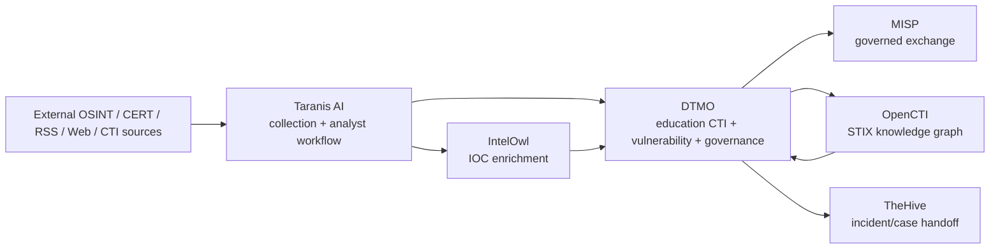

# Phase 11 — Platform Industrialisation

Status: **ACTIVE / HIGHEST PRIORITY**  
Production decision: **Phase 10 NO-GO remains in force**  
Scope rule: all non-Phase-11 product evolution is paused until this roadmap is completed or explicitly re-prioritized.

## Objective

Industrialise DTMO by integrating mature open-source platforms where they provide stronger production capabilities than continued custom implementation. DTMO remains the education-sector CTI, vulnerability-context, governance and assurance layer. Generic collection, enrichment, knowledge-graph and incident/case-management capabilities should be delegated to established platforms where this reduces operational risk and duplicated engineering.

## Target platform direction

## Architectural principles

1. **API/service separation first.** Taranis AI is EUPL-1.2 while DTMO is Apache-2.0. No upstream source is vendored into DTMO without an explicit licensing review.
2. **DTMO keeps its differentiators.** Governance, Normenkader IBP evidence mapping, education-sector context, vulnerability prioritisation, provenance policy, accountable sharing and assurance remain DTMO responsibilities.
3. **Do not rebuild commodity platform features.** Generic web/RSS collection, enrichment orchestration, STIX graph infrastructure, general case management and report publishing should use established projects where feasible.
4. **Human authority remains human.** No platform integration grants autonomous external sharing/publication authority.
5. **Canonical contracts remain explicit.** Cross-platform data exchange must preserve source provenance, TLP/classification, timestamps, confidence, identifiers and review/share state.
6. **Fail closed.** An unavailable or ambiguous external service may degrade functionality but must not silently change authorization, provenance or governance semantics.

# Delivery sequence

## 11.1 — Taranis AI architecture & gap assessment — ACTIVE

Deliverables:

- file-/capability-level comparison of DTMO and Taranis;
- `KEEP DTMO / INTEGRATE / REPLACE / DEPRECATE / MIGRATE` decision matrix;
- data-model mapping: Taranis News Item / Story / Report -> DTMO canonical intelligence;
- source/provenance/TLP/classification mapping;
- identity/RBAC and service-account boundary assessment;
- deployment topology and trust-boundary assessment;
- collector/worker/reporting overlap assessment;
- API/OpenAPI integration feasibility;
- licensing and component-boundary decision;
- migration risks and proof-of-concept acceptance criteria.

Exit criterion: architecture decision accepted and a bounded Taranis->DTMO adapter backlog exists.

## 11.2 — Taranis -> DTMO canonical adapter

Priority after 11.1.

Build a read-oriented governed adapter from Taranis into DTMO. Initial scope:

- News Item -> canonical intelligence record;
- Story/report context -> DTMO collection/report reference;
- provenance preservation;
- TLP/classification mapping;
- attachment/evidence references;
- idempotency/replay handling;
- health/freshness/timeout/failure isolation;
- no implicit publication/share authority.

## 11.3 — IntelOwl enrichment subsystem

Adopt IntelOwl as the preferred generic IOC-enrichment subsystem, leveraging the existing Taranis IntelOwl integration. DTMO should consume normalized, provenance-backed enrichment results rather than implement provider-specific enrichment engines itself.

Initial analyzers/observable classes: CVE, IP, domain, URL, hash and approved email observables. Provider secrets remain external to DTMO and are never copied into repository evidence.

## 11.4 — OpenCTI knowledge graph integration

Use OpenCTI for STIX-oriented entity/relationship graph capabilities where DTMO currently has contextual intelligence but not a full CTI knowledge graph.

Scope includes STIX object exchange, ATT&CK relationships, vulnerability/threat-actor/campaign/infrastructure linkage and graph-context presentation in DTMO. OpenCTI does not replace DTMO governance or evidence semantics.

## 11.5 — MISP consolidation

Unify MISP usage across Taranis, DTMO and optional OpenCTI flows. Establish one authoritative outbound-sharing policy with explicit TLP/distribution checks, human share approval, replay protection and unpublished-event semantics where applicable.

## 11.6 — TheHive incident/case handoff

Integrate TheHive only after the enrichment and graph layers are stable. DTMO should hand off actionable intelligence into cases rather than become a full incident/case-management platform. Cortex remains optional and should only be added if IntelOwl leaves a proven enrichment gap.

## 11.7 — Production platform hardening

Industrialise the combined platform:

- hardened container/Kubernetes deployment model;
- PostgreSQL high availability and tested restore;
- Redis persistence/HA appropriate to workload;
- ingress/TLS/WAF controls;
- secret-manager integration and rotation;
- workload identities/OIDC/SSO;
- network policies / least-privilege east-west access;
- immutable signed images, SBOM and vulnerability scanning;
- object-storage durability and lifecycle controls;
- centralized audit/logging;
- Prometheus/Grafana/SLOs and alerting;
- capacity, load, failure-isolation and recovery testing.

## 11.8 — Migration and compatibility

Migrate or reconcile existing DTMO connectors, source catalogue, canonical intelligence, MISP/AIL integrations and E8 functionality. Every replaced capability requires explicit regression evidence before deprecation.

## 11.9 — Production-equivalent integrated validation

Validate the complete multi-platform topology against one immutable candidate identity, including end-to-end source -> Taranis -> enrichment -> DTMO -> governed exchange/case/graph paths and degraded dependency behavior.

## 11.10 — Independent external assurance

Perform independent security/architecture/operations assurance against the integrated candidate and remediate/retest release-blocking findings.

# Phase 12 — Production Go/No-Go

Phase 12 replaces the currently blocked Phase 10 as the next production authorization attempt after industrialisation. A production `GO` may only be considered after Phase 11.1-11.10 are accepted against the same materially equivalent release architecture.

## Explicitly paused work

Until Phase 11 is complete or reprioritized, pause:

- unrelated UI feature expansion;
- new bespoke generic collectors;
- new provider-specific enrichment engines inside DTMO;
- custom STIX graph implementation;
- generic case/ticketing implementation;
- custom report/publishing engines;
- non-essential product-scope additions that materially change the candidate.

Security fixes, dependency/CVE remediation and defects that block Phase 11 are exempt from the pause.

# Priority order

1. Taranis AI
2. IntelOwl
3. OpenCTI
4. MISP consolidation
5. TheHive
6. Cortex only on demonstrated need
7. Integrated production-platform hardening
8. Migration/compatibility
9. Production-equivalent validation
10. Independent external assurance
11. Phase 12 formal production go/no-go
