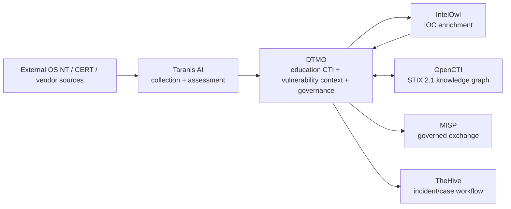
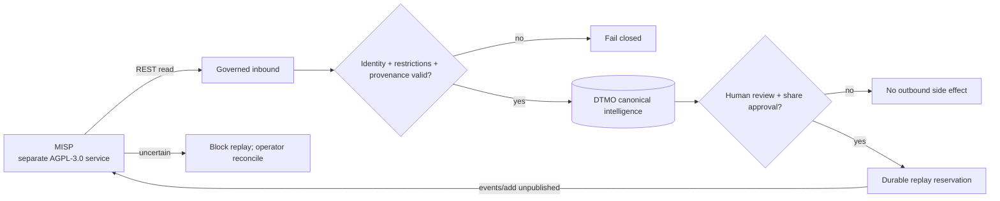

# DTMO Platform Industrialisation Roadmap

Last updated: **2026-08-16**  
Programme state: **`ACTIVE / HIGHEST PRIORITY`**

## Purpose

Phase 10 concluded with `NO-GO / BLOCKED` for production authorization. Phase 11 is the successor industrialisation programme and is executed one bounded pull request at a time. Historical Phase 8/9 evidence remains candidate-bound and is not reused for the materially changed integrated platform.

DTMO prefers mature service integrations over rebuilding generic collection, enrichment, graph, exchange and case-management platforms inside DTMO.

## Strategic target

The target is a composed service architecture, not a source-code merger. Provenance, RBAC, human publication/share authority and fail-closed evidence rules remain explicit across every boundary.

## Fixed priority order

1. 11.1 Taranis AI architecture/API/data-model/identity/licensing assessment.
2. 11.2 Taranis → DTMO canonical adapter.
3. 11.3 IntelOwl enrichment integration.
4. 11.4 OpenCTI STIX knowledge-graph integration.
5. 11.5 MISP consolidation and authoritative governed sharing model.
6. 11.6 TheHive incident/case handoff.
7. 11.7 Cortex only if a validated IntelOwl capability gap exists.
8. 11.8 Kubernetes/Helm/GitOps plus HA/secrets/network/observability/recovery/supply-chain hardening.
9. 11.9 migration/compatibility.
10. 11.10 new production-equivalent validation.
11. 11.11 new independent external assurance.
12. Phase 12 formal production GO/NO-GO.

## Phase 11 — Platform industrialisation

### 11.1 Taranis AI architecture and gap assessment

**Status:** `PASS / REPOSITORY_COMPLETE`

### 11.2 Taranis → DTMO canonical adapter

**Status:** `PASS / REPOSITORY_COMPLETE`

### 11.3 IntelOwl enrichment integration

**Status:** `PASS / REPOSITORY_COMPLETE`

### 11.4 OpenCTI knowledge-graph integration

**Status:** `PASS / REPOSITORY_COMPLETE`

The accepted Phase 11.4 boundary includes the OpenCTI service/API/STIX/licensing contract, bounded read-only GraphQL/STIX adapter, explicit OpenCTI/STIX↔DTMO identity mapping, immutable reconciliation history, database-enforced no-share/no-local-compromise invariants and PostgreSQL-before-checkpoint ordering. Repository acceptance remains engineering evidence only and does not prove live OpenCTI deployment or production authorization.

### 11.5 MISP consolidation

**Status:** `IN PROGRESS / CONTRACT IN EXACT-HEAD VALIDATION`

The active bounded slice defines one authoritative MISP service/API, identity, restriction, synchronization and sharing model before implementation changes.

Reviewed upstream baseline: **MISP v2.5.44**, kept as a separate **AGPL-3.0** service/API boundary.

Existing E8 capabilities to consolidate:

- governed inbound `POST /events/restSearch` with event/attribute/object identity, distribution, sharing-group, TLP/tag, galaxy and provenance preservation;
- governed outbound `POST /events/add` requiring separate human DTMO review/share approval, deterministic replay protection and unpublished destination events.

Required Phase 11.5 invariants:

- MISP UUIDs and DTMO canonical UUIDs remain distinct and explicitly attributable;
- source distribution, sharing-group and TLP restrictions cannot be broadened;
- ingestion cannot grant `share_approved`, publication authority or local-compromise proof;
- service accounts, connectors, schedulers, IntelOwl, OpenCTI and MISP itself cannot grant DTMO sharing authority;
- uncertain outbound delivery blocks automatic replay pending operator reconciliation;
- MISP server push/pull synchronization and OpenCTI↔MISP automatic synchronization are excluded from the first consolidation boundary;
- runtime secrets, production HTTPS, least privilege and `401`/`403` fail-closed behavior remain mandatory;
- repository CI is not live-MISP, deployment, assurance or production evidence.

After protected acceptance of the contract, the next bounded Phase 11.5 PR is the single reconciled MISP synchronization-state/persistence and authority-enforcement implementation. Phase 11.6 remains blocked until Phase 11.5 is repository-complete.

### 11.6 TheHive incident/case handoff

**Status:** `PLANNED / BLOCKED BY 11.5`

### 11.7 Cortex decision gate

**Status:** `PLANNED / CONDITIONAL`

Adopt Cortex only when an accepted IntelOwl capability-gap analysis proves it is needed.

### 11.8 Integrated runtime industrialisation

**Status:** `PLANNED`

Kubernetes, Helm, GitOps, immutable images, workload identities/external secrets, TLS/network policy, HA/recovery, centralized observability, SBOM/scanning/signing/attestation, capacity and upgrade/rollback procedures are required across the composed platform.

### 11.9 Migration and compatibility

**Status:** `PLANNED`

### 11.10 Integrated production-equivalent validation

**Status:** `PLANNED`

Run new production-equivalent validation against one immutable integrated deployment identity. Prior Phase 8 evidence is historical only.

### 11.11 Independent external assurance

**Status:** `PLANNED`

Run fresh independent assurance against the same integrated candidate after 11.10 acceptance.

## Phase 12 — Production GO/NO-GO

**Status:** `NOT STARTED`

A `GO` requires accepted 11.10 and 11.11 evidence for the same immutable integrated release identity plus accountable production ownership, residual-risk, change/support and rollback authority. Missing evidence remains fail-closed.

## Delivery discipline

Every bounded PR requires one primary objective, exact-head CI, expected-head merge protection, professional documentation synchronization, explicit security/licensing/evidence boundaries and one declared next priority. A code/integration PR does not merge when required documentation is missing or stale.

## Immediate sequence

1. Accept the **Phase 11.5 MISP consolidation contract** on fully green exact-head CI.
2. Implement the reconciled MISP synchronization-state/persistence and authority model as exactly one next bounded PR.
3. Reconcile Phase 11.5 to `PASS / REPOSITORY_COMPLETE` only after all Phase 11.5 slices are protected-merged.
4. Start exactly **11.6 TheHive**.
5. Continue 11.7–11.11 in fixed order and enter Phase 12 only after every required Phase 11 gate is accepted.
