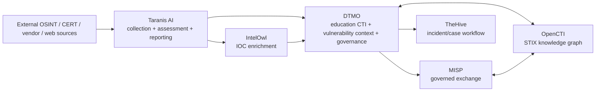

# DTMO Platform Industrialisation Roadmap

Last updated: **2026-08-15**  
Programme state: **`ACTIVE / HIGHEST PRIORITY`**

## Purpose

Phase 10 concluded with `NO-GO / BLOCKED` for production authorization. The accepted DTMO product, staging and external-assurance evidence remains valuable, but the accountable production decision requires a stronger industrial platform foundation before a new production authorization attempt.

This roadmap defines the successor programme. It deliberately prefers integration with mature open-source platforms over rebuilding generic OSINT, enrichment, knowledge-graph, case-management and orchestration capabilities inside DTMO.

## Strategic target

DTMO remains the education-sector CTI, vulnerability-context, governance and decision-support layer. Generic platform responsibilities are delegated where a mature project already provides them.

The target is an integrated platform, not a source-code merger. Service boundaries, APIs, provenance and authorization remain explicit.

## Priority order

The development order is fixed unless a higher-severity security, licensing or architecture blocker is found:

1. **Taranis AI** — collection, analyst workflow, structured reporting and production deployment foundation.
2. **IntelOwl** — IOC enrichment subsystem, preferably through the existing Taranis integration path.
3. **OpenCTI** — STIX knowledge graph and relationship model.
4. **MISP consolidation** — one authoritative governed sharing and synchronization model.
5. **TheHive** — incident/case-management handoff from accepted intelligence.
6. **Cortex only if needed** — add only when IntelOwl cannot satisfy a validated analyzer/orchestration requirement.
7. **Platform industrialisation** — Kubernetes/Helm/GitOps, HA, secrets, ingress, observability, backup/recovery and supply-chain hardening across the composed platform.
8. **Migration and compatibility** — preserve DTMO canonical intelligence, governance, E8 connectors and evidence semantics.
9. **Production-equivalent validation** of the integrated platform.
10. **Independent external assurance** of the integrated platform.
11. **Phase 12 production GO/NO-GO**.

## Phase 11 — Platform industrialisation

### 11.1 Taranis AI architecture and gap assessment

**Status:** `IN PROGRESS / ACTIVE`

Deliverables:

- DTMO/Taranis responsibility boundary;
- Keep / Integrate / Replace / Deprecate / Migrate capability matrix;
- Taranis API and data-model mapping to DTMO canonical intelligence;
- identity/RBAC and service-account mapping;
- source/collector and provenance mapping;
- deployment/runtime mapping;
- licensing and redistribution boundary;
- threat-model and trust-boundary impact;
- migration risks and acceptance criteria for 11.2.

Exit criteria:

- no generic capability is duplicated without an explicit reason;
- no Taranis source code is copied into DTMO before licensing review;
- the service-to-service boundary is documented and testable;
- canonical DTMO governance/provenance semantics have an explicit preservation path.

### 11.2 Taranis → DTMO canonical adapter

**Status:** `PLANNED`

Build a bounded API integration instead of a code fork. Required mappings include Taranis source/news/story/report concepts to DTMO source, canonical intelligence, evidence, provenance, classification and review semantics.

Acceptance criteria:

- idempotent ingestion;
- source identity and original evidence retained;
- TLP/classification cannot be silently weakened;
- canonical persistence remains durable;
- replay and duplicate handling are deterministic;
- no Taranis publishing permission becomes DTMO external-share authority;
- contract and integration tests cover degraded and partial failure states.

### 11.3 IntelOwl enrichment integration

**Status:** `PLANNED`

Use IntelOwl as the preferred generic IOC enrichment subsystem. Start from the existing Taranis IntelOwl bot path and normalize selected results into DTMO with analyzer identity, timestamps, confidence/context and raw-result provenance.

Priority observable classes:

- CVE;
- IP;
- domain;
- URL;
- hash;
- email only where privacy/data-processing approval exists.

Acceptance criteria include dedicated service identity, secret-store backed tokens, HTTPS verification outside local development, provider quota/rate-limit handling, bounded retention and no enrichment result being misrepresented as proof of local compromise.

### 11.4 OpenCTI knowledge-graph integration

**Status:** `PLANNED`

OpenCTI becomes the optional authoritative CTI relationship/graph service for STIX entities and relationships. DTMO remains the education/governance decision layer.

Required scope:

- STIX 2.x import/export boundary;
- entity identity and deduplication policy;
- ATT&CK relationships;
- vulnerabilities, indicators, malware, campaigns, infrastructure and threat actors;
- graph links surfaced in DTMO without duplicating a graph database implementation;
- provenance and confidence preservation.

### 11.5 MISP consolidation

**Status:** `PLANNED`

Consolidate DTMO and Taranis MISP capabilities into one documented authority model.

Required outcomes:

- authoritative inbound read path;
- deterministic conflict/synchronization handling;
- DTMO governed outbound approval remains authoritative;
- export remains unpublished until separately authorized;
- distribution, sharing group and TLP handling remain fail-closed;
- no automated collector or publisher receives implicit external-share authority.

### 11.6 TheHive incident/case handoff

**Status:** `PLANNED`

Introduce a controlled intelligence-to-case handoff after CTI/enrichment integration is stable.

Required outcomes:

- explicit case-creation permission;
- provenance links back to DTMO intelligence;
- no case-management state becomes canonical CTI truth;
- audit/correlation identifiers cross the integration boundary;
- response status and intelligence assessment remain semantically distinct.

### 11.7 Cortex decision gate

**Status:** `PLANNED / CONDITIONAL`

Cortex is not a default dependency. It is adopted only when a documented analyzer/orchestration requirement cannot be met safely and maintainably by IntelOwl. Duplicate enrichment platforms require an explicit architecture decision record.

### 11.8 Integrated runtime industrialisation

**Status:** `PLANNED`

Move from repository-reference topology to a supported production platform model.

Required capabilities:

- Kubernetes-based deployment;
- Helm/value-driven configuration;
- GitOps promotion, preferably ArgoCD-compatible;
- pinned immutable image versions/digests;
- PostgreSQL HA and tested recovery;
- Redis persistence/HA appropriate to queue semantics;
- object/evidence storage durability;
- TLS ingress and network policies;
- external secret manager and rotation;
- workload/service identities;
- centralized logs, audit, metrics and alerting;
- SBOM, vulnerability scanning, signing/attestation and dependency governance;
- resource limits, autoscaling/capacity testing and upgrade/rollback procedures.

Taranis already provides Kubernetes, Helm and ArgoCD deployment material, but DTMO will not treat upstream examples as production evidence. The integrated topology must be reviewed and hardened as one system.

### 11.9 Migration and compatibility

**Status:** `PLANNED`

Preserve accepted DTMO data and governance value while retiring duplicated implementation.

Required migration domains:

- source/catalog configuration;
- canonical intelligence and raw evidence;
- provenance and confidence;
- classifications and severity;
- governance mappings;
- MISP/AIL/OpenCVE/Vulnerability-Lookup compatibility;
- user/role mapping where appropriate;
- audit references;
- dashboards and operational metrics.

Every deprecation requires a documented replacement and rollback path.

### 11.10 Integrated production-equivalent validation

**Status:** `PLANNED`

Repeat production-equivalent validation against one immutable integrated deployment identity. Prior Phase 8 evidence is historical and cannot authorize the materially changed composed platform.

Validation includes application/runtime health, databases/queues/storage, service identities, RBAC, source-to-intelligence, enrichment, STIX graph, MISP sharing controls, case handoff where enabled, observability, backup/restore, rollback, capacity and failure isolation.

### 11.11 Independent external assurance

**Status:** `PLANNED`

Repeat external assurance on the integrated platform after 11.10 acceptance. Scope includes penetration testing, identity/trust boundaries, secrets, network segmentation, supply-chain/dependency posture, integration abuse cases, privacy/data handling and resilience.

## Phase 12 — Production GO/NO-GO

**Status:** `NOT STARTED`

Phase 12 replaces a retry of the previous Phase 10 decision. A `GO` requires accepted Phase 11 production-equivalent validation and independent external assurance against the same immutable integrated release identity, plus production ownership, change authorization, support/on-call, residual-risk acceptance and rollback authority.

Phase 12 remains fail-closed.

## Delivery discipline

The programme is executed one bounded pull request at a time. Each PR must have:

- one primary objective;
- explicit acceptance criteria;
- architecture/security/evidence boundaries;
- exact-head CI where applicable;
- professional documentation updates;
- a single declared next priority.

Material architecture changes are not stacked behind red CI. The next phase does not start until the current bounded gate is green or a genuine external blocker is recorded.

## Stop / defer list

While Phase 11 is active, do not spend development capacity on unrelated UI polish, new generic crawlers, a custom IOC enrichment engine, a custom STIX graph engine, a custom SOAR, generic case management or a separate report-publishing engine unless the Phase 11 assessment proves an integration cannot satisfy the requirement.

## Immediate sequence

1. Complete **11.1 Taranis AI architecture and gap assessment**.
2. Implement **11.2 Taranis → DTMO canonical adapter**.
3. Integrate **11.3 IntelOwl**.
4. Integrate **11.4 OpenCTI**.
5. Consolidate **11.5 MISP**.
6. Add **11.6 TheHive** handoff.
7. Decide **11.7 Cortex** only from evidence.
8. Industrialise the composed runtime in **11.8**.
9. Complete migration/compatibility in **11.9**.
10. Execute **11.10** and **11.11**.
11. Enter **Phase 12** only after all Phase 11 release blockers are closed.