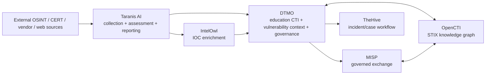

# DTMO Platform Industrialisation Roadmap

Last updated: **2026-08-16**  
Programme state: **`ACTIVE / HIGHEST PRIORITY`**

## Purpose

Phase 10 concluded with `NO-GO / BLOCKED` for production authorization. The accepted DTMO product, staging and external-assurance evidence remains valuable, but the accountable production decision requires a stronger industrial platform foundation before a new production authorization attempt.

This roadmap defines the successor programme. It deliberately prefers integration with mature open-source platforms over rebuilding generic OSINT, enrichment, knowledge-graph, case-management and orchestration capabilities inside DTMO.

## Strategic target

DTMO remains the education-sector CTI, vulnerability-context, governance and decision-support layer. Generic platform responsibilities are delegated where a mature project already provides them.

The target is an integrated platform, not a source-code merger. Service boundaries, APIs, provenance and authorization remain explicit.

## Priority order

The development order is fixed unless a higher-severity security, licensing or architecture blocker is found:

1. **Taranis AI** — collection, analyst workflow, structured reporting and production deployment foundation.
2. **IntelOwl** — IOC enrichment subsystem.
3. **OpenCTI** — STIX knowledge graph and relationship model.
4. **MISP consolidation** — one authoritative governed sharing and synchronization model.
5. **TheHive** — incident/case-management handoff from accepted intelligence.
6. **Cortex only if needed** — add only when IntelOwl cannot satisfy a validated analyzer/orchestration requirement.
7. **Platform industrialisation** — Kubernetes/Helm/GitOps, HA, secrets, ingress, observability, backup/recovery and supply-chain hardening across the composed platform.
8. **Migration and compatibility** — preserve DTMO canonical intelligence, governance, E8 connectors and evidence semantics.
9. **Production-equivalent validation** of the integrated platform.
10. **Independent external assurance** of the integrated platform.
11. **Phase 12 production GO/NO-GO**.

## Phase 11 — Platform industrialisation

### 11.1 Taranis AI architecture and gap assessment

**Status:** `PASS / REPOSITORY_COMPLETE`

The architecture assessment and accepted integration contract establish the service-to-service boundary for Taranis. DTMO retains education-sector CTI, vulnerability context, governance, provenance and governed publication/share authority. Taranis remains an upstream collection/assessment/reporting service; its implementation source is not vendored into DTMO.

### 11.2 Taranis → DTMO canonical adapter

**Status:** `PASS / REPOSITORY_COMPLETE`

Repository-complete implementation includes read-only collection, stable namespaced identity, fail-closed TLP handling, durable checkpointing/reconciliation, bounded detail/CTI retrieval, governed execution, canonical persistence/indexing and observability. Repository completion is not live production evidence and historical Phase 8/9 evidence is not reused for the materially changed candidate.

### 11.3 IntelOwl enrichment integration

**Status:** `IN PROGRESS / GOVERNED EXECUTION + DURABLE HISTORY IN EXACT-HEAD VALIDATION`

The service/API/security/licensing contract and bounded policy-enforced IntelOwl client adapter are accepted and repository-complete. The active bounded slice adds human-authorized execution, immutable durable enrichment history and the operational read boundary needed to complete Phase 11.3 repository work.

Accepted adapter capabilities:

- runtime-secret-backed IntelOwl API token and production HTTPS requirement;
- explicit production analyzer allowlist;
- approved default observable classes: CVE, IP, domain, URL and hash;
- email/personal-data observable classes excluded by default;
- analyzer requests constrained to the explicit allowlist;
- `connectors_requested=[]` to prevent MISP/OpenCTI/Slack/email side effects in the initial path;
- bounded submission/polling, immutable upstream job-ID verification and maximum result-size enforcement;
- unknown returned analyzers rejected fail-closed;
- explicit partial-success semantics;
- normalized authority metadata preserving `external_share_authorized=false` and `local_compromise_proven=false`.

Active governed execution/persistence capabilities:

- `POST /api/v1/intelowl/items/{item_id}/enrich` requires a human principal with `REVIEW_INTELLIGENCE`;
- service accounts cannot autonomously invoke this governed endpoint under the current RBAC model;
- every requested analyzer is conservatively treated as an external disclosure boundary, so `red`, `tlp:red` and `review-required` handling fails closed before network disclosure;
- migration `0011_intelowl_enrichment_history` adds immutable durable history linked to canonical intelligence;
- `(item_id, job_id)` uniqueness makes persistence idempotent for one upstream job;
- database constraints enforce no external-share authority and no local-compromise proof;
- `GET /api/v1/intelowl/items/{item_id}/history` exposes read-only persisted enrichment context to principals with `READ_INTELLIGENCE`;
- operator, user and QA documentation explicitly preserve evidence and authority boundaries.

This slice deliberately does **not** claim live IntelOwl connectivity, provider credentials, provider/analyzer quality, privacy approval, production-equivalent persistence/recovery, independent assurance or production authorization.

Phase 11.4 OpenCTI starts only after this exact-head slice is fully green, merged and Phase 11.3 is reconciled as `PASS / REPOSITORY_COMPLETE`.

### 11.4 OpenCTI knowledge-graph integration

**Status:** `PLANNED / BLOCKED BY 11.3 ACCEPTANCE`

OpenCTI becomes the optional authoritative CTI relationship/graph service for STIX entities and relationships. DTMO remains the education/governance decision layer.

Required scope:

- STIX 2.x import/export boundary;
- entity identity and deduplication policy;
- ATT&CK relationships;
- vulnerabilities, indicators, malware, campaigns, infrastructure and threat actors;
- graph links surfaced in DTMO without duplicating a graph database implementation;
- provenance and confidence preservation.

### 11.5 MISP consolidation

**Status:** `PLANNED`

Consolidate DTMO and Taranis MISP capabilities into one documented authority model. DTMO governed outbound approval remains authoritative and automated collectors/publishers receive no implicit external-share authority.

### 11.6 TheHive incident/case handoff

**Status:** `PLANNED`

Introduce controlled intelligence-to-case handoff with explicit case-creation permission, provenance back to DTMO intelligence, correlation identifiers and separation between case state and canonical CTI truth.

### 11.7 Cortex decision gate

**Status:** `PLANNED / CONDITIONAL`

Cortex is adopted only when a documented analyzer/orchestration requirement cannot be met safely and maintainably by IntelOwl. Duplicate enrichment platforms require an explicit architecture decision record.

### 11.8 Integrated runtime industrialisation

**Status:** `PLANNED`

Required capabilities include Kubernetes, Helm/value-driven configuration, GitOps promotion, immutable image identities, PostgreSQL HA/recovery, Redis persistence/HA appropriate to queue semantics, evidence-storage durability, TLS ingress/network policies, external secret management, workload identities, centralized observability, SBOM/vulnerability scanning/signing/attestation, resource controls, capacity testing and upgrade/rollback procedures.

### 11.9 Migration and compatibility

**Status:** `PLANNED`

Preserve accepted DTMO data and governance value while retiring duplicated implementation. Every deprecation requires a documented replacement and rollback path.

### 11.10 Integrated production-equivalent validation

**Status:** `PLANNED`

Repeat production-equivalent validation against one immutable integrated deployment identity. Prior Phase 8 evidence is historical and cannot authorize the materially changed composed platform.

### 11.11 Independent external assurance

**Status:** `PLANNED`

Repeat independent external assurance on the integrated platform after 11.10 acceptance, including identity/trust boundaries, secrets, network segmentation, supply chain, integration abuse cases, privacy/data handling and resilience.

## Phase 12 — Production GO/NO-GO

**Status:** `NOT STARTED`

A `GO` requires accepted Phase 11.10 production-equivalent validation and Phase 11.11 independent external assurance against the same immutable integrated release identity, plus accountable ownership/change/support/residual-risk/rollback authority. Phase 12 remains fail-closed.

## Delivery discipline

The programme is executed one bounded pull request at a time. Each PR must have one primary objective, explicit acceptance criteria, architecture/security/evidence boundaries, exact-head CI, professional documentation updates and one declared next priority. Material architecture changes are not stacked behind red CI.

## Stop / defer list

While Phase 11 is active, do not spend development capacity on unrelated UI polish, new generic crawlers, a custom IOC enrichment engine, a custom STIX graph engine, a custom SOAR, generic case management or a separate report-publishing engine unless Phase 11 proves an integration cannot satisfy the requirement.

## Immediate sequence

1. Accept the bounded **11.3 governed IntelOwl execution/persistence and operational integration** slice on fully green exact-head CI.
2. Reconcile **11.3 as repository-complete**.
3. Integrate **11.4 OpenCTI**.
4. Consolidate **11.5 MISP**.
5. Add **11.6 TheHive** handoff.
6. Decide **11.7 Cortex** only from evidence.
7. Industrialise the composed runtime in **11.8**.
8. Complete migration/compatibility in **11.9**.
9. Execute **11.10** and **11.11**.
10. Enter **Phase 12** only after all Phase 11 release blockers are closed.
