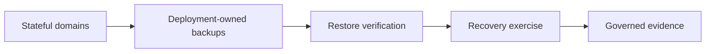

# DTMO Platform Industrialisation Roadmap

Last updated: **2026-08-18**  
Programme state: **`ACTIVE / HIGHEST PRIORITY`**

## Purpose

Phase 10 concluded with `NO-GO / BLOCKED` for production authorization. Phase 11 is the successor industrialisation programme and is executed one bounded pull request at a time. Historical Phase 8/9 evidence remains candidate-bound and is not reused for the materially changed integrated platform.

## Fixed priority order

1. 11.1 Taranis AI assessment.
2. 11.2 Taranis → DTMO canonical adapter.
3. 11.3 IntelOwl.
4. 11.4 OpenCTI.
5. 11.5 MISP consolidation.
6. 11.6 TheHive.
7. 11.7 Cortex decision gate.
8. 11.7b Cortex analyzer connector.
9. 11.8 Kubernetes/Helm/GitOps plus HA/secrets/network/observability/recovery/supply-chain hardening.
10. 11.9 migration/compatibility.
11. 11.10 new production-equivalent validation.
12. 11.11 new independent external assurance.
13. Phase 12 formal production GO/NO-GO.

## Phase 11 status

11.1–11.7b: **`PASS / REPOSITORY_COMPLETE`**.

### 11.8 Integrated runtime industrialisation

**Status:** `IN PROGRESS / ACTIVE`

#### 11.8a Runtime foundation
**Status:** `PASS / REPOSITORY_COMPLETE`

#### 11.8b Workload identity and external secret delivery
**Status:** `PASS / REPOSITORY_COMPLETE`

#### 11.8c Ingress/TLS and network segmentation
**Status:** `PASS / REPOSITORY_COMPLETE`

#### 11.8d HA and disruption hardening
**Status:** `PASS / REPOSITORY_COMPLETE`

Accepted repository evidence covers application replica spreading, host anti-affinity, PodDisruptionBudget and graceful termination. It does not prove live zone-failure survival or stateful failover.

#### 11.8e Observability hardening
**Status:** `PASS / REPOSITORY_COMPLETE`

Accepted repository evidence establishes opt-in metrics discovery, structured JSON logging and opt-in tracing boundaries. It does not prove live telemetry ingestion, alert delivery, retention or SLO attainment.

#### 11.8f Backup, restore and recovery hardening
**Status:** `IN PROGRESS / EXACT-HEAD VALIDATION REQUIRED`

This bounded slice defines PostgreSQL, Redis, OpenSearch and object storage as explicit recovery domains. Deployment owners must establish backup method, retention, restore verification, recovery exercise cadence and measurable RPO/RTO evidence. Backup success is never inferred from CI or configuration alone; missing recovery evidence fails closed.

Repository acceptance does not prove successful live backups, point-in-time recovery, achieved RPO/RTO, provider durability, disaster failover, production-equivalent behavior, independent assurance or production authorization.

#### Remaining Phase 11.8 bounded slices

Subsequent PRs must independently cover SBOM/vulnerability scanning/signing/provenance attestations; capacity; and upgrade/rollback exercises. None is accepted by 11.8f.

### 11.9 Migration and compatibility
**Status:** `PLANNED`

### 11.10 Integrated production-equivalent validation
**Status:** `PLANNED`

### 11.11 Independent external assurance
**Status:** `PLANNED`

## Phase 12 — Production GO/NO-GO
**Status:** `NOT STARTED`

A `GO` requires accepted 11.10 and 11.11 evidence for the same immutable integrated release identity plus accountable production ownership, residual-risk, change/support and rollback authority. Missing evidence remains fail-closed.

## Delivery discipline

Every bounded PR requires one primary objective, exact-head CI, expected-head merge protection, professional documentation synchronization, explicit security/licensing/evidence boundaries and one declared next priority.

## Immediate sequence

1. Accept **Phase 11.8f backup, restore and recovery hardening** only on fully green exact-head CI.
2. Continue remaining Phase 11.8 hardening one bounded PR at a time.
3. Start 11.9 only after all required 11.8 controls have been accepted.
