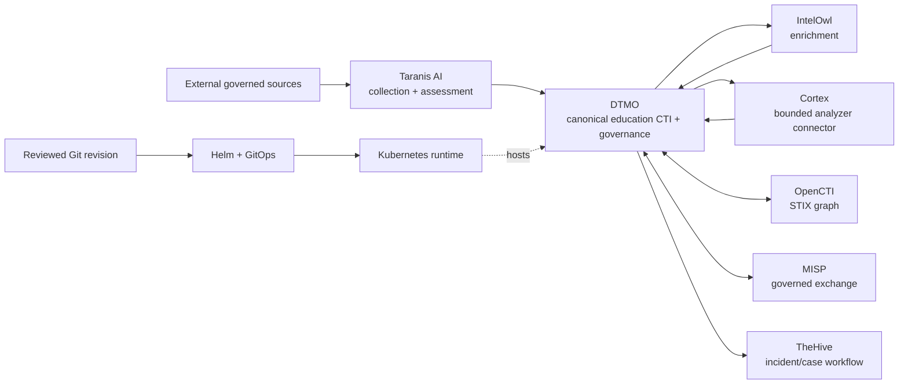
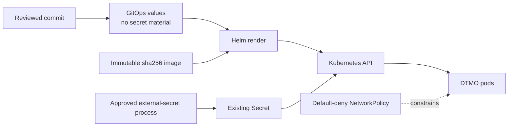

# DTMO Platform Industrialisation Roadmap

Last updated: **2026-08-17**  
Programme state: **`ACTIVE / HIGHEST PRIORITY`**

## Purpose

Phase 10 concluded with `NO-GO / BLOCKED` for production authorization. Phase 11 is the successor industrialisation programme and is executed one bounded pull request at a time. Historical Phase 8/9 evidence remains candidate-bound and is not reused for the materially changed integrated platform.

DTMO prefers mature service integrations over rebuilding generic collection, enrichment, graph, exchange and case-management platforms inside DTMO.

## Strategic target

The original 11.7 Cortex no-adoption decision remains preserved as historical evidence. The later owner-required 11.7b analyzer connector is separately accepted. Phase 11.8 is now active. Provenance, RBAC, human publication/share authority, service licensing boundaries and fail-closed evidence rules remain explicit across every runtime boundary.

## Fixed priority order

1. 11.1 Taranis AI architecture/API/data-model/identity/licensing assessment.
2. 11.2 Taranis → DTMO canonical adapter.
3. 11.3 IntelOwl enrichment integration.
4. 11.4 OpenCTI STIX knowledge-graph integration.
5. 11.5 MISP consolidation and authoritative governed sharing model.
6. 11.6 TheHive incident/case handoff.
7. 11.7 Cortex conditional decision gate.
8. 11.7b owner-required Cortex analyzer connector.
9. 11.8 Kubernetes/Helm/GitOps plus HA/secrets/network/observability/recovery/supply-chain hardening.
10. 11.9 migration/compatibility.
11. 11.10 new production-equivalent validation.
12. 11.11 new independent external assurance.
13. Phase 12 formal production GO/NO-GO.

## Phase 11 — Platform industrialisation

### 11.1–11.2 Taranis AI

**Status:** `PASS / REPOSITORY_COMPLETE`

### 11.3 IntelOwl enrichment integration

**Status:** `PASS / REPOSITORY_COMPLETE`

### 11.4 OpenCTI knowledge-graph integration

**Status:** `PASS / REPOSITORY_COMPLETE`

### 11.5 MISP consolidation

**Status:** `PASS / REPOSITORY_COMPLETE`

### 11.6 TheHive incident/case handoff

**Status:** `PASS / REPOSITORY_COMPLETE`

### 11.7 Cortex decision gate

**Status:** `PASS / REPOSITORY_COMPLETE — HISTORICAL DECISION BASELINE`

The accepted decision record found no validated IntelOwl capability gap for the then-approved enrichment requirement set. That historical claim is preserved rather than rewritten.

### 11.7b Cortex analyzer connector

**Status:** `PASS / REPOSITORY_COMPLETE`

The later owner-required connector is analyzer-only and remains a separate Cortex service/API boundary. It preserves explicit analyzer/datatype/TLP validation, stable identity, bounded result import, no-share/no-local-compromise semantics and excludes responders, external side effects, administration, automatic IntelOwl replacement and source vendoring. Live provider permissions and lawful disclosure remain deployment evidence, not CI claims.

### 11.8 Integrated runtime industrialisation

**Status:** `IN PROGRESS / ACTIVE`

Phase 11.8 is delivered as bounded sub-slices so each runtime control has exact-head evidence and professional documentation.

#### 11.8a Runtime foundation

**Status:** `IN PROGRESS / EXACT-HEAD VALIDATION REQUIRED`

This slice introduces a governed Kubernetes/Helm/GitOps runtime foundation for the DTMO application workload. The chart requires an immutable image digest; references an existing Secret rather than storing credentials in Git; runs non-root with read-only root filesystem, RuntimeDefault seccomp, dropped capabilities and no privilege escalation; disables service-account token automounting; supplies resource limits/requests and health probes; defines two replicas plus a PodDisruptionBudget; and enables fail-closed NetworkPolicy with explicit external CIDR allowlisting.

Repository validation does not prove live cluster behavior, CNI enforcement, cloud IAM, secret-provider entitlement or production availability.

#### Remaining Phase 11.8 bounded slices

Subsequent PRs must independently cover stateful/multi-zone HA; workload identity and external-secret implementation; ingress/TLS and finer network segmentation; centralized metrics/logs/traces; backup/restore and recovery exercises; SBOM/vulnerability scanning/signing/provenance attestations; capacity; and upgrade/rollback exercises. None is accepted by 11.8a.

### 11.9 Migration and compatibility

**Status:** `PLANNED`

### 11.10 Integrated production-equivalent validation

**Status:** `PLANNED`

Run new production-equivalent validation against one immutable integrated deployment identity. Prior Phase 8 evidence is historical only.

### 11.11 Independent external assurance

**Status:** `PLANNED`

Run fresh independent assurance against the same integrated candidate after 11.10 acceptance.

## Phase 12 — Production GO/NO-GO

**Status:** `NOT STARTED`

A `GO` requires accepted 11.10 and 11.11 evidence for the same immutable integrated release identity plus accountable production ownership, residual-risk, change/support and rollback authority. Missing evidence remains fail-closed.

## Delivery discipline

Every bounded PR requires one primary objective, exact-head CI, expected-head merge protection, professional documentation synchronization, explicit security/licensing/evidence boundaries and one declared next priority. A code/integration PR does not merge when required documentation is missing or stale.

## Immediate sequence

1. Accept **Phase 11.8a runtime foundation** only on fully green exact-head CI.
2. Continue the remaining Phase 11.8 hardening slices one bounded PR at a time.
3. Start 11.9 only after all required 11.8 controls have been accepted.
4. Continue 11.10–11.11 in fixed order and enter Phase 12 only after every required Phase 11 gate is accepted.
