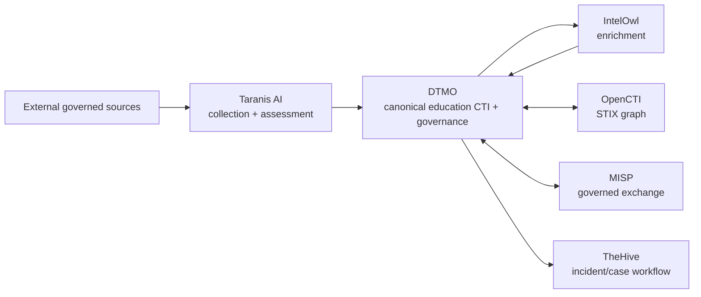
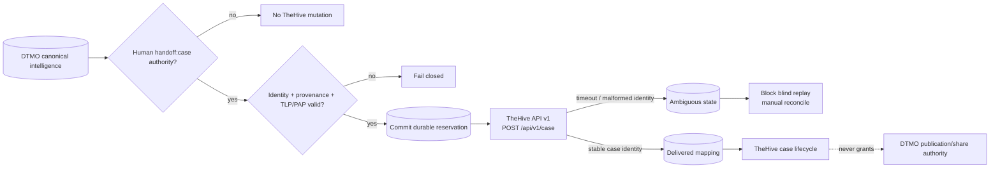

# DTMO Platform Industrialisation Roadmap

Last updated: **2026-08-17**  
Programme state: **`ACTIVE / HIGHEST PRIORITY`**

## Purpose

Phase 10 concluded with `NO-GO / BLOCKED` for production authorization. Phase 11 is the successor industrialisation programme and is executed one bounded pull request at a time. Historical Phase 8/9 evidence remains candidate-bound and is not reused for the materially changed integrated platform.

DTMO prefers mature service integrations over rebuilding generic collection, enrichment, graph, exchange and case-management platforms inside DTMO.

## Strategic target

Provenance, RBAC, human publication/share authority and fail-closed evidence rules remain explicit across every boundary.

## Fixed priority order

1. 11.1 Taranis AI architecture/API/data-model/identity/licensing assessment.
2. 11.2 Taranis → DTMO canonical adapter.
3. 11.3 IntelOwl enrichment integration.
4. 11.4 OpenCTI STIX knowledge-graph integration.
5. 11.5 MISP consolidation and authoritative governed sharing model.
6. 11.6 TheHive incident/case handoff.
7. 11.7 Cortex only if a validated IntelOwl capability gap exists.
8. 11.8 Kubernetes/Helm/GitOps plus HA/secrets/network/observability/recovery/supply-chain hardening.
9. 11.9 migration/compatibility.
10. 11.10 new production-equivalent validation.
11. 11.11 new independent external assurance.
12. Phase 12 formal production GO/NO-GO.

## Phase 11 — Platform industrialisation

### 11.1 Taranis AI architecture and gap assessment

**Status:** `PASS / REPOSITORY_COMPLETE`

### 11.2 Taranis → DTMO canonical adapter

**Status:** `PASS / REPOSITORY_COMPLETE`

### 11.3 IntelOwl enrichment integration

**Status:** `PASS / REPOSITORY_COMPLETE`

### 11.4 OpenCTI knowledge-graph integration

**Status:** `PASS / REPOSITORY_COMPLETE`

### 11.5 MISP consolidation

**Status:** `PASS / REPOSITORY_COMPLETE`

The accepted Phase 11.5 boundary keeps MISP v2.5.44 as a separate AGPL-3.0 service/API, unifies governed `events/restSearch` inbound and human-approved unpublished `events/add` outbound behavior through durable `misp_synchronization_state`, preserves authoritative distribution/sharing-group/TLP restrictions and fails closed on identity/restriction ambiguity or uncertain outbound delivery. Automatic federation, automatic publication and automatic OpenCTI↔MISP synchronization remain excluded.

### 11.6 TheHive incident/case handoff

**Status:** `IN PROGRESS / BOUNDED HANDOFF IMPLEMENTATION IN EXACT-HEAD VALIDATION`

The Phase 11.6 contract baseline is `PASS / REPOSITORY_COMPLETE`. It fixed TheHive 5.5.16, API v1, separate-service/licensing boundaries, dedicated human case-handoff authority, stable identity, replay safety, handling constraints and explicit exclusions before mutation code was added.

The active bounded implementation now realizes only the minimal human-authorized case handoff:

- `POST /api/v1/case` is the only accepted external mutation;
- DTMO exposes a dedicated `handoff:case` server-side RBAC permission, distinct from `approve:share`;
- service accounts cannot authorize a handoff;
- canonical item identity and provenance are required before mutation;
- severity, TLP and PAP use deterministic explicit mappings and unknown values fail closed;
- a durable `thehive_handoff_state` reservation is committed before the external request;
- request UUID, canonical item UUID, human principal, organization and authority envelope are persisted;
- a stable returned TheHive identity transitions the reservation to `delivered`;
- timeout/network ambiguity or a success response without stable identity transitions it to `ambiguous` and automated replay is blocked;
- definitive bounded failures become `failed`;
- database constraints enforce unique request/case identity plus no-share/no-local-compromise invariants;
- payloads are minimized to title, human-approved summary, deterministic severity, explicit TLP/PAP, bounded tags and DTMO UUID reference;
- attachments, raw source bodies, credentials, private enrichment, unrelated personal data, tasks/observables, responders, Cortex, automatic MISP→TheHive automation, case deletion, external sharing and administration remain excluded.

The feature remains disabled by default. Production configuration requires HTTPS API base, runtime token and explicit organization scope when enabled. TheHive 5.3+ still requires an activated Community/Gold/Platinum license for continued write functionality. Repository CI does not establish live connectivity, entitlement, deployed service-account permissions, organization/access configuration, privacy approval, real-data TLP/PAP correctness, HA/recovery, independent assurance or production authorization.

Phase 11.6 is not complete until this implementation is accepted on fully green exact-head CI and the authoritative documentation set is repository-complete.

### 11.7 Cortex decision gate

**Status:** `PLANNED / CONDITIONAL`

Adopt Cortex only when an accepted capability-gap analysis proves IntelOwl cannot satisfy a validated requirement. TheHive integration does not itself justify Cortex adoption.

### 11.8 Integrated runtime industrialisation

**Status:** `PLANNED`

Kubernetes, Helm, GitOps, immutable images, workload identities/external secrets, TLS/network policy, HA/recovery, centralized observability, SBOM/scanning/signing/attestation, capacity and upgrade/rollback procedures are required across the composed platform.

### 11.9 Migration and compatibility

**Status:** `PLANNED`

### 11.10 Integrated production-equivalent validation

**Status:** `PLANNED`

Run new production-equivalent validation against one immutable integrated deployment identity. Prior Phase 8 evidence is historical only.

### 11.11 Independent external assurance

**Status:** `PLANNED`

Run fresh independent assurance against the same integrated candidate after 11.10 acceptance.

## Phase 12 — Production GO/NO-GO

**Status:** `NOT STARTED`

A `GO` requires accepted 11.10 and 11.11 evidence for the same immutable integrated release identity plus accountable production ownership, residual-risk, change/support and rollback authority. Missing evidence remains fail-closed.

## Delivery discipline

Every bounded PR requires one primary objective, exact-head CI, expected-head merge protection, professional documentation synchronization, explicit security/licensing/evidence boundaries and one declared next priority. A code/integration PR does not merge when required documentation is missing or stale.

## Immediate sequence

1. Accept the **Phase 11.6 bounded TheHive handoff implementation** on fully green exact-head CI.
2. Mark Phase 11.6 repository-complete only after runtime, persistence, RBAC, operations and documentation gates all pass.
3. Evaluate Phase 11.7 Cortex only after Phase 11.6 acceptance and only against a validated IntelOwl capability gap.
4. Continue 11.8–11.11 in fixed order and enter Phase 12 only after every required Phase 11 gate is accepted.
