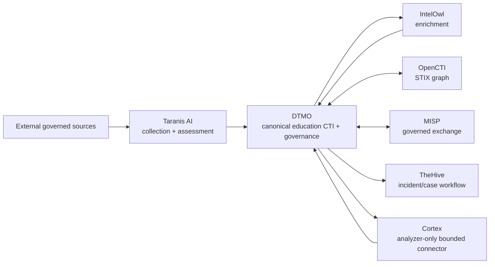
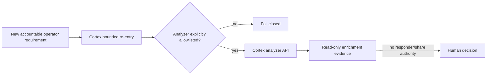

# DTMO Platform Industrialisation Roadmap

Last updated: **2026-08-17**  
Programme state: **`ACTIVE / HIGHEST PRIORITY`**

## Purpose

Phase 10 concluded with `NO-GO / BLOCKED` for production authorization. Phase 11 is the successor industrialisation programme and is executed one bounded pull request at a time. Historical Phase 8/9 evidence remains candidate-bound and is not reused for the materially changed integrated platform.

DTMO prefers mature service integrations over rebuilding generic collection, enrichment, graph, exchange and case-management platforms inside DTMO.

## Strategic target

Cortex was originally not adopted because Phase 11.7 found no validated IntelOwl capability gap. On 2026-08-17 an explicit accountable-operator requirement added a Cortex connector. That new attributable requirement triggers a bounded re-entry while preserving the original decision as historical evidence. Responders remain excluded.

Provenance, RBAC, human publication/share authority and fail-closed evidence rules remain explicit across every boundary.

## Fixed priority order

1. 11.1 Taranis AI architecture/API/data-model/identity/licensing assessment.
2. 11.2 Taranis → DTMO canonical adapter.
3. 11.3 IntelOwl enrichment integration.
4. 11.4 OpenCTI STIX knowledge-graph integration.
5. 11.5 MISP consolidation and authoritative governed sharing model.
6. 11.6 TheHive incident/case handoff.
7. 11.7 Cortex decision gate.
8. 11.7A operator-triggered Cortex analyzer connector re-entry.
9. 11.8 Kubernetes/Helm/GitOps plus HA/secrets/network/observability/recovery/supply-chain hardening.
10. 11.9 migration/compatibility.
11. 11.10 new production-equivalent validation.
12. 11.11 new independent external assurance.
13. Phase 12 formal production GO/NO-GO.

## Phase 11 — Platform industrialisation

### 11.1–11.2 Taranis AI

**Status:** `PASS / REPOSITORY_COMPLETE`

### 11.3 IntelOwl enrichment integration

**Status:** `PASS / REPOSITORY_COMPLETE`

The accepted boundary provides bounded human-authorized generic enrichment, explicit analyzer allowlisting, TLP/handling checks, stable job/analyzer identity, partial-result semantics, durable enrichment history and database-enforced no-share/no-local-compromise invariants.

### 11.4 OpenCTI knowledge-graph integration

**Status:** `PASS / REPOSITORY_COMPLETE`

### 11.5 MISP consolidation

**Status:** `PASS / REPOSITORY_COMPLETE`

MISP remains a separate AGPL-3.0 service/API with governed inbound/outbound exchange, durable synchronization state, authoritative distribution/sharing-group/TLP restrictions and human-approved unpublished export.

### 11.6 TheHive incident/case handoff

**Status:** `PASS / REPOSITORY_COMPLETE`

The accepted Phase 11.6 boundary provides only the minimal human-authorized `POST /api/v1/case` path, dedicated `handoff:case` permission, durable reservation before mutation, stable request/item/case/organization identity, `reserved`/`delivered`/`ambiguous`/`failed` reconciliation, blocked blind replay after ambiguity, minimized payloads and hard no-share/no-local-compromise invariants. Responders, automatic MISP→TheHive automation, external sharing and administration remain excluded.

Live TheHive use still requires actual entitlement, credentials, effective permissions, organization scope, privacy/handling approval and later deployment-bound validation; repository acceptance does not invent that evidence.

### 11.7 Cortex decision gate

**Status:** `PASS / REPOSITORY_COMPLETE`

The accepted decision record `docs/architecture/CORTEX_DECISION_GATE.md` found no validated IntelOwl capability gap for the original approved DTMO enrichment requirement set and therefore did not adopt Cortex at that time.

That evidence remains historically valid and is not rewritten into a retroactive capability-gap claim.

### 11.7A Cortex analyzer connector re-entry

**Status:** `IN PROGRESS / EXACT-HEAD VALIDATION REQUIRED`

An explicit accountable-operator requirement now requires DTMO to include a Cortex connector. This new attributable requirement activates the Phase 11.7 re-entry mechanism.

The bounded implementation is analyzer-only. It provides explicit analyzer allowlisting, observable/TLP policy checks, stable job identity, bounded report size and read-only result import. Imported reports do not grant responder execution, external-share authority or local-compromise proof.

Cortex remains a separate AGPL-3.0 service/API boundary. No Cortex or Cortex-Analyzer source is vendored. Responders, automated response, TheHive responder automation and automatic publication remain excluded and would require a new bounded decision.

### 11.8 Integrated runtime industrialisation

**Status:** `PLANNED / NEXT AFTER 11.7A ACCEPTANCE`

Kubernetes, Helm, GitOps, immutable images, workload identities/external secrets, TLS/network policy, HA/recovery, centralized observability, SBOM/scanning/signing/attestation, capacity and upgrade/rollback procedures are required across the composed platform.

### 11.9 Migration and compatibility

**Status:** `PLANNED`

### 11.10 Integrated production-equivalent validation

**Status:** `PLANNED`

Run new production-equivalent validation against one immutable integrated deployment identity. Prior Phase 8 evidence is historical only.

### 11.11 Independent external assurance

**Status:** `PLANNED`

Run fresh independent assurance against the same integrated candidate after 11.10 acceptance.

## Phase 12 — Production GO/NO-GO

**Status:** `NOT STARTED`

A `GO` requires accepted 11.10 and 11.11 evidence for the same immutable integrated release identity plus accountable production ownership, residual-risk, change/support and rollback authority. Missing evidence remains fail-closed.

## Delivery discipline

Every bounded PR requires one primary objective, exact-head CI, expected-head merge protection, professional documentation synchronization, explicit security/licensing/evidence boundaries and one declared next priority. A code/integration PR does not merge when required documentation is missing or stale.

## Immediate sequence

1. Accept the **Phase 11.7A Cortex analyzer connector** on fully green exact-head CI.
2. Preserve Cortex as analyzer-only; responders remain excluded unless separately authorized and assessed.
3. Start exactly Phase 11.8 integrated runtime industrialisation.
4. Continue 11.9–11.11 in fixed order and enter Phase 12 only after every required Phase 11 gate is accepted.
