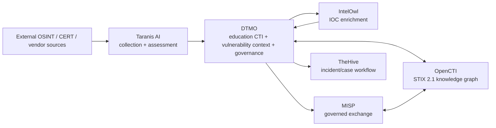
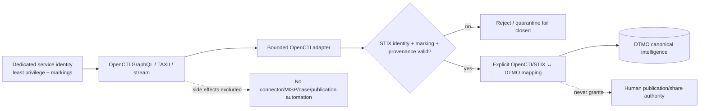

# DTMO Platform Industrialisation Roadmap

Last updated: **2026-08-16**  
Programme state: **`ACTIVE / HIGHEST PRIORITY`**

## Purpose

Phase 10 concluded with `NO-GO / BLOCKED` for production authorization. Phase 11 is the successor industrialisation programme and is executed one bounded pull request at a time. Historical Phase 8/9 evidence remains candidate-bound and is not reused as evidence for the materially changed integrated platform.

DTMO prefers mature service integrations over rebuilding generic collection, enrichment, graph, exchange and case-management platforms inside DTMO.

## Strategic target

The target is a composed service architecture, not a source-code merger. Provenance, RBAC, human publication/share authority and fail-closed evidence rules remain explicit across every boundary.

## Fixed priority order

1. 11.1 Taranis AI architecture/API/data-model/identity/licensing assessment.
2. 11.2 Taranis → DTMO canonical adapter.
3. 11.3 IntelOwl enrichment integration.
4. 11.4 OpenCTI STIX knowledge-graph integration.
5. 11.5 MISP consolidation and authoritative governed sharing model.
6. 11.6 TheHive incident/case handoff.
7. 11.7 Cortex only if a validated IntelOwl capability gap exists.
8. 11.8 Kubernetes/Helm/GitOps plus HA/secrets/network/observability/recovery/supply-chain hardening.
9. 11.9 migration/compatibility.
10. 11.10 new production-equivalent validation.
11. 11.11 new independent external assurance.
12. Phase 12 formal production GO/NO-GO.

## Phase 11 — Platform industrialisation

### 11.1 Taranis AI architecture and gap assessment

**Status:** `PASS / REPOSITORY_COMPLETE`

The accepted assessment establishes a service-to-service Taranis boundary. DTMO retains education-sector CTI, vulnerability context, governance, provenance and governed publication/share authority. Taranis source is not vendored into DTMO.

### 11.2 Taranis → DTMO canonical adapter

**Status:** `PASS / REPOSITORY_COMPLETE`

Repository-complete implementation includes read-only collection, stable namespaced identity, fail-closed TLP handling, durable checkpointing/reconciliation, bounded detail/CTI retrieval, governed execution, canonical persistence/indexing and observability.

### 11.3 IntelOwl enrichment integration

**Status:** `PASS / REPOSITORY_COMPLETE`

The Phase 11.3 contract, bounded adapter and governed execution/persistence boundary are accepted. Repository-complete scope includes production HTTPS/token/analyzer allowlist policy, bounded submission/polling, fail-closed TLP/privacy behavior, immutable job identity, explicit partial success, human `REVIEW_INTELLIGENCE` execution authority, durable enrichment history and database-enforced no-share/no-local-compromise invariants.

IntelOwl remains a separate AGPL-3.0 service/API boundary. No historical Phase 8/9 evidence is transferred to this materially changed candidate.

### 11.4 OpenCTI knowledge-graph integration

**Status:** `IN PROGRESS / CONTRACT IN EXACT-HEAD VALIDATION`

OpenCTI becomes the CTI relationship/knowledge-graph service for STIX entities and relationships while DTMO remains the education/governance decision layer.

The active bounded contract slice defines:

- reviewed upstream compatibility baseline **OpenCTI 7.260811.0**;
- Community Edition Apache-2.0 versus separately licensed Enterprise Edition boundary;
- separate service/API consumption with no OpenCTI source vendoring;
- GraphQL, STIX 2.1, TAXII 2.1 and access-controlled stream boundaries;
- dedicated least-privilege non-human identity and runtime-secret handling;
- explicit OpenCTI/STIX ↔ DTMO canonical identity mapping;
- marking/TLP/PAP, confidence and provenance preservation;
- fail-closed behavior for unknown markings, malformed STIX, authorization failures and unsupported semantics;
- restart-safe pagination/stream reconciliation requirements;
- no implicit connector registration, MISP synchronization, enrichment, case creation or publication side effects;
- no graph result, confidence or relationship becoming local-compromise proof or DTMO share/publication authority.

This contract does not claim live OpenCTI connectivity, deployed credentials, effective production RBAC/markings, real graph interoperability/performance, privacy approval, HA/recovery, independent assurance or production authorization.

After protected acceptance, the next bounded Phase 11.4 PR is the **read-only OpenCTI STIX/identity adapter with pagination/reconciliation and provenance preservation**.

### 11.5 MISP consolidation

**Status:** `PLANNED / BLOCKED BY 11.4`

Consolidate inbound/synchronization and governed outbound exchange into one documented authority model. DTMO human/governed outbound approval remains authoritative.

### 11.6 TheHive incident/case handoff

**Status:** `PLANNED`

Introduce controlled intelligence-to-case handoff with explicit case-creation permission, provenance back to DTMO intelligence and separation between case state and canonical CTI truth.

### 11.7 Cortex decision gate

**Status:** `PLANNED / CONDITIONAL`

Adopt Cortex only when an accepted IntelOwl capability-gap analysis proves it is needed.

### 11.8 Integrated runtime industrialisation

**Status:** `PLANNED`

Kubernetes, Helm, GitOps, immutable images, workload identities/external secrets, TLS/network policy, HA/recovery, centralized observability, SBOM/scanning/signing/attestation, capacity and upgrade/rollback procedures are required across the composed platform.

### 11.9 Migration and compatibility

**Status:** `PLANNED`

Preserve canonical intelligence, provenance, classification, governance and accepted E8 semantics while retiring duplication with explicit rollback paths.

### 11.10 Integrated production-equivalent validation

**Status:** `PLANNED`

Run new production-equivalent validation against one immutable integrated deployment identity. Prior Phase 8 evidence is historical only.

### 11.11 Independent external assurance

**Status:** `PLANNED`

Run fresh independent assurance against the same integrated candidate after 11.10 acceptance.

## Phase 12 — Production GO/NO-GO

**Status:** `NOT STARTED`

A `GO` requires accepted 11.10 and 11.11 evidence for the same immutable integrated release identity plus accountable production ownership, residual-risk, change/support and rollback authority. Missing evidence remains fail-closed.

## Delivery discipline

Every bounded PR requires one primary objective, exact-head CI, expected-head merge protection, professional documentation synchronization, explicit security/licensing/evidence boundaries and one declared next priority. A code/integration PR does not merge when required documentation is missing or stale.

## Immediate sequence

1. Accept the **11.4 OpenCTI contract** on fully green exact-head CI.
2. Implement the bounded **read-only OpenCTI STIX/identity adapter**.
3. Complete remaining OpenCTI reconciliation/operational integration until 11.4 is repository-complete.
4. Continue to **11.5 MISP consolidation**, then 11.6–11.11 in the fixed order.
5. Enter Phase 12 only after every required Phase 11 gate is accepted.
