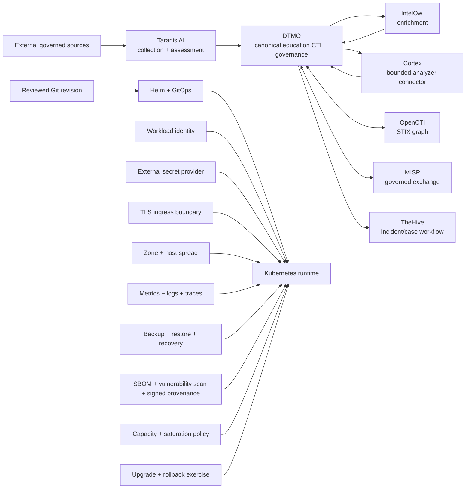

# DTMO Platform Industrialisation Roadmap

Last updated: **2026-08-19**  
Programme state: **`ACTIVE / HIGHEST PRIORITY`**

## Purpose

Phase 10 concluded with `NO-GO / BLOCKED` for production authorization. Phase 11 is the successor industrialisation programme and is executed one bounded pull request at a time. Historical Phase 8/9 evidence remains candidate-bound and is not reused for the materially changed integrated platform.

DTMO prefers mature service integrations over rebuilding generic collection, enrichment, graph, exchange and case-management platforms inside DTMO.

## Strategic target

The original 11.7 Cortex no-adoption decision remains preserved as historical evidence. The later owner-required 11.7b analyzer connector is separately accepted. Phase 11.8 is active. Provenance, RBAC, human publication/share authority, service licensing boundaries and fail-closed evidence rules remain explicit across every runtime boundary.

## Fixed priority order

1. 11.1 Taranis AI architecture/API/data-model/identity/licensing assessment.
2. 11.2 Taranis → DTMO canonical adapter.
3. 11.3 IntelOwl enrichment integration.
4. 11.4 OpenCTI STIX knowledge-graph integration.
5. 11.5 MISP consolidation and authoritative governed sharing model.
6. 11.6 TheHive incident/case handoff.
7. 11.7 Cortex conditional decision gate.
8. 11.7b owner-required Cortex analyzer connector.
9. 11.8 Kubernetes/Helm/GitOps plus HA/secrets/network/observability/recovery/supply-chain/capacity/upgrade hardening.
10. 11.9 migration/compatibility.
11. 11.10 new production-equivalent validation.
12. 11.11 new independent external assurance.
13. Phase 12 formal production GO/NO-GO.

## Phase 11 — Platform industrialisation

### 11.1–11.2 Taranis AI
**Status:** `PASS / REPOSITORY_COMPLETE`

### 11.3 IntelOwl enrichment integration
**Status:** `PASS / REPOSITORY_COMPLETE`

### 11.4 OpenCTI knowledge-graph integration
**Status:** `PASS / REPOSITORY_COMPLETE`

### 11.5 MISP consolidation
**Status:** `PASS / REPOSITORY_COMPLETE`

### 11.6 TheHive incident/case handoff
**Status:** `PASS / REPOSITORY_COMPLETE`

### 11.7 Cortex decision gate
**Status:** `PASS / REPOSITORY_COMPLETE — HISTORICAL DECISION BASELINE`

### 11.7b Cortex analyzer connector
**Status:** `PASS / REPOSITORY_COMPLETE`

### 11.8 Integrated runtime industrialisation
**Status:** `IN PROGRESS / ACTIVE`

Phase 11.8 is delivered as bounded sub-slices so each runtime control has exact-head evidence and professional documentation.

#### 11.8a Runtime foundation
**Status:** `PASS / REPOSITORY_COMPLETE`

Immutable image digest, GitOps-owned non-secret values, non-root/read-only workload hardening, disabled service-account token automounting, probes/resources, PodDisruptionBudget and fail-closed NetworkPolicy are accepted repository controls.

#### 11.8b Workload identity and external secret delivery
**Status:** `PASS / REPOSITORY_COMPLETE`

Provider-neutral workload identity and opt-in external secret delivery are accepted without storing identity credentials or secret values in Git.

#### 11.8c Ingress/TLS and network segmentation
**Status:** `PASS / REPOSITORY_COMPLETE`

TLS-only ingress and explicit ingress-controller network segmentation are accepted repository controls; live DNS/certificate/CNI enforcement is not inferred.

#### 11.8d HA and disruption hardening
**Status:** `PASS / REPOSITORY_COMPLETE`

Application replicas, zone/host spread, anti-affinity, PodDisruptionBudget and graceful termination are accepted. Stateful quorum/failover remains deployment-specific.

#### 11.8e Observability hardening
**Status:** `PASS / REPOSITORY_COMPLETE`

Metrics discovery, structured JSON logging and opt-in distributed tracing boundaries are accepted; live telemetry/SLO attainment is not inferred.

#### 11.8f Backup, restore and recovery hardening
**Status:** `PASS / REPOSITORY_COMPLETE`

PostgreSQL, Redis, OpenSearch and object storage have explicit recovery ownership, retention, restore-verification, exercise and RPO/RTO evidence boundaries. Live backup/recovery success is not inferred.

#### 11.8g Software supply-chain hardening
**Status:** `PASS / REPOSITORY_COMPLETE`

Accepted repository controls cover exact-head SBOM generation, Python/container vulnerability scanning, SHA-256 artifact identities, minimal runtime boundaries and a governed release path for signed provenance/SBOM attestations. Repository acceptance does not claim a future artifact has already been signed, admitted or deployed.

#### 11.8h Capacity and resource planning
**Status:** `PASS / REPOSITORY_COMPLETE`

Accepted repository controls establish explicit CPU/memory requests and limits, bounded autoscaling, stabilization behavior and saturation-evidence thresholds. They do not prove production sizing, provider capacity, workload demand or SLO attainment.

#### 11.8i Exercised upgrade and rollback
**Status:** `IN PROGRESS / EXACT-HEAD VALIDATION REQUIRED`

This final bounded Phase 11.8 slice requires immutable baseline/candidate/rollback digests, safe RollingUpdate settings, revision history, progress/min-ready bounds, required post-upgrade and post-rollback health evidence and restoration of the exact prior accepted digest. Automatic database down migration is forbidden. Missing identity, rollback compatibility or health evidence fails closed.

CI exercises a deterministic repository transition from one synthetic immutable digest to a different candidate digest and back to the exact baseline digest. That is repository engineering evidence only; it does not prove a live-cluster rollback, stateful recovery, production-equivalent continuity or production authorization.

### 11.9 Migration and compatibility
**Status:** `PLANNED`

11.9 starts only after 11.8i is accepted on fully green exact-head CI.

### 11.10 Integrated production-equivalent validation
**Status:** `PLANNED`

Run new production-equivalent validation against one immutable integrated deployment identity, including fresh upgrade, rollback, health, saturation and recovery evidence. Prior Phase 8 evidence is historical only.

### 11.11 Independent external assurance
**Status:** `PLANNED`

Run fresh independent assurance against the same integrated candidate after 11.10 acceptance.

## Phase 12 — Production GO/NO-GO
**Status:** `NOT STARTED`

A `GO` requires accepted 11.10 and 11.11 evidence for the same immutable integrated release identity plus accountable production ownership, residual-risk, change/support and rollback authority. Missing evidence remains fail-closed.

## Delivery discipline

Every bounded PR requires one primary objective, exact-head CI, expected-head merge protection, professional documentation synchronization, explicit security/licensing/evidence boundaries and one declared next priority. A code/integration PR does not merge when required documentation is missing or stale.

## Immediate sequence

1. Accept **Phase 11.8i exercised upgrade/rollback** only on fully green exact-head CI.
2. Start **Phase 11.9 migration/compatibility** only after 11.8i is accepted.
3. Continue 11.10–11.11 in fixed order and enter Phase 12 only after every required Phase 11 gate is accepted.
