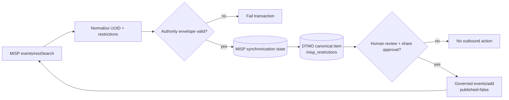

# DTMO Roadmap — Production Readiness and Product Evolution

Last updated: **2026-08-17**

## Purpose

This roadmap separates production authorization from product evolution and platform industrialisation. Repository engineering, accountable acceptance, deployment-bound validation, independent assurance and production authorization remain distinct evidence classes.

## Current position

| Stage | Scope | Status |
|---|---|---|
| Phases 1–7 | Repository-controlled engineering baseline | `PASS` |
| RC13 + owner retest | Unified-console functional acceptance | `PASS / OWNER_ACCEPTED` |
| E8.1–E8.10 | Vulnerability & CTI ecosystem integrations | `PASS / REPOSITORY_COMPLETE` |
| Phase 8 | Production-equivalent validation and accountable acceptance | `PASS / OWNER_ACCEPTED` |
| Phase 9 | Independent external assurance | `PASS / EXTERNAL_ASSURANCE_ACCEPTED` |
| Phase 10 | Formal production go/no-go | `NO-GO / BLOCKED — PLATFORM INDUSTRIALISATION REQUIRED` |
| Phase 11.1 | Taranis architecture/API/licensing | `PASS / REPOSITORY_COMPLETE` |
| Phase 11.2 | Taranis→DTMO canonical adapter | `PASS / REPOSITORY_COMPLETE` |
| Phase 11.3 | IntelOwl enrichment integration | `PASS / REPOSITORY_COMPLETE` |
| Phase 11.4 | OpenCTI STIX knowledge-graph integration | `PASS / REPOSITORY_COMPLETE` |
| Phase 11.5 contract | MISP service/API/licensing/authority model | `PASS / REPOSITORY_COMPLETE` |
| Phase 11.5 implementation | MISP synchronization state/persistence + authority enforcement | `IN PROGRESS / EXACT-HEAD VALIDATION REQUIRED` |
| Phase 12 | New formal production go/no-go for integrated platform | `NOT STARTED` |

DTMO remains **not production authorized**. Phase 10 concluded with a no-go decision and Phase 11 remains the highest-priority programme.

## Historical readiness evidence

Phase 8 remains `PASS / OWNER_ACCEPTED` and Phase 9 remains `PASS / EXTERNAL_ASSURANCE_ACCEPTED` for the earlier candidate they actually covered. Those claims are historical and are not transferred to the materially changed Phase 11 platform.

## Phase 11 platform industrialisation

The authoritative detailed programme is `docs/roadmap/PLATFORM_INDUSTRIALISATION_ROADMAP.md` and the fixed order remains Taranis → IntelOwl → OpenCTI → MISP → TheHive → conditional Cortex → integrated runtime → migration/compatibility → new validation → new assurance.

### Phase 11.1–11.2 — Taranis

**Status:** `PASS / REPOSITORY_COMPLETE`

### Phase 11.3 — IntelOwl

**Status:** `PASS / REPOSITORY_COMPLETE`

### Phase 11.4 — OpenCTI

**Status:** `PASS / REPOSITORY_COMPLETE`

Accepted repository evidence covers the OpenCTI service/API/licensing contract, bounded read-only GraphQL/STIX adapter, explicit OpenCTI/STIX↔DTMO identity mapping, immutable reconciliation history, database-enforced no-share/no-local-compromise invariants and PostgreSQL-before-checkpoint ordering. This remains repository evidence only.

### Phase 11.5 — MISP consolidation

**Status:** `IN PROGRESS / SYNCHRONIZATION STATE IN EXACT-HEAD VALIDATION`

The MISP v2.5.44 contract is `PASS / REPOSITORY_COMPLETE`. MISP remains a separate AGPL-3.0 service/API boundary. The active implementation consolidates the existing governed `events/restSearch` inbound and human-approved unpublished `events/add` outbound paths without creating a second MISP client.

Active repository scope:

- durable `misp_synchronization_state` binds one DTMO canonical item to one stable MISP event UUID;
- distribution, sharing-group and normalized TLP restrictions are retained as an authoritative source envelope;
- accepted restrictions are projected to canonical `metadata_json.misp_restrictions` for the established governed-export path;
- canonical MISP candidate persistence and authority-state reconciliation happen in the same database transaction;
- event UUID collision/drift, unknown distribution, missing sharing-group context, malformed/non-authoritative restrictions and inbound share-authority attempts fail closed;
- migration `0013_misp_synchronization_state` follows `0012_opencti_mapping_persistence`;
- database constraints preserve known distribution/sharing semantics and `external_share_authorized=false`;
- human DTMO review/share approval remains the only outbound authority;
- automatic event publication, MISP server push/pull federation and OpenCTI↔MISP automatic synchronization remain excluded.

Only after protected acceptance and lifecycle reconciliation may Phase 11.5 become `PASS / REPOSITORY_COMPLETE`. Phase 11.6 TheHive remains blocked until then.

### Phase 11.6–11.11

Subsequent phases remain blocked by the fixed order. They cover TheHive handoff, conditional Cortex, Kubernetes/Helm/GitOps and platform hardening, migration/compatibility, new production-equivalent validation and new independent external assurance.

## Phase 12 — formal production GO/NO-GO

**Status:** `NOT STARTED`

Phase 12 starts only after one immutable integrated Phase 11 candidate has accepted Phase 11.10 production-equivalent validation and Phase 11.11 independent external assurance plus required production ownership/IAM/secrets/network/recovery/monitoring/privacy/legal/change approvals.

## Product and platform boundary

DTMO remains the education-sector CTI and decision-support layer with vulnerability context, provenance, canonical evidence semantics, explicit governance/framework relationships, governed Administration/RBAC and human-controlled external-sharing authority. Generic collection, IOC enrichment, CTI graph and case-management functions are integrated from mature projects instead of duplicated inside DTMO.

## Delivery and documentation discipline

Each material change requires one bounded pull request with explicit acceptance criteria, exact-head CI, expected-head protection, architecture/security/licensing/evidence boundaries and synchronized professional documentation. A code/integration PR is not mergeable if affected current-state, architecture, integration, security, QA/evidence, roadmap or user/admin documentation is stale.
