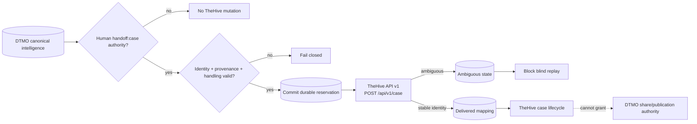

# DTMO Roadmap — Production Readiness and Product Evolution

Last updated: **2026-08-17**

## Purpose

This roadmap separates production authorization from product evolution and platform industrialisation. Repository engineering, accountable acceptance, deployment-bound validation, independent assurance and production authorization remain distinct evidence classes.

## Current position

| Stage | Scope | Status |
|---|---|---|
| Phases 1–7 | Repository-controlled engineering baseline | `PASS` |
| RC13 + owner retest | Unified-console functional acceptance | `PASS / OWNER_ACCEPTED` |
| E8.1–E8.10 | Vulnerability & CTI ecosystem integrations | `PASS / REPOSITORY_COMPLETE` |
| Phase 8 | Production-equivalent validation and accountable acceptance | `PASS / OWNER_ACCEPTED` |
| Phase 9 | Independent external assurance | `PASS / EXTERNAL_ASSURANCE_ACCEPTED` |
| Phase 10 | Formal production go/no-go | `NO-GO / BLOCKED — PLATFORM INDUSTRIALISATION REQUIRED` |
| Phase 11.1–11.5 | Taranis, IntelOwl, OpenCTI and MISP integration boundaries | `PASS / REPOSITORY_COMPLETE` |
| Phase 11.6 contract | TheHive incident/case handoff service/API/identity/licensing boundary | `PASS / REPOSITORY_COMPLETE` |
| Phase 11.6 implementation | Human-authorized TheHive case handoff + durable mutation state | `IN PROGRESS / EXACT-HEAD VALIDATION REQUIRED` |
| Phase 12 | New formal production go/no-go for integrated platform | `NOT STARTED` |

DTMO remains **not production authorized**. Phase 10 concluded with a no-go decision and Phase 11 remains the highest-priority programme.

## Historical readiness evidence

Phase 8 remains `PASS / OWNER_ACCEPTED` and Phase 9 remains `PASS / EXTERNAL_ASSURANCE_ACCEPTED` for the earlier candidate they actually covered. Those claims are historical and are not transferred to the materially changed Phase 11 platform.

## Phase 11 platform industrialisation

The authoritative detailed programme is `docs/roadmap/PLATFORM_INDUSTRIALISATION_ROADMAP.md` and the fixed order remains Taranis → IntelOwl → OpenCTI → MISP → TheHive → conditional Cortex → integrated runtime → migration/compatibility → new validation → new assurance.

### Phase 11.1–11.5 — accepted integration baseline

**Status:** `PASS / REPOSITORY_COMPLETE`

Accepted repository evidence covers Taranis collection/assessment and canonical adaptation, IntelOwl bounded enrichment, OpenCTI graph integration and MISP governed exchange/synchronization state. These claims remain repository engineering evidence only.

### Phase 11.6 — TheHive incident/case handoff

**Status:** `IN PROGRESS / BOUNDED IMPLEMENTATION IN EXACT-HEAD VALIDATION`

The TheHive 5.5.16/API v1 service/API/identity/licensing/authority contract is `PASS / REPOSITORY_COMPLETE`. The active slice now implements only the contract-approved minimal human-authorized case handoff.

Active repository scope:

- TheHive remains a separate StrangeBee service; no upstream source is vendored;
- `POST /api/v1/case` is the only accepted external mutation;
- `handoff:case` is a dedicated human permission separate from `approve:share`;
- service accounts cannot authorize handoff;
- canonical item identity and repository provenance are mandatory before mutation;
- severity, TLP and PAP use deterministic explicit mappings and unknown values fail closed;
- a requested TLP cannot broaden a known authoritative TLP restriction;
- authoritative MISP distribution/sharing-group restrictions block this handoff until a deployment-approved TheHive organization/access mapping exists;
- DTMO commits durable `thehive_handoff_state` before calling TheHive;
- request UUID, canonical item UUID, human principal, target organization and handling envelope are persisted;
- a stable TheHive case identity is required for `delivered` status;
- timeout/network uncertainty or malformed success identity becomes `ambiguous` and blocks blind replay;
- definitive bounded failures become `failed`;
- persisted delivered outcome is minimized to case identity, case number and organization;
- database constraints enforce unique request/case identity and no-share/no-local-compromise invariants;
- the feature is disabled by default and production configuration requires HTTPS API base, runtime token and explicit organization when enabled;
- attachments, raw source bodies, credentials, private enrichment, unrelated personal data, task/observable creation, responders, Cortex, automatic MISP→TheHive, case deletion, external sharing and administration remain excluded.

Repository implementation acceptance cannot establish live TheHive connectivity, activated Community/Gold/Platinum entitlement, effective deployed service permissions, target-organization membership, privacy approval, real-data handling correctness, production-equivalent validation, independent assurance or production authorization.

After protected acceptance, Phase 11.6 can become `PASS / REPOSITORY_COMPLETE`. Phase 11.7 is then only a conditional capability-gap decision, not an automatic Cortex implementation.

### Phase 11.7–11.11

Subsequent phases remain governed by the fixed order. Cortex is adopted only if an accepted IntelOwl capability gap exists. Phase 11.8 covers Kubernetes/Helm/GitOps and platform hardening; 11.9 migration/compatibility; 11.10 fresh production-equivalent validation; 11.11 fresh independent assurance.

## Phase 12 — formal production GO/NO-GO

**Status:** `NOT STARTED`

Phase 12 starts only after one immutable integrated Phase 11 candidate has accepted Phase 11.10 production-equivalent validation and Phase 11.11 independent external assurance plus required production ownership/IAM/secrets/network/recovery/monitoring/privacy/legal/change approvals.

## Product and platform boundary

DTMO remains the education-sector CTI and decision-support layer with vulnerability context, provenance, canonical evidence semantics, explicit governance/framework relationships, governed Administration/RBAC and human-controlled external-sharing and case-handoff authority. Generic collection, IOC enrichment, CTI graph, exchange and case-management functions are integrated from mature projects instead of duplicated inside DTMO.

## Delivery and documentation discipline

Each material change requires one bounded pull request with explicit acceptance criteria, exact-head CI, expected-head protection, architecture/security/licensing/evidence boundaries and synchronized professional documentation. A code/integration PR is not mergeable if affected current-state, architecture, integration, security, QA/evidence, roadmap or user/admin documentation is stale.
