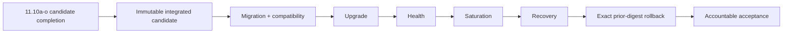

# DTMO Roadmap — Production Readiness and Product Evolution

Last updated: **2026-08-20**

## Purpose

This roadmap separates production authorization from product evolution and platform industrialisation. Repository engineering, release supply-chain evidence, accountable acceptance, deployment-bound validation, independent assurance and production authorization remain distinct evidence classes.

## Current position

| Stage | Scope | Status |
|---|---|---|
| Phases 1–7 | Repository-controlled engineering baseline | `PASS` |
| RC13 + owner retest | Unified-console functional acceptance | `PASS / OWNER_ACCEPTED` |
| E8.1–E8.10 | Vulnerability & CTI ecosystem integrations | `PASS / REPOSITORY_COMPLETE` |
| Phase 8 | Production-equivalent validation | `PASS / OWNER_ACCEPTED — HISTORICAL CANDIDATE` |
| Phase 9 | Independent external assurance | `PASS / EXTERNAL_ASSURANCE_ACCEPTED — HISTORICAL CANDIDATE` |
| Phase 10 | Formal production go/no-go | `NO-GO / BLOCKED — PLATFORM INDUSTRIALISATION REQUIRED` |
| Phase 11.1–11.8 | Service integrations and integrated runtime industrialisation | `PASS / REPOSITORY_COMPLETE` |
| Phase 11.9 | Migration and compatibility | `PASS / REPOSITORY_COMPLETE` |
| Phase 11.10 | Candidate completion + new production-equivalent validation | `IN PROGRESS / FRESH CANDIDATE-BOUND EVIDENCE REQUIRED` |
| Phase 11.10a | Frontend architecture/design contract | `IN PROGRESS / REPOSITORY ARCHITECTURE CONTRACT` |
| Phase 11.11 | New independent external assurance | `NOT STARTED` |
| Phase 12 | New formal production go/no-go | `NOT STARTED` |

DTMO remains **not production authorized**. Phase 11 is `IN PROGRESS / ACTIVE` and remains the highest-priority programme.

## Historical readiness evidence

Phase 8 remains `PASS / OWNER_ACCEPTED` and Phase 9 remains `PASS / EXTERNAL_ASSURANCE_ACCEPTED` for the earlier candidate they actually covered. Those claims are historical and are not transferred to the materially changed Phase 11 platform.

## Phase 11 platform industrialisation

The authoritative detailed programme is `docs/roadmap/PLATFORM_INDUSTRIALISATION_ROADMAP.md`. The controlled order is Taranis → IntelOwl → OpenCTI → MISP → TheHive → Cortex historical decision/later bounded connector → integrated runtime → migration/compatibility → Unified Operations Workbench candidate completion → fresh production-equivalent validation → fresh independent assurance.

### Phase 11.1–11.8 — Accepted integrated repository baseline

**Status:** `PASS / REPOSITORY_COMPLETE`

Accepted controls include the complete service-integration baseline and Kubernetes/Helm/GitOps runtime industrialisation: workload identity/external secrets, ingress/TLS/network segmentation, HA/disruption, observability, backup/recovery, software supply chain, capacity/resource planning and upgrade/rollback contracts.

These are bounded repository claims. They do not establish production-equivalent behavior or production authorization.

### Phase 11.9 — Migration and compatibility

**Status:** `PASS / REPOSITORY_COMPLETE`

The accepted contract requires one connected Alembic revision graph, explicit migration functions, forward-first sequencing and backward-compatible rolling application overlap. Destructive changes require expand/migrate/contract. Application rollback never authorizes automatic database down migration.

### Phase 11.10 — Candidate completion and new production-equivalent validation

**Status:** `IN PROGRESS / FRESH CANDIDATE-BOUND EVIDENCE REQUIRED`

The owner-required next-generation interface materially changes the candidate. Therefore Phase 11.10 is executed in two controlled parts.

#### Part A — 11.10a–11.10o candidate completion

The interface is built one bounded PR at a time:

1. 11.10a frontend architecture/design contract — active;
2. 11.10b canonical application shell;
3. 11.10c Command Center;
4. 11.10d Unified Intelligence Workspace;
5. 11.10e IntelOwl/Cortex integrated analysis;
6. 11.10f OpenCTI graph/entity workspace;
7. 11.10g MISP Sharing & Exchange;
8. 11.10h TheHive Investigations & Cases;
9. 11.10i Vulnerability & Exposure Center;
10. 11.10j Sources & Collection Control Center;
11. 11.10k Automation & Playbooks;
12. 11.10l Governance & Evidence Center;
13. 11.10m Operations & Administration;
14. 11.10n role-aware UX/accessibility;
15. 11.10o consolidation/full functional acceptance.

The canonical frontend security path is **browser → DTMO API → governed integration adapter → upstream service**. Server-side RBAC, provenance, human publication/share authority and separate case authority remain unchanged.

#### Part B — 11.10p new production-equivalent validation

After 11.10o acceptance, freeze one immutable integrated deployment identity and run the fresh production-equivalent validation. The complete package requires candidate identity, migration/compatibility, upgrade, rollback, health/readiness, representative saturation/capacity and recovery/continuity evidence.

All external artifacts must be attributable to the same candidate fingerprint and production-equivalent environment. Historical Phase 8/9 evidence cannot satisfy this gate. Missing, ambiguous, inaccessible, placeholder or mixed-candidate evidence fails closed.

Repository CI and the manifest validator support the gate but are not live-environment evidence. Design mockups and generated frontend visuals are design artifacts only. Phase 11.10 completes only when candidate completion is accepted, the complete 11.10p real-environment package is reviewed and an accountable owner records `PASS / OWNER_ACCEPTED`.

### Phase 11.11 — New independent external assurance

**Status:** `NOT STARTED`

Run fresh independent assurance against the same immutable integrated candidate only after Phase 11.10 acceptance. Historical Phase 9 assurance cannot satisfy this gate. Material candidate changes require a new production-equivalent evidence binding before assurance.

## Phase 12 — Formal production GO/NO-GO

**Status:** `NOT STARTED`

Phase 12 starts only after accepted Phase 11.10 and Phase 11.11 evidence for the same immutable integrated release identity plus required production ownership, IAM/secrets/network/recovery/monitoring/privacy/legal/change approvals.

## Product and authority boundary

DTMO remains the education-sector CTI and decision-support layer and becomes the canonical control plane for normal user workflows. Generic collection, enrichment, graph, exchange and case-management capabilities remain separate services. Frontend integration, deployment, validation, supply-chain metadata and signatures do not alter licensing boundaries, grant publication/share or case authority, or establish local compromise.

## Delivery discipline

Each material repository change requires one bounded pull request with explicit acceptance criteria, exact-head CI, expected-head protection and synchronized professional documentation. Production-equivalent validation and independent assurance remain external evidence classes and cannot be manufactured by repository changes.

## Immediate sequence

1. Complete Phase **11.10a frontend architecture/design contract**.
2. Continue 11.10b–11.10o one green merged bounded PR at a time.
3. Freeze one immutable integrated candidate and execute **11.10p fresh production-equivalent validation**.
4. After explicit Phase 11.10 acceptance, run Phase 11.11 independent external assurance against that same candidate.
5. Enter Phase 12 only after both evidence classes are accepted and all production-specific prerequisites are reviewable.
