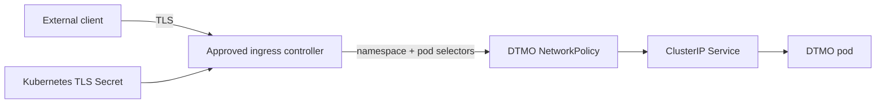

# DTMO Roadmap — Production Readiness and Product Evolution

Last updated: **2026-08-18**

## Purpose

This roadmap separates production authorization from product evolution and platform industrialisation. Repository engineering, accountable acceptance, deployment-bound validation, independent assurance and production authorization remain distinct evidence classes.

## Current position

| Stage | Scope | Status |
|---|---|---|
| Phases 1–7 | Repository-controlled engineering baseline | `PASS` |
| RC13 + owner retest | Unified-console functional acceptance | `PASS / OWNER_ACCEPTED` |
| E8.1–E8.10 | Vulnerability & CTI ecosystem integrations | `PASS / REPOSITORY_COMPLETE` |
| Phase 8 | Production-equivalent validation | `PASS / OWNER_ACCEPTED` — historical candidate |
| Phase 9 | Independent external assurance | `PASS / EXTERNAL_ASSURANCE_ACCEPTED` — historical candidate |
| Phase 10 | Formal production go/no-go | `NO-GO / BLOCKED — PLATFORM INDUSTRIALISATION REQUIRED` |
| Phase 11.1–11.8b | Accepted service/runtime boundaries | `PASS / REPOSITORY_COMPLETE` |
| Phase 11.8c | Ingress/TLS and network segmentation | `IN PROGRESS / EXACT-HEAD VALIDATION REQUIRED` |
| Phase 11.9 | Migration and compatibility | `NOT STARTED` |
| Phase 11.10 | New production-equivalent validation | `NOT STARTED` |
| Phase 11.11 | New independent external assurance | `NOT STARTED` |
| Phase 12 | New formal production go/no-go | `NOT STARTED` |

DTMO remains **not production authorized**. Phase 11 is `IN PROGRESS / ACTIVE` and remains the highest-priority programme.

## Historical readiness evidence

Phase 8 remains `PASS / OWNER_ACCEPTED` and Phase 9 remains `PASS / EXTERNAL_ASSURANCE_ACCEPTED` for the earlier candidate they actually covered. Those claims are historical and are not transferred to the materially changed Phase 11 platform.

## Phase 11 platform industrialisation

The authoritative detailed programme is `docs/roadmap/PLATFORM_INDUSTRIALISATION_ROADMAP.md`. The controlled order is Taranis → IntelOwl → OpenCTI → MISP → TheHive → Cortex historical decision / later owner-required connector → integrated runtime → migration/compatibility → new validation → new assurance.

### Phase 11.1–11.8b — accepted repository baseline

**Status:** `PASS / REPOSITORY_COMPLETE`

Accepted repository evidence covers Taranis collection/assessment and canonical adaptation, IntelOwl bounded enrichment, OpenCTI graph integration, MISP governed exchange, TheHive human-authorized case handoff, the later owner-required Cortex analyzer connector, the Helm/GitOps runtime foundation and provider-neutral workload identity/external-secret delivery. These are repository engineering boundaries only.

The original Phase 11.7 no-adoption decision is preserved as historical evidence for its then-current requirements rather than rewritten after the later owner requirement.

### Phase 11.8 — integrated runtime industrialisation

**Status:** `IN PROGRESS / ACTIVE`

#### 11.8a Runtime foundation

**Status:** `PASS / REPOSITORY_COMPLETE`

Accepted repository controls include immutable image digest enforcement, non-root/read-only workload hardening, disabled service-account token automounting, resource/probe defaults, PodDisruptionBudget, `ClusterIP` service exposure and fail-closed/default-deny NetworkPolicy.

#### 11.8b Workload identity and external secret delivery

**Status:** `PASS / REPOSITORY_COMPLETE`

Accepted repository controls include provider-neutral ServiceAccount identity annotations, opt-in ExternalSecret delivery, explicit SecretStore/ClusterSecretStore and remote-key mappings, and no credential or secret value in Git.

#### 11.8c Ingress/TLS and network segmentation

**Status:** `IN PROGRESS / EXACT-HEAD VALIDATION REQUIRED`

Current bounded repository scope:

- ingress disabled by default;
- explicit ingress class and hostname required when enabled;
- TLS mandatory for enabled ingress;
- explicit Kubernetes TLS Secret reference with private key material remaining outside Git;
- DTMO application Service remains `ClusterIP`;
- NetworkPolicy remains mandatory for ingress exposure;
- ingress-controller reachability requires both explicit namespace and pod selectors.

This slice does not prove DNS ownership, certificate validity, live ingress-controller admission, cloud load-balancer/WAF policy, CNI enforcement, stateful/multi-zone HA, centralized observability, backup/recovery objectives, SBOM/scanning/signing/attestation, capacity or exercised upgrade/rollback. Those remain later bounded Phase 11.8 slices or later deployment-bound validation.

Taranis AI, IntelOwl, Cortex, OpenCTI, MISP and TheHive remain separate service/licensing/identity boundaries. Kubernetes placement and network reachability do not grant publication/share authority, case-handoff authority or local-compromise proof.

### Phase 11.9 — Migration and compatibility

**Status:** `NOT STARTED`

Migration work begins only after the required bounded Phase 11.8 hardening slices are accepted. It must preserve canonical intelligence, provenance, classification/governance state and accepted service identity/reconciliation semantics with explicit rollback paths.

### Phase 11.10 — New production-equivalent validation

**Status:** `NOT STARTED`

Run fresh production-equivalent validation against one immutable integrated deployment identity. Historical Phase 8 evidence cannot satisfy this gate.

### Phase 11.11 — New independent external assurance

**Status:** `NOT STARTED`

Run fresh independent assurance against the same immutable integrated candidate after Phase 11.10 acceptance. Historical Phase 9 evidence cannot satisfy this gate.

## Phase 12 — Formal production GO/NO-GO

**Status:** `NOT STARTED`

Phase 12 starts only after accepted Phase 11.10/11.11 evidence plus required production ownership, IAM/secrets/network/recovery/monitoring/privacy/legal/change approvals for the same release identity.

## Product and platform boundary

DTMO remains the education-sector CTI and decision-support layer. Generic collection, enrichment, graph, exchange and case-management capabilities remain separate mature services. Provenance, RBAC, human publication/share authority, separate case-handoff authority and fail-closed evidence rules remain authoritative across the integrated runtime.

## Delivery and documentation discipline

Each material change requires one bounded pull request with explicit acceptance criteria, exact-head CI, expected-head protection, architecture/security/licensing/evidence boundaries and synchronized professional documentation. A code/integration PR is not mergeable if affected current-state, architecture, integration, security, QA/evidence, roadmap or user/admin documentation is stale.