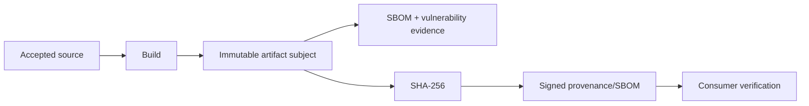

# DTMO Roadmap — Production Readiness and Product Evolution

Last updated: **2026-08-18**

## Purpose

This roadmap separates production authorization from product evolution and platform industrialisation. Repository engineering, release supply-chain evidence, accountable acceptance, deployment-bound validation, independent assurance and production authorization remain distinct evidence classes.

## Current position

| Stage | Scope | Status |
|---|---|---|
| Phases 1–7 | Repository-controlled engineering baseline | `PASS` |
| RC13 + owner retest | Unified-console functional acceptance | `PASS / OWNER_ACCEPTED` |
| E8.1–E8.10 | Vulnerability & CTI ecosystem integrations | `PASS / REPOSITORY_COMPLETE` |
| Phase 8 | Production-equivalent validation | `PASS / OWNER_ACCEPTED` — historical candidate |
| Phase 9 | Independent external assurance | `PASS / EXTERNAL_ASSURANCE_ACCEPTED` — historical candidate |
| Phase 10 | Formal production go/no-go | `NO-GO / BLOCKED — PLATFORM INDUSTRIALISATION REQUIRED` |
| Phase 11.1–11.8f | Accepted service/runtime boundaries | `PASS / REPOSITORY_COMPLETE` |
| Phase 11.8g | Software supply-chain hardening | `IN PROGRESS / EXACT-HEAD VALIDATION REQUIRED` |
| Phase 11.9 | Migration and compatibility | `NOT STARTED` |
| Phase 11.10 | New production-equivalent validation | `NOT STARTED` |
| Phase 11.11 | New independent external assurance | `NOT STARTED` |
| Phase 12 | New formal production go/no-go | `NOT STARTED` |

DTMO remains **not production authorized**. Phase 11 is `IN PROGRESS / ACTIVE` and remains the highest-priority programme.

## Historical readiness evidence

Phase 8 remains `PASS / OWNER_ACCEPTED` and Phase 9 remains `PASS / EXTERNAL_ASSURANCE_ACCEPTED` for the earlier candidate they actually covered. Those claims are historical and are not transferred to the materially changed Phase 11 platform.

## Phase 11 platform industrialisation

The authoritative detailed programme is `docs/roadmap/PLATFORM_INDUSTRIALISATION_ROADMAP.md`. The controlled order is Taranis → IntelOwl → OpenCTI → MISP → TheHive → Cortex historical decision/later bounded connector → integrated runtime → migration/compatibility → fresh validation → fresh assurance.

### Phase 11.1–11.8f accepted repository baseline

**Status:** `PASS / REPOSITORY_COMPLETE`

Accepted repository evidence covers the service integrations and the runtime foundation through workload identity/secrets, ingress/network, HA/disruption, observability and recovery hardening. These are bounded engineering claims only.

### Phase 11.8g software supply-chain hardening

**Status:** `IN PROGRESS / EXACT-HEAD VALIDATION REQUIRED`

The active repository scope requires exact-head build identity, Python and container CycloneDX SBOMs, governed vulnerability evidence, SHA-256 artifact identity, and a governed release path for cryptographically signed provenance and SBOM attestations.

PR CI validates the mechanism and candidate scan outputs only. Actual signed release evidence exists only after the governed release workflow executes for the exact subject. Signed provenance does not prove vulnerability absence, deployment admission or production readiness.

### Remaining Phase 11.8

After protected 11.8g acceptance, continue capacity/resource planning and upgrade/rollback exercise controls as separate bounded work. Phase 11.9 does not start before all required Phase 11.8 controls are accepted.

### Phase 11.9 — Migration and compatibility

**Status:** `NOT STARTED`

Migration must preserve canonical intelligence, provenance, classification/governance state and accepted service identity/reconciliation semantics with explicit rollback paths.

### Phase 11.10 — New production-equivalent validation

**Status:** `NOT STARTED`

Run fresh production-equivalent validation against one immutable integrated deployment identity. Historical Phase 8 evidence cannot satisfy this gate.

### Phase 11.11 — New independent external assurance

**Status:** `NOT STARTED`

Run fresh independent assurance against the same immutable integrated candidate after Phase 11.10 acceptance. Historical Phase 9 evidence cannot satisfy this gate.

## Phase 12 — Formal production GO/NO-GO

**Status:** `NOT STARTED`

Phase 12 starts only after accepted Phase 11.10/11.11 evidence plus required production ownership, IAM/secrets/network/recovery/monitoring/privacy/legal/change approvals for the same release identity.

## Product and authority boundary

DTMO remains the education-sector CTI and decision-support layer. Generic collection, enrichment, graph, exchange and case-management capabilities remain separate services. Supply-chain metadata/signatures do not alter licensing boundaries, grant publication/share or case authority, or establish local compromise.

## Delivery discipline

Each material change requires one bounded pull request with explicit acceptance criteria, exact-head CI, expected-head protection and synchronized professional documentation. A code/integration PR is not mergeable when affected current-state, architecture, security, governance, operations, QA/evidence, roadmap or user/admin documentation is stale.
