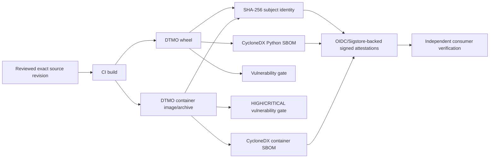

# Phase 11.8g — Software supply-chain hardening

## Scope

This bounded Phase 11.8 slice establishes repository-controlled software supply-chain controls for DTMO build artifacts. It covers dependency and container vulnerability scanning, CycloneDX SBOM generation, artifact hashing, and cryptographically signed provenance/SBOM attestations for release artifacts. It does not claim that a PR test build has been released, signed, deployed or admitted to production.

## Trust boundary

## Security invariants

- PR validation runs on the exact pull-request head and produces non-sensitive engineering evidence only.
- Python dependencies are audited and a CycloneDX JSON dependency SBOM is generated from the resolved CI environment.
- The candidate container is scanned for known `HIGH` and `CRITICAL` OS/library vulnerabilities; detected findings fail closed.
- A CycloneDX container SBOM is generated for the built candidate image.
- Release artifacts receive SHA-256 identities before attestation.
- Release provenance and SBOM attestations use GitHub Actions OIDC-backed signing through `actions/attest`; long-lived signing keys are not stored in the repository.
- Signing is a release-path operation, not a way to promote every PR test build into release evidence.
- An attestation proves a signed relationship between an artifact and build metadata/SBOM; it does **not prove** that the artifact is vulnerability-free, safe to deploy, production-equivalent or production-authorized.
- Taranis, IntelOwl, OpenCTI, MISP, TheHive and Cortex remain separate service/licensing boundaries. Supply-chain metadata grants no publication/share, case, responder or compromise authority.
- Missing SBOM, scan, subject digest, provenance or signature evidence fails closed for any release candidate that claims Phase 11.8g compliance.

## Release evidence classes

1. **PR engineering evidence:** exact-head contract tests, SBOM generation, vulnerability scan output and build hashes.
2. **Release signing evidence:** signed provenance and SBOM attestations generated by the release workflow for the exact release artifact.
3. **Deployment verification evidence:** later consumers verify the attestation and artifact identity before admission/deployment.
4. **Production evidence:** remains outside this slice and requires Phase 11.10, 11.11 and Phase 12 authorization.

## Claim boundary

Repository acceptance can prove that the governed supply-chain mechanisms exist and execute successfully on the exact PR head. It does not prove a future release attestation exists until the release workflow runs, does not substitute for runtime admission policy, and does not reuse historical Phase 8/9 assurance for the materially changed Phase 11 candidate.
