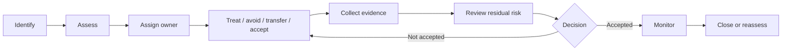

# DTMO Security Risk Management

## Purpose

This document defines the project-level security risk-management model for DTMO. It establishes a common method for identifying, assessing, treating, accepting and reviewing security risks without turning transient findings into undocumented exceptions.

Risk management supports engineering, staging, independent assurance and production decisions. It does not replace any required Phase 8, Phase 9 or Phase 10 acceptance gate.

## Principles

- risks are recorded explicitly and assigned an accountable owner;
- impact and likelihood are assessed separately;
- treatment decisions are evidence-based and time-bounded where appropriate;
- residual risk is distinguished from untreated inherent risk;
- accepted risk requires explicit authority and rationale;
- open high-impact risks cannot be hidden by successful CI;
- external-assurance findings remain traceable to their originating evidence;
- security exceptions and waivers have expiry/review criteria;
- absence of incidents is not evidence that a risk is acceptable.

## Risk lifecycle

## Assessment model

DTMO uses a five-level qualitative scale for likelihood and impact.

| Level | Likelihood | Impact |
|---|---|---|
| 1 | Rare | Negligible |
| 2 | Unlikely | Minor |
| 3 | Possible | Moderate |
| 4 | Likely | Major |
| 5 | Almost certain | Severe / critical |

Risk score = `likelihood × impact`.

| Score | Rating | Default governance expectation |
|---|---|---|
| 1–4 | Low | Manage through normal backlog/control process |
| 5–9 | Moderate | Named owner and treatment plan required |
| 10–16 | High | Explicit security review and tracked remediation required |
| 17–25 | Critical | Blocks progression unless formally resolved or exceptionally accepted by appropriate accountable authority |

The score supports prioritization; it does not override mandatory release gates or statutory/contractual obligations.

## Mandatory risk record fields

Every material risk record should contain:

- unique risk identifier;
- title and description;
- affected asset, capability, trust boundary or environment;
- threat/event and vulnerability/control weakness;
- confidentiality, integrity, availability, provenance, privacy or authority impact as applicable;
- inherent likelihood and impact;
- inherent rating;
- existing controls;
- treatment plan and owner;
- target date;
- evidence references;
- residual likelihood and impact after treatment;
- residual rating;
- status (`OPEN`, `TREATING`, `ACCEPTED`, `CLOSED`, `SUPERSEDED`);
- acceptance authority when applicable;
- review/expiry date for accepted residual risk.

## Risk treatment options

### Mitigate
Reduce likelihood and/or impact through technical, operational or governance controls.

### Avoid
Remove the activity, source, feature or deployment condition that creates the risk.

### Transfer/share
Use contractual, supplier, insurance or service arrangements where appropriate. Transfer does not remove DTMO's obligation to understand residual exposure.

### Accept
Explicitly accept residual risk within defined authority. Acceptance requires rationale, scope, evidence, owner and review/expiry conditions.

## Release and readiness interaction

Risk status influences release decisions but does not silently change gate status.

- Phases 1–7 and RC13 repository evidence may reveal or reduce risk, but cannot establish staging or external-assurance acceptance.
- Phase 8 risks must be assessed against the actual immutable staging deployment identity.
- Phase 9 findings must be recorded as risks or findings with explicit disposition and retest where required.
- Phase 10 must review remaining open and accepted material risks before production go/no-go.

## Risk review cadence

Material risks are reviewed on major release/readiness transitions, after significant architecture/security changes, after material incidents, after external assurance, and before formal production go/no-go.

Critical risks require immediate review. High risks require active treatment tracking. Accepted moderate/high residual risks require explicit review dates.

## Current baseline

The repository does not claim that all production risks have been assessed for a real production-equivalent deployment. Phase 8 environment identity remains a prerequisite for target-specific staging risk assessment, and Phase 9 remains required for independent external assurance.
