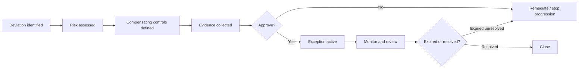

# DTMO Security Exception and Waiver Procedure

## Purpose

This procedure governs temporary deviations from approved DTMO security, architecture, operational or release requirements. An exception is not a workaround hidden in implementation detail; it is an explicit, attributable, time-bounded governance decision.

## When an exception is required

A formal exception is required when a material requirement cannot be satisfied as designed and the project proposes to continue with compensating controls or bounded residual risk.

Examples include temporary dependency constraints, environment-specific control gaps, unavailable platform capabilities, delayed remediation of a non-critical finding, or a justified deviation from a documented baseline.

Exceptions must not be used to bypass mandatory legal obligations, fabricate Phase 8/9/10 evidence, or convert failed/absent acceptance evidence into `PASS`.

## Required exception record

Each exception must record:

- unique identifier;
- requirement/control being deviated from;
- scope: component, release, environment and deployment identity where applicable;
- reason and business/technical justification;
- security and operational impact;
- associated risk identifier(s);
- compensating controls;
- validation evidence;
- accountable owner;
- approving authority;
- effective date;
- expiry or mandatory review date;
- remediation/exit plan;
- status (`PROPOSED`, `APPROVED`, `EXPIRED`, `CLOSED`, `REVOKED`).

## Approval rules

Approval authority must match the nature and severity of the exception. Engineering cannot self-approve a governance or security exception solely because it implemented the compensating control. High or critical residual security risk requires explicit security/risk authority in addition to delivery ownership.

External-share authority, production authorization and independent-assurance acceptance cannot be delegated through a generic technical waiver.

## Lifecycle

## Expiry and renewal

Exceptions are fail-closed at expiry. Expired exceptions do not remain valid by silence. Renewal requires a fresh assessment of risk, evidence and continued necessity. Repeated renewal should trigger review of whether the temporary deviation has become an undocumented design choice.

## Evidence boundary

An approved exception is evidence that a defined deviation was consciously governed. It is not evidence that the underlying control is satisfied. Documentation and readiness reporting must preserve that distinction.

## Phase 8–10 application

Phase 8 exceptions must identify the actual staging deployment identity and cannot substitute for missing deployment identity evidence. Phase 9 findings may only be accepted where the external-assurance gate permits risk acceptance and the required accountable authority approves the disposition. Phase 10 must review all active exceptions before production go/no-go.
