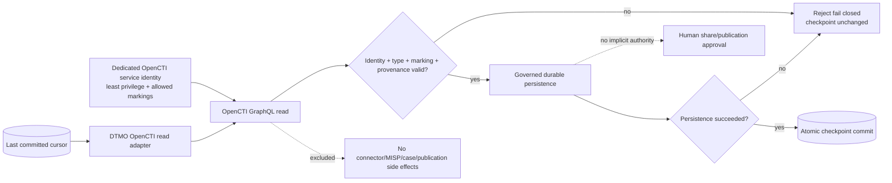

# DTMO Security Overview

Last updated: **2026-08-16**  
Software baseline: **16.0.0rc12 plus accepted post-RC13/E8/Phase-11 repository enhancements**

## Security objectives

DTMO protects the confidentiality, integrity, availability, provenance, accountability and controlled dissemination of cyber threat intelligence used in an education context. Security controls keep source trust, identity, authorization, evidence and human decision boundaries explicit and enforceable.

DTMO is **not production authorized**. Phase 10 concluded `NO-GO / BLOCKED — PLATFORM INDUSTRIALISATION REQUIRED`; Phase 11 is active. Phase 11.1–11.2 Taranis and Phase 11.3 IntelOwl are repository-complete. The Phase 11.4 OpenCTI contract is `PASS / REPOSITORY_COMPLETE`; the active bounded gate is the **OpenCTI read-only STIX/identity adapter**.

## Identity and authentication

Bearer tokens are externally issued and cryptographically validated according to the configured trust model. DTMO does not silently mint or rewrite active external token claims from managed local principal state.

External Phase 11 services use dedicated non-human identities with minimum required scope. Taranis remains read-only. IntelOwl uses a dedicated non-admin identity. OpenCTI routine integration likewise requires a dedicated non-human identity with only the knowledge/read capabilities and allowed markings required by the bounded path.

OpenCTI administrator authority, `Bypass all capabilities` and connector capabilities are not routine DTMO integration requirements. A `401` or `403` is an authorization/configuration failure and never a reason to broaden privilege automatically.

## Identity and access control

- Server-side RBAC is authoritative.
- Human and service-account authorities remain separated.
- Least privilege and explicit role/permission scope are enforced server-side.
- Service accounts/connectors do not receive human review/share-approval authority.
- Governed IntelOwl execution requires `REVIEW_INTELLIGENCE`; IntelOwl history reads require `READ_INTELLIGENCE`.
- OpenCTI access is bounded by OpenCTI role/capability and marking/data-segregation controls.
- Auditor/read-only paths remain non-mutating.
- Privileged Administration remains human-authorized and auditable.
- Client-supplied role or identity values do not establish privilege.

## Separation of duties and publication authority

Technical success is not dissemination authority. Source execution, enrichment, graph synchronization, analysis, review, external-share approval, Administration, security/CISO authority and audit access remain distinct responsibilities.

Taranis publisher state, IntelOwl analyzer/job results and OpenCTI entities/relationships/confidence/connector capabilities do **not** authorize DTMO external sharing or publication. Existing DTMO human approval and governed export/MISP controls remain authoritative.

## Source and ingestion security

Source execution is fail-closed around approved profiles, endpoints, normalization semantics, provenance and source restrictions. Credentialed integrations use logical runtime secret references; raw API keys, passwords or bearer tokens are not stored as repository/catalog evidence.

The accepted source ecosystem includes OpenCVE, CIRCL Vulnerability-Lookup, governed MISP read/export, AIL read/enrichment/correlation and the Phase 11.2 Taranis canonical integration. Canonical ingestion preserves raw evidence/source context and requires durable canonical persistence before successful application-level ingestion is reported.

## Threat and vulnerability management

DTMO threat and vulnerability management preserves source provenance, separates external intelligence from local exposure evidence, and keeps CVE/CVSS/EPSS/KEV, enrichment and graph signals attributable rather than treating them as proof of local compromise. Phase 11 integrations extend this evidence model without weakening human review, RBAC, privacy/TLP or publication authority.

## Phase 11.3 IntelOwl enrichment security boundary

The IntelOwl service/API/security/licensing contract, bounded adapter and governed execution/persistence path are repository-complete. The accepted path keeps analyzer allowlists, HTTPS/token requirements, bounded polling/result validation, `connectors_requested=[]`, durable job attribution and database-enforced `external_share_authorized=false` / `local_compromise_proven=false` invariants.

IntelOwl remains a separate AGPL-3.0 service. Repository acceptance does not prove live provider connectivity, production credentials, analyzer quality, privacy approval or production authorization.

## Phase 11.4 OpenCTI security boundary

The reviewed baseline is OpenCTI 7.260811.0. DTMO consumes OpenCTI as a separate service/API boundary. Community Edition is Apache-2.0; Enterprise Edition is separately licensed and any Enterprise-only dependency requires explicit entitlement/legal review.

The active adapter is read-only and uses only GraphQL `stixCoreObjects` retrieval. Production enablement requires HTTPS, a runtime bearer token, an explicit entity-type allowlist and an absolute durable checkpoint path. The token is a runtime secret and never repository evidence.

Required controls:

- DTMO canonical UUID and OpenCTI/STIX identity remain distinct and explicitly mapped/preserved;
- mutable names/labels are never sufficient deduplication identity;
- markings/TLP/PAP and confidence remain attributable provenance;
- malformed identity, marking, confidence, GraphQL/page/cursor or checkpoint state fails closed;
- `TLP:RED` or equivalent restricted data is never automatically broadened or published;
- pagination is bounded by page size and maximum-page limits;
- `read_pages()` does not advance durable state;
- checkpoint/cursor state advances only through `commit_page(page)` after successful durable DTMO persistence;
- checkpoint writes use atomic replacement and malformed checkpoint files fail closed;
- OpenCTI outage or synchronization failure must not make unrelated DTMO read paths unavailable;
- routine integration does not register connectors, enable MISP synchronization, trigger enrichment, create cases, publish reports or modify OpenCTI security/marking configuration;
- graph presence, confidence or upstream labels are contextual evidence and do not prove local compromise/exposure/attribution certainty;
- OpenCTI success never mutates DTMO `share_approved` or publication authority.

## Vulnerability intelligence and enrichment semantics

DTMO supports governed vulnerability context including CVE, vendor/product, CWE, CVSS, EPSS, KEV and sighting evidence where sources support those fields. These signals inform prioritization but do not by themselves prove local exposure, exploitability, compromise or remediation completion.

IntelOwl and OpenCTI add contextual evidence classes. Provider/analyzer/graph results, reliability, confidence, DTMO relevance, local exposure evidence, severity and TLP/handling remain separate dimensions.

## Data protection and privacy

- Collect and retain only data needed for the defined intelligence purpose.
- Preserve source, enrichment and graph provenance/confidence/context.
- Avoid unnecessary personal data in logs and retained evidence.
- Do not commit secret values, credentials or bearer tokens.
- Treat external enrichment and graph synchronization as potential data disclosures across service boundaries.
- Apply the stronger applicable marking/handling restriction across integrations.
- Do not infer privacy/data-processing approval from technical connectivity.

## Persistence and integrity

Security-relevant responsibilities remain explicit:

- PostgreSQL — canonical DTMO application/RBAC/intelligence state and IntelOwl enrichment history;
- OpenSearch — supporting search/index representation;
- S3-compatible object storage — raw source evidence;
- Redis — coordination/cache/queue runtime state;
- Prometheus/Grafana — operational telemetry;
- OpenCTI — separate graph service, never a silent replacement for DTMO canonical application truth;
- OpenCTI checkpoint — restart cursor state only; it is not canonical intelligence and advances only after durable page persistence.

A later bounded Phase 11.4 slice must add the durable canonical OpenCTI mapping/persistence/operational integration needed before repository completion can be claimed.

## Auditability and observability

Privileged/security-relevant activity retains actor/principal identity, action/resource context, correlation identifiers and attributable outcomes. Operational troubleshooting must not copy secrets or unnecessary sensitive payloads into tickets or repository evidence.

OpenCTI synchronization observability must expose dependency/cursor/correlation outcome without exposing runtime tokens or unnecessary STIX payload content.

## Supply chain and licensing security

- Exact-head CI is required before protected merge.
- A new commit invalidates earlier PR-head evidence.
- Open-source governance/licensing controls remain mandatory.
- Service-to-service integration is preferred where it preserves licensing and trust boundaries.
- DTMO is Apache-2.0.
- IntelOwl/pyIntelOwl remain separate AGPL-3.0 services.
- OpenCTI Community Edition is Apache-2.0; Enterprise Edition is separately licensed.
- Phase 11.4 does not vendor OpenCTI source or authorize unapproved Enterprise Edition features.
