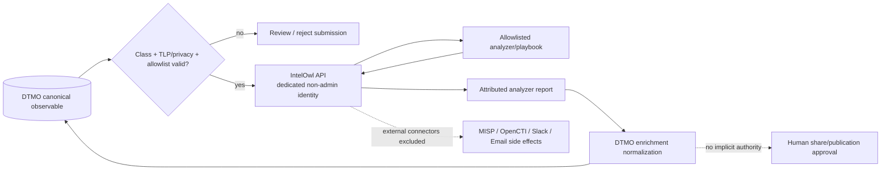

# DTMO Security Overview

Last updated: **2026-08-16**  
Software baseline: **16.0.0rc12 plus accepted post-RC13/E8/Phase-11 repository enhancements**

## Security objectives

DTMO protects the confidentiality, integrity, availability, provenance, accountability and controlled dissemination of cyber threat intelligence used in an education context. Security controls are designed so that source trust, identity, authorization, evidence and human decision boundaries remain visible and enforceable.

DTMO is **not production authorized**. Phase 10 concluded `NO-GO / BLOCKED — PLATFORM INDUSTRIALISATION REQUIRED`; Phase 11 is the active platform-industrialisation programme. Phase 11.1 and 11.2 are repository-complete. Phase 11.3 IntelOwl is the active bounded integration step.

## Identity and authentication

Bearer tokens are externally issued and cryptographically validated according to the configured trust model. DTMO does not silently mint or rewrite active external token claims from managed local principal state.

Production identity requirements include approved issuer/audience/key trust, known role/principal-type claims, token-state validation where applicable and explicit reconciliation/reissue/revocation when role state changes.

Local/reference identity helpers are development conveniences, not production identity architecture.

External Phase 11 service integrations use dedicated non-human identities with the minimum required scope. Taranis remains read-only. The proposed IntelOwl path requires a dedicated non-admin service identity and runtime-secret API token; a `403` is an authorization/configuration failure and never a reason to broaden privilege automatically.

## Identity and access control

- Server-side RBAC is authoritative.
- Human and service-account authorities remain separated.
- Least privilege and explicit role/permission scope are enforced server-side.
- Service accounts/connectors do not receive human review/share-approval authority.
- Auditor/read-only paths remain non-mutating.
- Privileged Administration actions require appropriate human authority.
- Administrator self-management and final-active-admin safeguards prevent lockout/escalation failure modes.
- Client-supplied role or identity values do not establish privilege.
- External-platform administrative/superuser authority is not required merely to support bounded DTMO integration.

## Separation of duties and publication authority

Technical success is not dissemination authority. Source execution, enrichment, analysis, review, external-share approval, Administration, security/CISO authority and audit access remain distinct responsibilities.

Connectors, CI, dashboards, analytics, Administration, Governance, staging access, infrastructure administration, Taranis publisher state and IntelOwl analyzer/job results do **not** automatically authorize external sharing or publication.

Existing DTMO human approval and governed MISP/export controls remain authoritative.

## Source and ingestion security

Source execution is fail-closed around approved profiles, endpoints, normalization semantics, provenance and source restrictions. Credentialed integrations use logical secret references; raw API keys, passwords or bearer tokens are not stored as repository/catalog evidence.

The accepted source ecosystem includes OpenCVE, CIRCL Vulnerability-Lookup, governed MISP read and separately governed outbound export, governed AIL read/enrichment/correlation and the Phase 11.2 Taranis read-only canonical integration. Taranis collection preserves stable upstream identity, provenance, handling restrictions, bounded replay/checkpoint semantics and explicit no-share authority.

Canonical ingestion preserves raw evidence/source context and requires durable canonical persistence before successful application-level ingestion is reported.

## Phase 11.3 IntelOwl enrichment security boundary

The IntelOwl integration is currently at contract stage; no live adapter is claimed yet. The accepted design direction is service-to-service and fail-closed.

Required controls:

- only CVE, IP, domain, URL and hash are initially eligible observables;
- email and other generic personal-data observables remain disabled until explicit privacy/data-processing approval;
- analyzers/playbooks are explicitly allowlisted; newly available IntelOwl plugins are not automatically trusted;
- DTMO must consider whether an analyzer sends data to an external provider before execution;
- unknown/missing TLP or handling state fails closed to review-required;
- `TLP:RED` or equivalent restricted material is not sent to external analyzers;
- bounded concurrency, polling, result-size, retry and provider-quota behavior prevents retry storms and uncontrolled disclosure;
- IntelOwl external Connectors are excluded from the initial enrichment path;
- analyzer/job/result identity and timestamps are retained in provenance;
- analyzer verdicts such as malicious/suspicious are attributed context and are not local-compromise proof;
- malformed, oversized, unknown-analyzer or partial results remain explicit and fail closed where attribution/safety cannot be established.

## Vulnerability intelligence and enrichment semantics

DTMO supports governed vulnerability context including CVE, vendor/product, CWE, CVSS, EPSS, KEV and sighting evidence where sources support those fields. These signals inform prioritization and analysis but do not by themselves prove local exposure, exploitability, compromise or remediation completion.

IntelOwl enrichment adds another contextual evidence class. Provider/analyzer result, reliability, confidence/evaluation, DTMO relevance, local exposure evidence, severity and TLP/handling remain separate dimensions. A provider verdict must never silently become an assertion that a DTMO-managed environment is affected.

Explainable prioritization must retain input provenance and semantic boundaries rather than collapse external signals into unsupported certainty.

## Data protection and privacy

- Collect and retain only data needed for the defined intelligence purpose.
- Preserve source and enrichment provenance and confidence/context.
- Avoid unnecessary personal data in logs and retained evidence.
- Do not commit secret values, credentials or bearer tokens.
- Minimize evidence artifacts and restrict sensitive references.
- Staging data must use an approved synthetic/sanitized/representative approach unless explicitly authorized otherwise.
- Treat external enrichment as a potential disclosure of the observable to a provider.
- Do not enable email/generic personal-data enrichment until lawful purpose, data-processing basis, provider/transfer implications and retention have been explicitly reviewed.

## Persistence and integrity

Security-relevant data responsibilities are explicit:

- PostgreSQL — canonical application/RBAC/intelligence/mapping state;
- OpenSearch — supporting search/index representation;
- S3-compatible object storage — raw evidence;
- Redis — coordination/cache/queue runtime state;
- Prometheus/Grafana — operational telemetry.

Search/index, raw-object or external enrichment success alone does not replace canonical PostgreSQL truth.

## Auditability and observability

Privileged/security-relevant activity is designed to retain actor/principal identity, action/resource context, request/correlation identifiers, before/after state where applicable and auditable event continuity. Operational troubleshooting must preserve correlation/provenance without copying unnecessary sensitive payloads into tickets or repository evidence.

Phase 11 enrichment observability must identify dependency, job/correlation context and outcome without logging API tokens, provider credentials or unnecessary observable payloads.

Prometheus and separately authenticated Grafana provide operational telemetry. Monitoring access does not create intelligence-review or publication authority.

## Supply chain and licensing security

- Exact-head CI is required before protected merge.
- A new commit invalidates earlier PR-head evidence for that PR.
- Open-source governance/licensing have dedicated controls.
- Dependency/container/advisory review must preserve provenance and applicability.
- Workflow configuration alone is not acceptance evidence.
- Service-to-service integration is preferred where it preserves licensing and trust boundaries.

DTMO is licensed under the **Apache License, Version 2.0** and maintains explicit security/contribution/licensing entry points.

Taranis remains a separately licensed service and its source is not vendored into DTMO under the accepted Phase 11.1/11.2 boundary. IntelOwl and pyIntelOwl are AGPL-3.0; the Phase 11.3 contract keeps them as separate service/API components. Embedding, modification, redistribution or operation of modified network-facing IntelOwl components requires explicit licensing review before architecture acceptance.

## Threat and vulnerability management

Threat, CVE and vendor-advisory review must be target-specific where it supports a deployment or assurance decision. Record source/provenance, review time, affected component/version, applicability, confidence and remediation/disposition.

For the materially changed Phase 11 candidate, repository tests and contracts remain engineering evidence. Deployment-specific vulnerability/security review belongs to fresh Phase 11.10 production-equivalent validation and Phase 11.11 independent assurance.

## Framework and governance claims

Framework mappings are security-relevant claims and therefore fail closed. Current controlled truth includes:

- Normenkader IBP — explicit partial DTMO control crosswalks and governed evidence relationships, including vulnerability-management evidence for `SM.07` and supporting controls;
- MITRE ATT&CK — explicit threat/detection/classification context and governed technique relationships;
- NIST CSF 2.0 — explicit DTMO control/outcome relationships;
- CVSS 4.0 — vulnerability-scoring context with explicit claim boundaries;
- DTMO internal security/release governance — repository-backed mappings.

Mappings are explicit, versioned/provenance-backed and non-inferred. A mapping does not imply complete compliance, certification, maturity, local exploitability or control effectiveness in a specific deployment unless corresponding evidence exists.

## Environment and evidence security

### Local/reference

Docker Compose provides engineering/reference evidence only. Development-only object-storage/bootstrap/admin credential compatibility patterns must not be reused as staging/production identity architecture.

### Historical Phase 8 and Phase 9

Phase 8 is `PASS / OWNER_ACCEPTED` and Phase 9 is `PASS / EXTERNAL_ASSURANCE_ACCEPTED` for the prior candidate they covered. Those evidence classes remain historical and candidate-bound.

### Integrated Phase 11 candidate

Because Phase 11 materially changes service composition and trust boundaries, prior Phase 8/9 evidence cannot be reused as production-equivalent validation or independent assurance for the integrated candidate. Fresh Phase 11.10 validation and Phase 11.11 independent assurance are required against an immutable integrated deployment identity.

### Production

Production authorization was not granted in Phase 10. A future Phase 12 `GO` can occur only after all mandatory Phase 11 evidence classes, ownership/support, residual-risk and release-identity requirements are accepted.

## Non-negotiable claim boundaries

- Missing, queued, failed, skipped, cancelled, stale, inferred or inaccessible evidence is not `PASS`.
- Repository CI does not create owner, deployment or independent-assurance acceptance.
- Historical Phase 8/9 evidence is not automatically transferable to the materially changed integrated candidate.
- Technical success, enrichment, analysis or upstream publisher state does not authorize publication/share.
- Raw secrets are never documentation evidence.
- Framework mappings are never inferred and never imply blanket compliance.
- IntelOwl analyzer/provider verdicts are attributed enrichment context, not proof of local compromise.
- Unknown TLP/privacy/analyzer state fails closed.