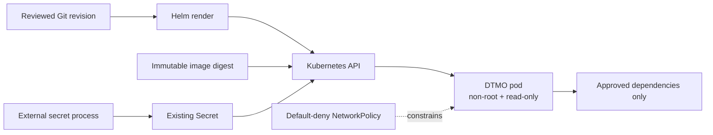

# DTMO Security Overview

Last updated: **2026-08-17**  
Software baseline: **16.0.0rc12 plus accepted post-RC13/E8/Phase-11 repository enhancements**

## Security objectives

DTMO protects confidentiality, integrity, availability, provenance, accountability and controlled dissemination of cyber threat intelligence. Security controls keep source trust, identity, authorization, evidence and human decision boundaries explicit and enforceable.

DTMO is **not production authorized**. Phase 10 concluded `NO-GO / BLOCKED — PLATFORM INDUSTRIALISATION REQUIRED`; Phase 11 is `IN PROGRESS / ACTIVE`. Phase 11.1–11.7b are `PASS / REPOSITORY_COMPLETE`. The active bounded gate is **Phase 11.8a governed Kubernetes/Helm/GitOps runtime foundation**, `IN PROGRESS / EXACT-HEAD VALIDATION REQUIRED`.

## Identity and access control

- Server-side RBAC remains authoritative.
- Human and service-account authorities remain separated.
- `handoff:case` remains distinct from `approve:share`.
- Connectors, schedulers, Kubernetes service accounts and integrated platforms do not receive human publication/share or case-handoff authority.
- Automatic service-account token mounting is disabled for the DTMO application workload in Phase 11.8a.
- Runtime secrets are never stored in repository evidence, logs or screenshots.
- Authentication/authorization failures and missing required runtime identity evidence fail closed.

## Accepted service and licensing boundaries

Taranis AI, IntelOwl, Cortex, OpenCTI, MISP and TheHive remain separate service/API/identity boundaries under their applicable licensing/provider terms. Kubernetes placement does not merge those products into DTMO and does not transfer license rights, source-code ownership or human authority.

PostgreSQL remains canonical DTMO application/RBAC/intelligence truth. External services contribute bounded collection, enrichment, graph, exchange or case-workflow evidence only. None independently proves DTMO-local exposure, exploitability or compromise.

## Phase 11.8a runtime security boundary

The first runtime-industrialisation slice establishes secure-by-default repository contracts for the DTMO application workload:

- Helm/GitOps desired state is repository-controlled;
- container images require an immutable digest;
- runtime secret values are not committed to Git and are consumed only through an existing Kubernetes Secret reference;
- pods run non-root with a read-only root filesystem and dropped Linux capabilities;
- automatic service-account token automounting is disabled;
- readiness/liveness probes and resource requests/limits are explicit;
- a PodDisruptionBudget protects the stateless application workload from avoidable voluntary disruption;
- NetworkPolicy is fail-closed/default-deny;
- external egress is unavailable unless explicitly allowlisted by CIDR.

## Trust and authority invariants

- Technical deployment success is not dissemination authority.
- Taranis publisher state, IntelOwl/Cortex analyzer results, OpenCTI graph content, MISP state and TheHive case state do **not** authorize DTMO external sharing or publication.
- TheHive case-handoff approval remains a separate human authority.
- Kubernetes workload/service identities cannot authorize human actions.
- Source handling restrictions and provenance cannot be broadened by runtime configuration.
- Missing, conflicting or unrepresentable evidence fails closed.

## Secrets and configuration

Phase 11.8a deliberately stops at an **existing Secret reference**. It does not claim a live external-secret provider, cloud workload identity or secret rotation mechanism.

Security requirements:

- no raw secret values in Git, Helm values, documentation evidence or screenshots;
- secret object names/keys may be declarative, but secret material remains deployment-controlled;
- later workload-identity/external-secret implementation requires a separate bounded PR and exact-head gate;
- production credential provenance, rotation, provider permissions and revocation must be proven in deployment-bound evidence.

## Network security

The Phase 11.8a baseline uses default-deny/fail-closed NetworkPolicy. Explicit internal dependency and external service flows must be added through governed rules; external CIDR egress cannot be implicit.

This repository contract cannot prove that a target CNI enforces NetworkPolicy correctly. CNI selection, ingress/TLS termination, DNS policy, service-to-service TLS and finer per-service segmentation remain later Phase 11.8 evidence.

## Availability and recovery boundary

A PodDisruptionBudget improves the stateless application workload's voluntary-disruption posture but does not establish system HA. Phase 11.8a does not prove:

- multi-zone placement or anti-affinity;
- PostgreSQL/Redis/OpenSearch/object-store HA;
- queue/storage durability under node or zone failure;
- backup/restore objectives or exercised recovery;
- capacity, failover or rollback behavior.

Those controls remain separate bounded Phase 11.8 work.

## Supply-chain boundary

Phase 11.8a requires immutable image identity by digest. It does **not** yet claim completed SBOM generation, vulnerability-policy enforcement, image signing, provenance attestation or admission verification. Those are explicit later 11.8 supply-chain gates.

No Taranis, IntelOwl, Cortex, OpenCTI, MISP or TheHive upstream source is vendored by this runtime foundation. Existing service-to-service licensing boundaries remain unchanged.

## Data protection and privacy

Technical reachability does not establish lawful authority to send intelligence to an external service. Approved source handling, TLP/data-classification rules and provider terms remain authoritative. Credentials, raw source bodies, private notes and unrelated personal data must not be introduced into runtime evidence.

## Evidence boundary

The Phase 11.8a repository gate can establish chart/policy/configuration/documentation contracts only. It cannot establish live Kubernetes admission behavior, cloud IAM/workload identity, secret-provider permissions, CNI enforcement, ingress/TLS, HA/recovery, observability, supply-chain attestation, production-equivalent validation, independent assurance or production authorization.

Historical Phase 8 `PASS / OWNER_ACCEPTED` and Phase 9 `PASS / EXTERNAL_ASSURANCE_ACCEPTED` evidence remains candidate-bound. Fresh Phase 11.10 and Phase 11.11 evidence is required for the integrated candidate before Phase 12.